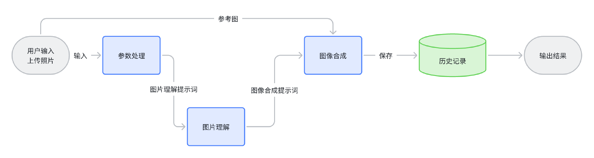

# 使用阿里的QVQ模型进行图片理解

在.env 中配置好 API key后，执行：
```shell
npm install
npm run start
```

参考：https://bailian.console.aliyun.com/?tab=api#/api/?type=model&url=https%3A%2F%2Fhelp.aliyun.com%2Fdocument_detail%2F2877996.html

---

理解图片后就能进一步进行图片合成：



比如，我们可以让大模型理解孩子的图片，然后再让大模型生成孩子成为宇航员的图片。