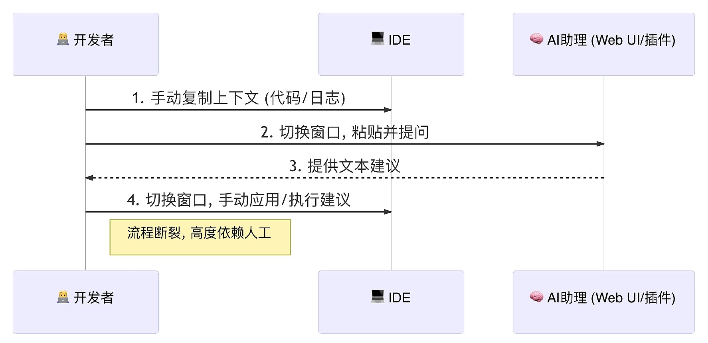
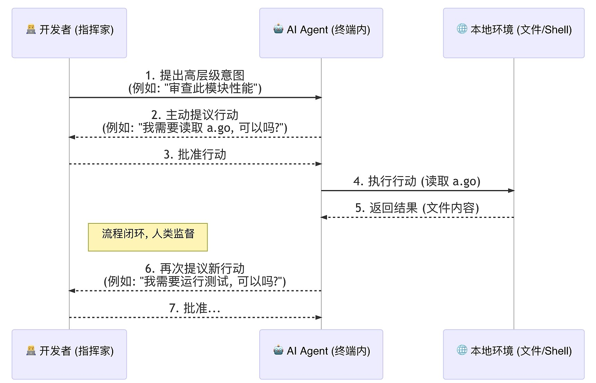
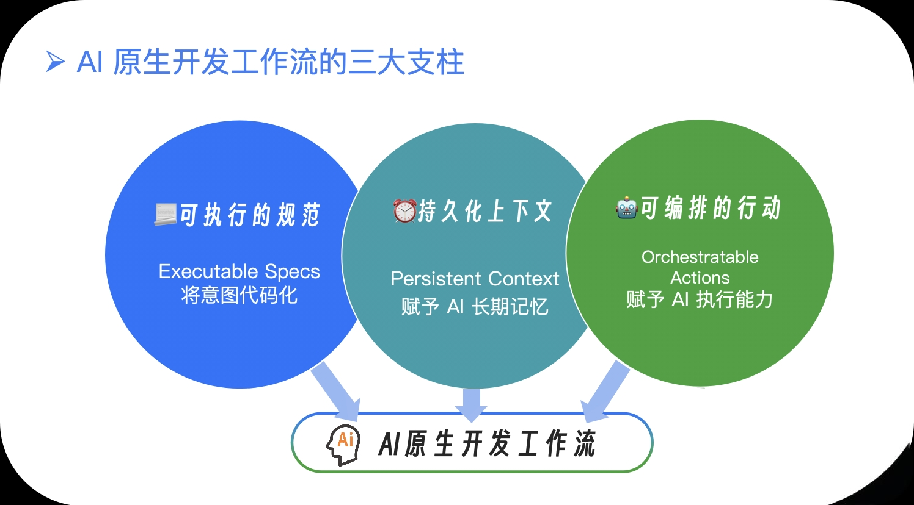
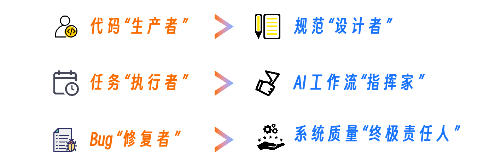
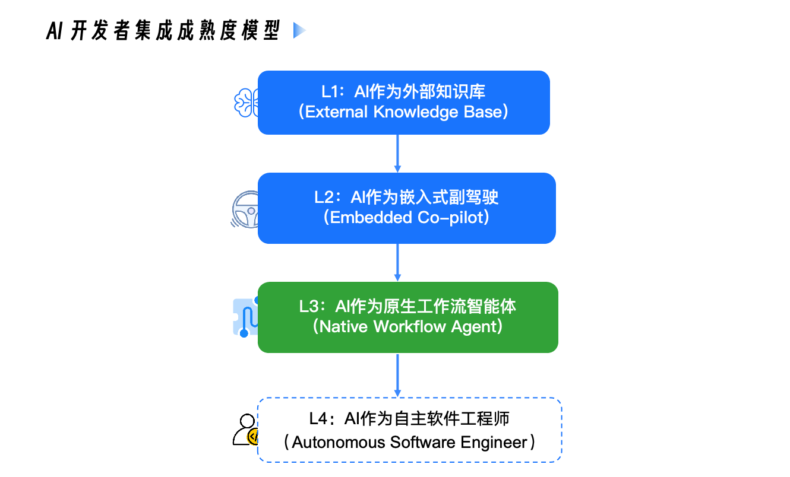

# 从工具到工作流的转变
AI 是一个强大的被动式工具，它的核心价值是知识的快速检索与内容的生成。整个工作流高度依赖人工串联，充满了断点。这是我们当前的使用方式：

更进一步，AI 成为开发工作流中一个原生的、可编程的组成部分。其核心价值不再仅仅是生成内容，而是理解意图并驱动流程。这场跃迁的关键，是 AI 获得了主动性——它不再被动等待，而是能主动规划并提议行动。

其工作流演变为：

---

AI 原生开发工作流”总结为三大核心支柱：

## 第一支柱：可执行的规范（Specs）
这是工作流的“灵魂”。它要求我们改变过去将“需求文档”与“代码”视为两个独立事物的习惯。

在 AI 原生工作流中，一份好的需求规格说明（Specification，简称 Spec），例如 spec.md，其本身就应该是一份“意图代码”。它不再是写给产品经理或开发者的散文，而是一份结构化的、可被 AI 精确理解和执行的“高级语言”。

AI Agent 会像编译器解释代码一样，将这份“意图代码”逐步“编译”为技术方案（plan.md）、任务列表（tasks.md），最终生成可运行的业务代码。这意味着，维护软件的核心，从维护易变的代码，转向了维护更稳定的规范。

当需求变更时，我们首先修改spec.md，然后驱动 AI 重新生成实现。这正是规范驱动开发（Spec-Driven Development, SDD）思想的精髓。

---

## 第二支柱：持久化的上下文
这是工作流的“记忆”。它旨在彻底解决我们作为“上下文搬运工”的窘境。通过CLAUDE.md、agents.md这类标准化的上下文文件，我们可以为 AI 提供关于项目的“长期记忆”。更重要的是，这种记忆是分层的、持久化的：
- 企业级记忆：整个公司的安全红线、合规要求。
- 项目级记忆：constitution.md 中定义的技术选型、架构原则、编码“宪法”。
- 模块级记忆：特定模块的 API 设计、核心逻辑。
- 个人级记忆：你个人的代码风格偏好。

---

## 第三支柱：可编排的行动
这是工作流的“手脚”。它赋予 AI 执行具体任务的能力。

在 AI 原生工作流中，AI 不仅仅能调用内置的工具（如读写文件、执行 Shell 命令），更重要的是，我们可以通过自定义指令（Slash Commands）、钩子（Hooks）和 MCP 服务器，为它打造一个几乎无限扩展的“工具箱”。
- 你可以定义一个 /review-go-code 指令，让 AI 执行你编写的一套包含静态检查、单元测试、代码风格扫描的完整审查脚本。
- 你可以设置一个 PostToolUse 钩子，让 AI 在每次修改完代码后，自动运行 gofmt 进行格式化。
- 你可以为它连接一个 Jira MCP 服务器，让它能够用自然语言帮你创建、查询和更新工单。

我们用可执行的规范定义“做什么”，AI 基于持久化的上下文理解“怎么做”，并通过可编排的行动来“完成它”。

---

## 角色的转变

---

## AI开发者成熟度模型

- L1: 问大模型，得到答案再复制粘贴
- L2: cursor、通义灵码等插件

这两个阶段，AI仍然是一个“被动”的伙伴：它响应你的显式指令，或在你编码时提供建议。但它不会主动发起一个任务。

它的视野是“文件级”的：它对你当前打开的几个文件理解得非常透彻，但对于整个项目的宏观架构、模块间的复杂依赖、Makefile 里定义的构建流程，甚至是 constitution.md 里约定的团队“宪法”，往往认知不足。它的上下文，更多地局限于“当前工作区”，而非“整个项目”。

---

### L3：AI 作为原生工作流智能体
其典型代表，就是以 Claude Code 为首的命令行 AI 智能体。

在这个层级，AI 的角色发生了根本性的转变。它不再仅仅是一个“副驾驶”，而是一个获得了“主动性”的工作流智能体。它能够：
- 感知全局：通过 @ 指令、CLAUDE.md 等机制，它可以理解整个项目的结构和规范。
- 规划行动：面对一个高层级的意图（例如“重构这个模块”），它能够自主地将任务分解为一系列具体步骤。
- 与环境交互：它能够主动地提议并执行读写文件、运行 Shell 命令等操作，与你的本地环境进行真实的交互。

在 Level 3，AI 与我们的对话，从“请告诉我怎么做”，变成了“我打算这么做，请批准”。开发者成为了“指挥家”与“审批者”，AI 则成为了那个能够将意图转化为一系列实际行动的“执行官”。这是 AI 真正成为可依赖的、生产级的、在专家监督下运行的开发伙伴的阶段。

---

### L4：AI 作为自主软件工程师
在这个层级，AI 将能够独立地、端到端地完成从需求理解到部署上线的整个软件开发生命周期。

而这个未来的种子，已经埋藏在今天最先进的工具之中。类似 Claude Code 的“Headless 模式”或全自动模式（即无需人工授权的“YOLO 模式”），正是迈向 Level 4 的清晰信号。

这在通用软件工程领域仍是前沿的探索方向。