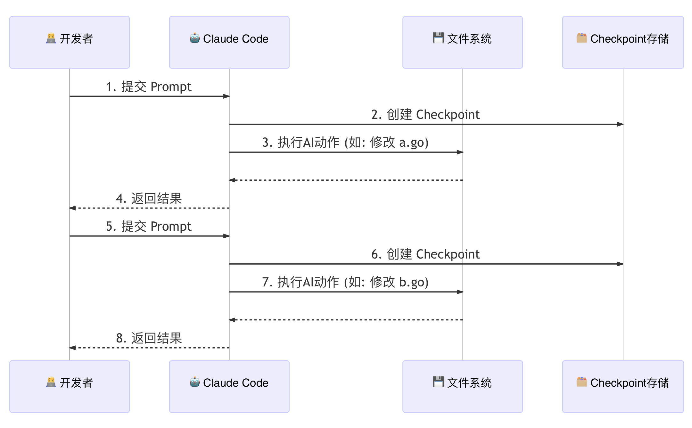
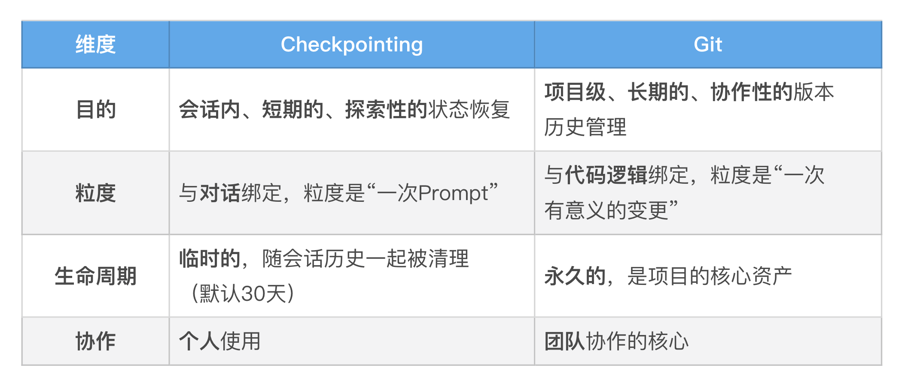

# Checkpointing
想象一下这个场景：你正在让 AI 帮你重构一个祖传的、长达 500 行的 Go 函数。
- 你下达了第一个指令：“先将这个函数拆分成三个更小的私有函数。” AI 完成得很漂亮，你很满意，批准了它的文件修改。
- 你信心大增，下达了第二个指令：“很好。现在，将这几个函数的核心逻辑，用 Go 的泛型进行重写，以提高复用性。”
- AI 再次动手，修改了多个文件，引入了新的类型参数。但这次，你看着生成的新代码，眉头紧锁。它虽然能跑，但设计得过于复杂，可读性反而下降了。
- 你想反悔，回到上一步的状态。但 AI 已经修改了 3 个文件，共计 15 处地方。你是要手动 Ctrl+Z 15 次，还是用 git restore 小心翼翼地恢复部分文件？无论哪种，都很痛苦，而且很容易出错。

这就是我们所说的“**重构的恐惧**”：当 AI 的修改偏离了我们的轨道时，我们缺乏一个简单、可靠、能够一键“反悔”的机制。

---

## Checkpointing 工作原理：会话级的“Git 快照”
Claude Code 的 Checkpointing 机制，就是你开发过程中的“自动存档系统”。它的工作原理可以概括为以下几点：
1.触发时机：每当你（用户）提交一个新的 Prompt 时，Checkpointing 系统就会被触发。它会在 AI 开始思考和行动之前，悄悄地为你的项目状态创建一个快照。

2.保存内容：这个快照，并不仅仅是代码的备份。它完整地记录了那一刻的“时空切片”，主要包含两部分信息：
- 代码状态：当前会话中所有被 AI“染指”过的文件（即被读取或修改过的文件）的完整内容。
- 对话状态：到那一刻为止的完整对话历史。

3.你可以把它想象成一个由 Claude Code 在后台为你维护的、与你项目主仓库完全隔离的“影子 Git 仓库”。
- 每当你提交 Prompt，Claude Code 就在这个“影子仓库”里帮你执行了一次 git commit -a -m "Checkpoint before prompt N"。
- 这个操作极其轻量，并且绝对不会污染你项目本身的 .git 历史。它所有的历史记录都存放在 Claude Code 的内部目录中（如 ~/.claude/ file-history/）。

这个机制的精妙之处在于，它将你的对话历史和代码变更历史，在每一个关键节点上进行了精确的绑定。

在 AI 对你的文件系统进行任何“写”操作之前，一个包含了“之前”所有状态的完美快照，已经被安全地存盘了。

---

## rewind
在 Claude Code 的输入框中，输入 /rewind（或者直接连按两次 Esc 键），“时光机”界面就会出现。

你会看到一个按时间顺序排列的检查点列表（旧的在上面，新的在下面），每一个都对应你提交的一次 Prompt。

当你通过方向键选择你要回退到的检查点并按下回车后，你会看到三个强大的“倒流”选项：

Rewind code（只回退代码）：
- 作用：将你的文件系统恢复到选定检查点的状态，但保留完整的对话历史。
- 心智模型：“AI，我们刚才的讨论都很有价值，但我对你的具体实现不满意。让我们回到你动手之前，然后基于我们刚才的讨论，你再试一次。”
- 适用场景：AI 的思路正确，但代码实现有误。

Rewind conversation（只回退对话）：
- 作用：将你的对话历史回退到选定检查点，但保留文件系统的所有修改。
- 心智模型：“AI，你刚才做的代码修改是对的，但我发现我给你的指令说错了。让我们保留现在的代码，然后从我上一个指令开始，我换个说法。”
- 适用场景：代码修改符合预期，但你想从一个早期的对话节点，探索另一个完全不同的方向。

Rewind code and conversation（全部回退）：
- 作用：彻底的“时光倒流”。将文件系统和对话历史，都完美地恢复到选定检查点的状态。
- 心智模型：“AI，我们刚才那段探索完全是条死胡同。让我们假装它从未发生过，从这个更早的时间点重新开始。”
- 适用场景：当你对 AI 的一系列修改和你们的整个讨论方向都不满意时，这是最彻底、最干净的“重置”按钮。

---

## Checkpointing 的边界：它不能做什么？
**1. 它不跟踪 Bash 命令的副作用**：这是最重要，也是最容易被误解的限制。

Checkpointing 系统只快照文件内容的状态。对于通过 ! 或 Bash 工具执行的命令所产生的副作用，它无能为力。例如，如果 AI 执行了：
- ! rm sensitive-data.log
- ! git push --force
- ! docker stop my-container
这些操作是不可逆的。/rewind 无法帮你恢复被删除的文件、撤销强制推送，或重启被停止的容器。 这也是为什么我们在上一讲强调，对高风险的 Bash 命令，必须使用最严格的 ask 或 deny 权限规则。

**2. 它不跟踪外部编辑**：

Checkpointing 的“眼睛”只盯着由 Claude Code 的内置编辑工具（如 Write, Edit）所修改的文件。如果你在与 AI 对话的同时，自己在 VS Code 或 VIM 里手动修改了 greeting.go，这个手动的修改不会被记录在 Checkpointing 的历史中。

这通常不是问题，但需要记住：/rewind 恢复的是上一个检查点时刻、由 Claude Code 所知晓的文件状态。

**3. 它不是 Git 的替代品**：。

Checkpointing 和 Git 是解决两种不同问题的工具，它们是互补而非替代关系。

最佳实践是：在一个功能开发的过程中，你可以自由地使用 Checkpointing 进行各种大胆的尝试和回滚。当你完成了一个有意义的、稳定的功能点时，再使用 git commit，将这个阶段性的成果，永久地记录到项目的“正式历史”中去。