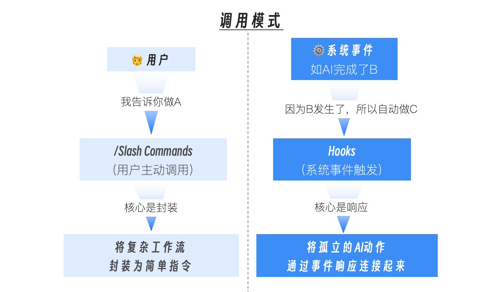
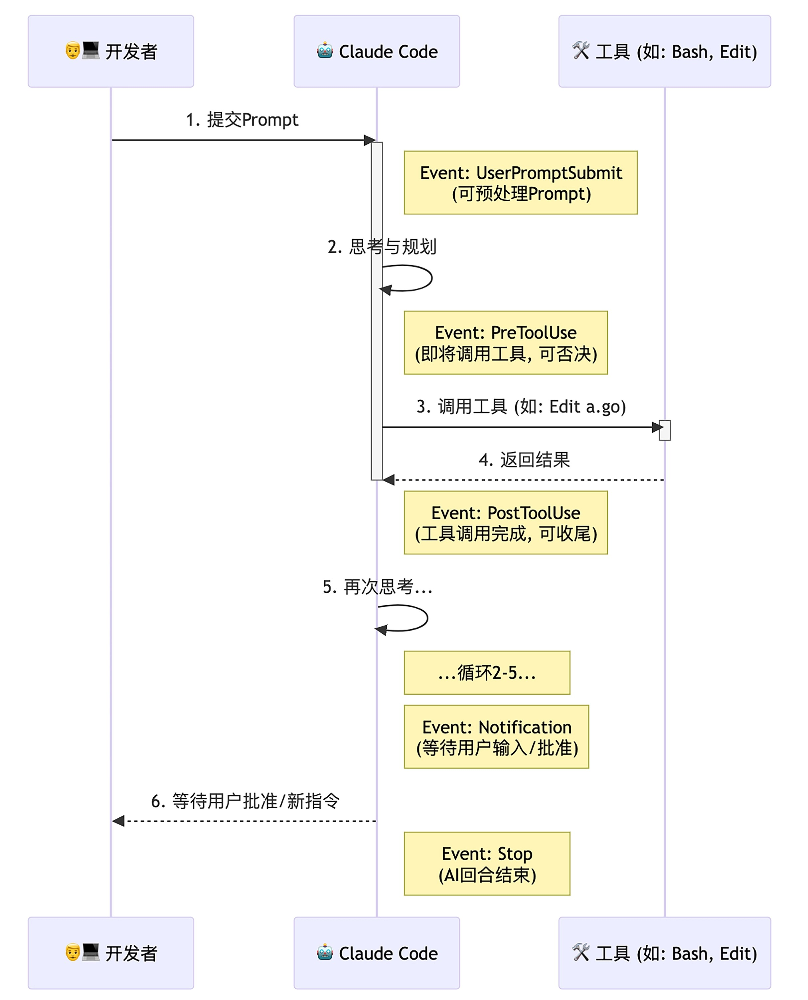

# Hooks



- Slash Commands 是“人驱动”的。它们是你工具箱里的“电动螺丝刀”。你需要主动地拿起它，对准某个目标，然后按下开关。它极大地提升了你执行单个、特定任务的效率。
- Hooks 是“事件驱动”的。它们是你预先设置在 AI 行动路径上的“传感器”和“响应器”。当 AI 生命周期中的某个事件（比如“AI 刚刚完成了一次文件写入”）发生时，对应的 Hook 会自动被触发，执行你预设好的响应动作。它致力于将孤立的 AI 行动，连接成更流畅的自动化序列。

一个成熟的 AI 原生工作流，必然是这两者的完美结合：你使用自定义的 Slash Command 启动一个复杂的任务，而 Hooks 则负责响应这个任务过程中所有可预测的、重复的事件，自动完成“胶水代码”和“收尾工作”。

Claude Code 为我们开放了多个核心的 Hook 事件。让我们通过一个典型的 AI 工作流程，来看看它们各自的位置和作用。



SessionStart/SessionEnd（会话级事件）：
- 时机：分别在 Claude Code 会话启动和退出时触发。
- 价值：适合执行全局的“初始化”和“清理”工作。例如，SessionStart时自动nvm use切换到项目指定的 Node 版本，或者加载环境变量。

UserPromptSubmit（用户输入事件）：
- 时机：当你按下回车，提交一个新的 Prompt 之后，AI 开始处理之前。
- 价值：可以在 AI 思考前，对你的 Prompt 进行“预处理”或“校验”。例如，检查你的指令是否包含某些敏感词，如果包含，则直接阻止本次提交。

PreToolUse（工具调用前事件）：
- 时机：在 AI 决定要调用一个工具（如Edit, Bash），即将执行但还未执行的那个瞬间。
- 价值：这是实现精细化安全控制和行为干预的最强武器。PreToolUse Hook 可以接收到 AI 即将调用的工具名称和参数，并可以通过返回一个非零的退出码（或特定的 JSON）来“一票否决”这次操作。

PostToolUse（工具调用后事件）：
- 时机：在工具调用完成之后，AI 接收到工具返回结果之前。
- 价值：这是实现“自动化收尾工作”的最佳节点。AI 刚刚修改完一个文件，PostToolUse Hook 可以立即触发，运行代码格式化或 Linter。

Notification（通知事件）：
- 时机：当 AI 完成了它的思考和行动，正在等待你输入下一个指令，或等待你对某个权限请求进行批准时。
- 价值：解决了“我不知道 AI 是不是在等我”的问题。我们可以利用这个 Hook，在 AI“空闲”下来并等待我们时，触发一个系统通知。

Stop/SubagentStop（回合结束事件）：
- 时机：分别在 AI 的一个主回合或一个 Sub-agent 任务彻底结束时。
- 价值：适合进行“回合总结”式的工作，比如统计本次回合的 token 消耗，并记录到日志中。

---

## Hooks配置
在 Claude Code 中，所有 Hooks 都定义在你的 settings.json 文件中（可以是 User 级或 Project 级）。其核心结构如下：
```json
{
  "hooks": {
    "<EventName>": [ // 如 PostToolUse
      {
        "matcher": "<ToolPattern>", // 匹配工具的模式，
        "hooks": [
          {
            "type": "command",
            "command": "<your-shell-command-here>",
            "timeout": 60 // 可选的超时时间（秒）
          }
        ]
      }
    ]
  }
}
```
- matcher（匹配器）：这是 PreToolUse 和 PostToolUse 事件特有的字段。它定义了 Hook 应该对哪些工具的调用做出反应，大小写敏感。"Edit|Write"：匹配这两个工具中的任意一个。"Bash(go:test:*)"：只匹配 go test 及其子命令。"" 或 "*"：匹配所有工具。
- command：你要执行的 Shell 命令。这是 Hook 的核心响应动作。
- 上下文传递：Claude Code 通过标准输入（stdin），以 JSON 格式向你的 Hook 命令传递关于当前事件的详细信息。

---

## 实战
### go代码自动格式化
目标：我们希望监听 Edit、Write 或 MultiEdit 工具的成功执行事件，当事件发生且目标文件是 .go 文件时，自动触发 gofmt -w 和 goimports -w 这两个格式化命令。

第一步，在 Claude Code 会话中，输入 /hooks。这是一个交互式的命令，它会引导你完成 Hook 的配置，并将最终结果保存到 settings.json 中。

第二步，选择 PostToolUse 事件，进入 Tool Matcher 配置页面。在“Add new matcher… ”上回车，进入 Add new matcher for PostToolUse 页面。我们输入 Edit|Write|MultiEdit，因为我们只关心文件被编辑的事件。回车确认后，完成该 matcher 添加。

第三步：编写 Hook 响应指令。我们需要编写一个 Shell 命令，它能够从 Claude Code 通过 stdin 传递的事件 JSON 数据中，解析出被修改的文件路径，然后执行格式化操作。PostToolUse 事件传递的 JSON 结构大致如下：
```json
{
  "session_id": "abc123",
  "transcript_path": "/Users/.../.claude/projects/.../00893aaf-19fa-41d2-8238-13269b9b3ca0.jsonl",
  "cwd": "/Users/...",
  "hook_event_name": "PostToolUse",
  "tool_name": "Write",
  "tool_input": {
    "file_path": "/path/to/your/project/internal/api/handler.go",
    "content": "file content"
  },
  "tool_response": {
    "filePath": "/path/to/file.txt",
    "success": true
  }
}
```
我们的命令需要解析这个 JSON，拿到 tool_input.file_path 字段。这里，jq 这个强大的命令行 JSON 处理工具是我们的不二之选。

根据指引进入 hook command 配置页面。输入:
```
FILE=<!--§§MATH_0§§-->FILE in *.go) gofmt -w <!--§§MATH_1§§-->FILE 2>&1 && jq -n --arg f "<!--§§MATH_2§§-->f)}' ;; *) jq -n '{}' ;; esac
```
这个命令是一个完整的 Bash 命令链，用分号 ; 分隔多个语句

第四步：保存配置。回车后，系统会问你将这个配置保存在哪里。选择 Project settings，这样这个自动化格式化的规则，就能被提交到 Git 仓库，成为团队所有成员共享的最佳实践。

按下 Esc 退出配置菜单。现在，你的 ./.claude/settings.json 文件里，应该已经自动生成了如下内容：
```json
{
  "hooks": {
    "PostToolUse": [
      {
        "matcher": "Edit|Write|MultiEdit",
        "hooks": [
          {
            "type": "command",
            "command": "FILE=<!--§§MATH_3§§-->FILE in *.go) gofmt -w <!--§§MATH_4§§-->FILE 2>&1 && jq -n --arg f \"<!--§§MATH_5§§-->f)}' ;; *) jq -n '{}' ;; esac"
          }
        ]
      }
    ]
  }
}
```
实际中，这里的command也可以用python脚本实现。

第五步：验证效果。你可以随便修改一个 Go 文件，让其处于未经 gofmt/goimports 格式化的状态。然后让 AI 修改该 Go 文件。比如：
```
@greeting.go 在这个文件中以空导入的方式导入 time 包
```
你会发现，在 AI 报告“文件修改成功”之后，终端会短暂地、安静地闪过。但如果你此时打开 greeting.go 文件，会发现它不仅空导入了 time 包，而且已经被 gofmt 和 goimports 完美地格式化了。我们成功地将一个重复性的、容易被遗忘的手动操作，通过事件驱动的方式，变成了一个无感的、永远在线的自动化流程。

---

## 调试 Hook
Claude Code 支持 debug 模式运行，在这种模式下运行时，它会将详细的执行日志，包括 Hook 的匹配和命令执行日志输出到调试日志文件中，我们通过查看和分析调试文件，就可以大致了解 Hook 的执行情况。

以 debug 模式运行：
```
claude --debug
```
你在继续和 Claude Code 交互之前，可以用 tail 命令监视调试文件的输出内容。

---

## 实战二：创建 PreToolUse Hook，阻止对 main 分支的直接修改
目标：这是一个更高级的安全实践。我们希望监听 Edit 或 Write 工具的调用前事件，检查当前是否在受保护的分支上，如果是，则自动否决该操作。

第一步，我们在项目根目录的.claude/hooks 下面建立一个名为 check_main_branch.py 命令脚本文件，将我们要进行的 Hook 事件输入处理、检查逻辑以及返回值和输出结果都封装在该脚本文件中：
```python
#!/usr/bin/env python3
"""
Claude Code Hook: Main Branch Protection
=========================================
This hook runs as a PreToolUse hook for Edit, Write, and MultiEdit tools.
It prevents file modifications when on the main branch.

Read more about hooks here: https://docs.anthropic.com/en/docs/claude-code/hooks

Configuration for hooks.json:
{
  "hooks": {
    "PreToolUse": [
      {
        "matcher": "Edit|Write|MultiEdit",
        "hooks": [
          {
            "type": "command",
            "command": "python3 /path/to/check-main-branch.py"
          }
        ]
      }
    ]
  }
}
"""

import json
import subprocess
import sys


def _get_current_branch() -> str:
    """Get the current git branch name."""
    try:
        result = subprocess.run(
            ["git", "rev-parse", "--abbrev-ref", "HEAD"],
            capture_output=True,
            text=True,
            check=True,
            timeout=5
        )
        return result.stdout.strip()
    except subprocess.CalledProcessError:
        # Not in a git repository or git command failed
        return ""
    except subprocess.TimeoutExpired:
        return ""
    except FileNotFoundError:
        # git not installed
        return ""


def _is_main_branch(branch: str) -> bool:
    """Check if the branch is a main branch (main or master)."""
    return branch.lower() in ("main", "master")


def main():
    try:
        input_data = json.load(sys.stdin)
    except json.JSONDecodeError as e:
        print(f"Error: Invalid JSON input: {e}", file=sys.stderr)
        sys.exit(1)

    tool_name = input_data.get("tool_name", "")

    # Check if this is an Edit, Write, or MultiEdit tool
    if tool_name not in ("Edit", "Write", "MultiEdit"):
        sys.exit(0)

    # Get current git branch
    current_branch = _get_current_branch()

    # If not in a git repository, allow the operation
    if not current_branch:
        sys.exit(0)

    # Block operations on main/master branch
    if _is_main_branch(current_branch):
        print(
            f"🚫 Cannot modify files on '{current_branch}' branch.\n"
            f"   Please switch to a feature branch before making changes.",
            file=sys.stderr
        )
        # Exit code 2 blocks the tool call and shows stderr to Claude
        sys.exit(2)

    # Allow operation on other branches
    sys.exit(0)


if __name__ == "__main__":
    main()
```
保存之后，别忘了使用 chomod 为这个文件加上可执行的权限:
```
chmod +x <project_root_dir>/.claude/hooks/check_main_branch.py
```

第二步：选择 Hook 事件与 Matcher进入 /hooks 配置菜单。
- 事件：选择 PreToolUse，因为我们要在操作发生之前进行拦截。
- Matcher：输入Edit|Write|MultiEdit，因为我们只关心有破坏性的写操作。

第三步：编写 Hook 响应命令这次我们只需要在 Command 输入框中输入：
```
"$CLAUDE_PROJECT_DIR"/.claude/hooks/check_main_branch.py
```
这里的 $CLAUDE_PROJECT_DIR 是一个内置的已知环境变量，Claude Code 会在执行该 Hook command 时，将其替换为项目当前的根目录路径。

保存后，会在settings.json 文件中生成如下配置：
```json
{
  "hooks": {
    "PreToolUse": [
      {
        "matcher": "Edit|Write|MultiEdit",
        "hooks": [
          {
            "type": "command",
            "command": "\"$CLAUDE_PROJECT_DIR\"/.claude/hooks/check_main_branch.py"
          }
        ]
      }
    ]
  }
}
```