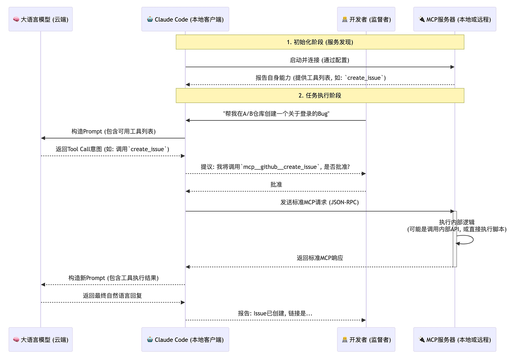
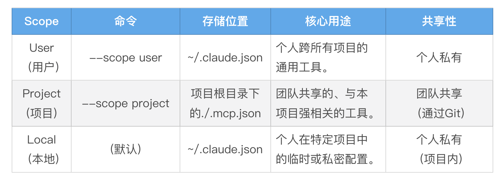

# Claude Cdoe with MCP
Claude Code的世界里，Claude Code 是一个 MCP Hosts，Claude Code 通过 MCP 协议与 MCP Servers 进行通信。

MCP Hosts（Claude Code）接收到 AI 模型的 Tool Call 意图后，通过其内部为特定服务器创建的客户端实例，将这个意图封装成一个标准的 MCP 协议请求，并发送给该服务器。服务器执行内部逻辑后，通过同一条专线连接，将结果返回给客户端，最终由主机呈现给用户或再次提交给 AI 模型。

这个流程清晰地揭示了 MCP 的几个关键特性：
- 服务发现：在连接之初，MCP 服务器就会向 Claude Code“自我介绍”，告诉 AI 自己拥有哪些工具（Tools）以及每个工具需要什么参数。
- 责任分离：AI 大模型只负责根据可用工具列表，产生“调用哪个工具”的意图。Claude Code 客户端负责将这个意图，翻译成标准的 MCP 协议请求。而 MCP 服务器则只负责响应这个标准协议，执行自身的业务逻辑。
- 命名空间：Claude Code 会自动为来自不同 MCP 服务器的工具加上命名空间前缀，格式为 `mcp__<server_name>__<tool_name>`，避免冲突。
- 认证解耦：这是 MCP 安全模型的核心。整个过程中，AI 大模型本身完全不接触任何敏感的 API Key 或 Token。认证凭证的配置发生在主机（Claude Code）侧。主机在启动时，会将这些配置好的凭证安全地注入到运行环境中（通常是通过环境变量）。

---

## 安装MCP Server
要将一个 MCP 服务器“注册”到 Claude Code 中，我们主要使用 claude mcp add 命令。根据服务器的部署方式，它支持三种传输协议（Transport）：
- --transport http：用于连接远程的、通过 HTTP 提供服务的 MCP 服务器。
- --transport sse：(已废弃) 用于连接老的、通过 Server-Sent Events
- --transport stdio：用于连接在你本地运行的、通过标准输入 / 输出（stdin/stdout）进行通信的 MCP 服务器。

你需要决定这个服务器配置的作用域（Scope），这决定了它的可用范围和共享级别:

【最佳实践】遵循一个简单的原则：需要团队所有成员都使用的服务，用 --scope project；只属于你自己的、跨项目通用的工具，用 --scope user；临时的、不想提交到 Git 的个人测试，使用默认的 local scope。