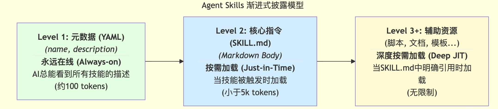

# Agent Skill
我们不可能为每一个垂直领域（比如“处理公司财务报表”“遵循团队 Figma 设计规范”“分析 Kubernetes 日志”）都去从零开始训练一个专门的大模型，那样的成本是天文数字。我们也不想把所有领域的专业知识都一股脑地塞进一个巨大的、难以维护的 CLAUDE.md 文件里，那样会迅速撑爆 AI 的上下文窗口，导致其性能下降和“认知混乱”。

我们需要一种更先进的知识封装和调用机制。这种机制，应该能让我们的专业知识像一个个独立的“知识插件”一样存在，只有在 AI 处理相关任务时，才被精准地、动态地、高效地加载进来。

正是 Anthropic 给出的革命性答案——Agent Skills（智能体技能）。

---

## 为什么说 Agent Skills 是能力涌现的关键？
- 指令（如 Slash Command）：是一个“祈使句”。它由用户发起，明确地告诉 AI“去做这件事”。例如，/review-go-code。
- 技能（Skill）：是一段“陈述句”。它由开发者预先定义，安静地躺在那里，向 AI“自我介绍”：“我是一种能做某件事的能力”。例如，“我是一个能够根据 Go 项目规范审查代码的技能”。

这，就是“智能涌现”的关键。 我们不再需要为每一个任务都设计一个精确的指令。我们只需要像建设一个图书馆一样，不断地用标准化的格式，为 AI 丰富它的“技能库”。AI 则会像一个聪明的学者，根据自己要研究的课题，自主地去图书馆里查找并使用最相关的书籍和工具。

---

## 一个 Skill 的具体形态
**基础结构：一个文件夹 + 一个 SKILL.md**
```
my-first-skill/
└── SKILL.md
```
这个 SKILL.md 文件，就是这个技能的“灵魂”和“大脑”，它由两部分构成：
- YAML Frontmatter（元数据）：文件最顶部由 --- 包围的区域。它定义了这个技能的“身份证”。其中，name（技能的唯一标识）和 description（技能的功能和触发时机的描述）是必须的。
- Markdown Body（指令主体）：文件的主体部分。它包含了当这个技能被激活时，AI 需要遵循的具体步骤、指南和示例。
```
---
name: my-skill-name
description: A clear description of what this skill does and when to use it.
---

# My Skill Name

[这里是AI在激活此技能时需要遵循的具体指令...]
```

**进阶结构：封装脚本与辅助文档**
```
pdf-processing-skill/
├── SKILL.md          # 技能的入口和核心指令
├── forms.md          # 专门处理PDF表单的详细指南
├── reference.md      # 更深入的PDF处理技术参考
└── scripts/
    ├── fill_form.py  # 可被SKILL.md中指令调用的Python脚本
    └── ...           # 其他辅助脚本
```
当一个技能变得复杂时，我们可以将不同的知识和工具，拆分到不同的文件中，形成一个自包含的“知识胶囊”。上面是官方 document-skills-pdf 示例所展示的高级模式。

在这个结构中，SKILL.md 扮演了“总纲”或“路由”的角色，它会在适当的时候，引导 AI 去阅读 forms.md 或调用 scripts/ 目录下的脚本。

---

## 部署位置：Project 级 vs. User 级
你创建的这些 Skill 文件夹，可以放在两个标准位置，这决定了它们的作用域：
Project Skills（团队共享）：
- 位置：项目根目录下的 ./.claude/skills/project-first-skill。
- 特点：这些技能会随着项目一起被提交到 Git 仓库。团队中的任何成员，只要克隆了项目，就能立即拥有这些技能。
- 用途：封装团队共享的最佳实践、项目特定的工作流。例如，go-code-reviewer、deploy-to-staging。

Personal Skills（个人专属）
- 位置：用户主目录下的 ~/.claude/skills/my-person-skill。
- 特点：这些技能只存在于你自己的机器上，可以在你所有的项目中随时被 AI 发现和调用。
- 用途：封装你个人的高频习惯、私人脚本工具集。例如，summarize-git-diff、translate-to-english。

Claude Code 在启动时，会自动扫描这两个目录，构建起它可用的“技能库”。

---

## “渐进式披露”：解决 AI 上下文瓶颈的优雅之道
Agent Skills 的设计哲学，可以用四个词来概括：可组合（Composable）、可移植（Portable）、高效（Efficient）、强大（Powerful）。而支撑这一切的核心机制，是一种被称为“渐进式披露（Progressive Disclosure）”的信息加载策略。它完美地解决了“为 AI 提供海量专业知识”与“保持其上下文窗口（Context Window）轻量高效”之间的根本矛盾。

通过一个三层信息加载模型来理解其精髓：



这个三层模型，就像是为 AI 设计的一套高效的“记忆检索系统”：
- Level 1：元数据（发现层 / 能力索引）：当 Claude Code 启动时，它会扫描所有可用的 Skills。但关键在于，它只加载每个 SKILL.md 文件最头部的 YAML Frontmatter，特别是 name 和 description 字段。这些极其简短的描述会被永久地注入到 AI 的系统提示（System Prompt）中。 这相当于为 AI 构建了一个可无限扩展的“能力索引”。AI 的知识库可以无限大，但它的“工作记忆”却只存放了索引，成本极低。这就是 Skills 解决可扩展性（Scalability）问题的答案。
- Level 2：核心指令（触发层 / 即时加载）：当用户提出一个任务时，AI 会用这个任务的意图去和它脑中的“能力索引”进行语义匹配。如果匹配成功，AI 就“触发”了这个 Skill。此时，它才会去真正地读取那个 SKILL.md 文件的主体内容（Markdown Body）。 这个过程，就是一种“即时加载（Just-in-Time Loading）”专业知识的体现。当 AI 需要成为一个“PDF 专家”时，它才去“阅读”那本名为pdf-skill.md的专业书籍，而不是把它所有的书都背在身上。这完美地解决了上下文效率（Efficiency）的问题。
- Level 3+：辅助资源（执行层 / 深度按需加载）：如果 SKILL.md 中的指令，又引用了该 Skill 目录下的其他文件（比如一个 Python 脚本 helper.py），AI只有在执行到那一步时，才会去加载那个具体的文件。 这是更深层次的按需加载，它允许我们构建包含大量脚本、模板、数据和文档的、极其复杂的 Skill，而不用担心会一次性撑爆 AI 的上下文窗口。这赋予了 Skills 强大的（Powerful）能力。

Skills 又是如何实现可组合性与可移植性的呢？
- 可移植性（Portable）：源于其标准化的文件夹结构。就像之前所讲解的那样，一个 Skill 本质上就是一个自包含的文件夹，你可以轻松地在不同项目、不同团队成员之间通过 Git 进行复制和共享，甚至跨 Claude Code、Claude API 等不同产品使用。Build once, use everywhere.
- 可组合性（Composable）：源于 AI 模型的自主协调能力。如果一个复杂任务同时触及多个技能的 description，AI 能够像一个项目经理一样，先后或交错地调用这些技能，共同完成最终任务。

---

## Skills vs. Slash Commands vs. Sub-agents


- 当你希望自己能方便快捷地触发一个固定流程时，用 Slash Command。
- 当你希望 AI 在处理某个特定领域的问题时，能自动地、更聪明地工作时，用 Agent Skill。
- 当你希望 AI 能将一个复杂的大问题，分包给一个不会干扰你当前对话的“专家分身”去独立解决时，用 Sub-agent。

---

## 实战
把[slashcommands](./8.%20slash%20commands.md)中创建的 /review-go-code 这个 Slash Command，改造为一个更智能、可被 AI 自主发现的 Agent Skill。

**第一步：创建 Skill 目录结构**。根据官方规范，Project 级的 Skill 应该存放在 ./.claude/skills/ 目录下。我们为新的 Skill 创建一个目录：
```bash
mkdir -p ./.claude/skills/go-code-reviewer
```
目录名 go-code-reviewer 将成为这个 Skill 的 ID.

**第二步：创建并编写 SKILL.md**, ./.claude/skills/go-code-reviewer/SKILL.md
```
---
name: Go Code Reviewer
description: A specialized skill for reviewing Go (Golang) code based on the project's constitution. Use this skill whenever a user asks to review Go code, check for best practices, or analyze code quality in this repository.
allowed-tools: Read, Grep, Glob
---

# Go Code Reviewer Skill

## 核心能力
本技能专用于根据本项目的开发“宪法” (`constitution.md`)，对Go语言代码进行深入、专业的审查。

## 触发条件
当用户的请求包含以下关键词时，你应该优先考虑激活本技能：
- "审查/review Go代码"
- "检查代码质量"
- "看看这段Go代码写得怎么样"
- "是否符合规范"

## 执行步骤
当你决定使用本技能时，必须严格遵循以下步骤：

1.  **加载核心准则:** 首先，你必须读取项目根目录下的 `constitution.md` 文件。这是你所有审查工作的最高准则。如果找不到该文件，应向用户报告。

2.  **定位审查目标:** 确定用户要求审查的代码范围。这可能是一个文件（通过`@`指令提供），或是一个目录。

3.  **逐条审查:** 根据`constitution.md`中定义的**每一条原则**（如简单性、测试先行、明确性、单一职责），对目标代码进行逐一比对和分析。

4.  **生成报告:** 按照以下Markdown格式，生成一份结构化的审查报告。报告必须直接回应“宪法”中的条款。

## 输出格式 (必须遵循)

### 总体评价

一句话总结代码的整体质量和合宪性。

### 优点 (值得称赞的地方)
- 列出1-2个最符合项目开发哲学的闪光点。

### 待改进项 (按优先级排序)
#### [高优先级] 违宪问题 (Violations of Constitution)
- **原则:** [引用违反的宪法条款，如：“第三条：明确性原则”]
- **位置:** `[文件名]:[行号]`
- **问题描述:** [清晰描述代码是如何违反该原则的]
- **修改建议:** [提供具体的、可执行的修改方案]

#### [中优先级] 建议性改进
- **位置:** `[文件名]:[行号]`
- **问题描述:** [描述可以进一步优化的地方]
- **修改建议:** [提供改进建议]
```
这个 SKILL.md 和我们之前的 Slash Command，发生了哪些关键的“升维”：
- 从“被动执行”到“主动思考”：Slash Command 的内容是：“请审查 @$1…”，它是一个直接的命令。而 Skill 的内容是：“本技能专用于审查…当你决定使用本技能时，请遵循以下步骤…”，它在向 AI 描述一种能力，并编程 AI 在使用该能力时的思考和行动流程。
- description 的魔力：新增的 description 字段是关键。Use this skill whenever a user asks to review Go code... 这部分，就是在为 AI 的“自主发现”机制，提供最关键的“索引关键词”。
- 更强的流程控制：Skill 中的“执行步骤”和“输出格式”部分，比 Slash Command 中的指令更详细、更具强制性。这是因为当 AI 自主调用一个能力时，我们需要比用户手动调用时，给予它更严格的流程约束，以保证输出的稳定性和可靠性。

**第三步：验证效果**
以 --debug 模式启动一个新的 Claude Code 会话，在 debug 日志的启动日志中，你可以看到 Claude Code 对我们定义的 Skill 的加载：
```
[DEBUG] Skills and commands included in Skill tool: Go Code Reviewer
```
然后，在这个会话中，我们不再使用指令，而是用一句非常自然的、口语化的方式提出请求：
```
帮我看看 internal/converter/ 目录下的 Go 代码写得怎么样，是否符合我们的项目规范？
```
接下来，你可能会在 Claude Code 的思考阶段看到类似这样的内部思考过程，包括读取 Go 代码、读取 constitution.md 以及匹配我们的 go-code-reviewer Skill 的操作。

AI 已经学会了自主地、智能地从它的“技能库”中，为我们的任务匹配并执行最合适的解决方案。

---

## 从官方 PDF Skill 示例看高级模式
Skills 的真正威力，在于它们能够封装包含多个辅助文档和可执行脚本的复杂能力。

这个 Skill 的目录结构，完美地诠释了“渐进式披露”的思想：
```
pdf/
├── SKILL.md          # Level 2: 核心入口和指令
├── forms.md          # Level 3+: 专门处理PDF表单的详细指南
├── reference.md      # Level 3+: 更深入的PDF处理技术参考
└── scripts/
    ├── fill_form.py  # Level 3+: 可被SKILL.md中指令调用的Python脚本
    └── ...           # 其他辅助脚本
```


SKILL.md 的主体内容，就像一个“路由”。

最关键的一点：forms.md、reference.md 和那些 Python 脚本，只有在被明确“提及”时，才会被加载到上下文中。AI 在处理一个简单的文本提取任务时，完全不会知道 forms.md 的存在，从而极大地节省了 Token。

这个官方示例，为我们揭示了**设计复杂 Skill 的最佳实践**：将你的专业知识，像写一本结构清晰的书一样组织起来。SKILL.md 是“目录”，辅助文档是“章节”，而可执行脚本，则是可以随时取用的“工具箱”。

---

## Skills 的设计哲学与最佳实践
**保持技能的“单一职责”**：比如，创建三个独立的 Skill：pdf-form-filling、word-doc-analysis、markdown-table-generator。

**精心撰写“技能广告语”**：description 字段是 AI 发现你技能的唯一入口。你必须像一个顶级的广告文案写手一样，精心打磨它。一个好的 description 必须清晰地回答两个问题：“这个技能能做什么？”和“什么时候该用它？”。例如：
```
yaml description: Analyze Excel spreadsheets, create pivot tables, and generate charts. Use when working with Excel files, spreadsheets, or analyzing tabular data in .xlsx format
```

**与团队一起“测试”和“演进”**:
Skills 并非一蹴而就。一个真正好用的 Skill，是在团队的实际使用中不断打磨出来的。你应该鼓励团队成员：
- 主动反馈：“我希望 AI 帮我做 X，但它没有调用 Y 技能，是不是 Y 技能的 description 不够好？”
- 共同建设：在 SKILL.md 中，像维护代码一样，通过注释或专门的章节，记录下使用的“坑”和成功的“模式”。
- 版本化文档：为你的 SKILL.md 添加版本历史。这对于团队共享的技能至关重要，它能让成员清晰地了解一个技能的能力边界在何时发生了变化。
```
## Version History
- v2.0 (2025-10-21): Added support for processing password-protected PDFs.
- v1.0 (2025-09-10): Initial release, supports text extraction and form filling.
```