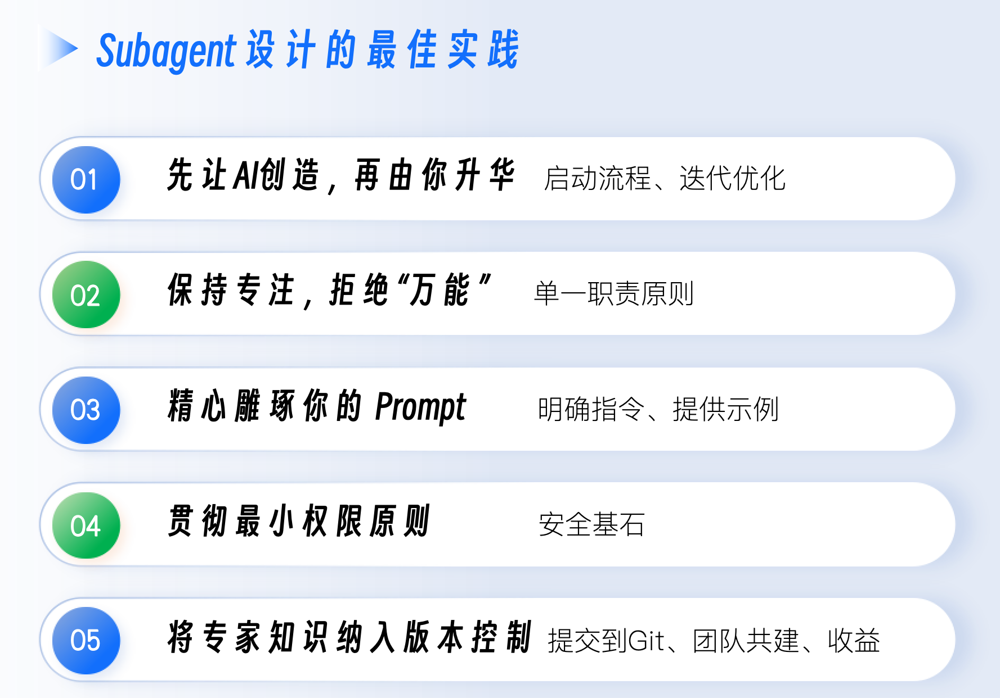

# Subagent
当你让同一个 AI Agent 同时扮演这两个“精神分裂”的角色时，混乱就产生了。AI 可能会在两个目标之间摇摆不定，或者因为上下文过于混杂而“忘记”了核心任务，最终的输出质量往往难以保证。

我们需要的，不再是一个试图精通所有事情的“超级个体”，而是一个能够协同作战的“专家团队”。这，正是我们今天要精通的终极能力扩展方式——Subagent（智能分身）机制。

单一 Agent 模型的根本瓶颈：对于开放式的、路径不确定的复杂问题（比如技术研究、大规模重构），依赖单个智能体“一条路走到黑”的线性探索，效率低下且容易陷入局部最优。

现实世界中的专家团队是如何解决这类问题的？他们采用并行处理和关注点分离。一个团队会分解任务，让数据库专家、前端专家和安全专家同时在各自的领域进行探索，最后再将各自的结论汇总。这正是多智能体系统（Multi-agent System）的核心思想。

一个设计良好的多智能体系统，其优势是压倒性的：
- 上下文压缩与并行推理：这是最核心的优势。一个主智能体（Orchestrator）可以将一个大问题分解为 5 个子问题，然后并行地启动 5 个 Subagent。每个 Subagent 都在自己独立的、干净的上下文窗口中，专注地研究自己的子问题。最后，它们只将高度浓缩的结论返回给主智能体。这相当于用 5 * ContextWindowSize 的总上下文容量，去解决一个远超单个智能体能力范围的问题。
- 关注点分离：每个 Subagent 都可以拥有自己独特的 Prompt（性格）、工具集（技能）和探索轨迹。这避免了单一 Agent 的“精神分裂”，让每个“专家”都能在自己的领域内做到最好。

Subagent 的核心价值在于上下文隔离和深度专注，这是Slash Command和Agent Skill无法替代的。

---

## Subagent 是什么
Subagent 是拥有独立上下文和工具的专家分身。它允许 AI 在主会话中，根据任务需要，“分身”出一个或多个临时的、专用的、拥有独立上下文的“专家 AI”来处理特定的子任务。

一个 Subagent 的核心特质包括：
- 独立的上下文窗口：这是最关键的特性。每个 Subagent 都有自己的一片“内存空间”，它在工作时不会读取、也不会污染主会话的对话历史。这从根本上解决了“上下文污染”的问题。
- 专属的系统提示：每个 Subagent 都由一个 Markdown 文件定义，其核心就是一段为它量身定制的 System Prompt。这解决了“指令冲突”的问题，让“安全专家”只思考安全的事，“性能专家”只思考性能的事。
- 精细的工具权限：你可以为每个 Subagent 单独配置它能使用的工具集。这遵循了“最小权限原则”，极大地增强了安全性。你可以放心地只给“代码审查员”只读工具，而把高风险的Bash工具留给“DevOps 工程师”。


## Subagent具像化
一个 Subagent 的全部定义，都浓缩在一个带有 YAML Frontmatter 的 Markdown 文件中。

Claude Code 会在两个标准位置自动发现这些“专家”定义文件。

Project-level Subagents（项目级专家）
- 位置：./.claude/agents/
- 作用域：仅在当前项目中可用
- 最佳实践：用于定义与本项目强相关的、需要团队共享的专家角色。例如，“api-design-reviewer”或“database-migration-generator”。这些文件应该被提交到 Git 仓库，成为团队的公共资产。

User-level Subagents（用户级专家）
- 位置：~/.claude/agents/
- 作用域：在你本地的所有项目中都可用
- 最佳实践：用于定义你个人的、跨项目的通用专家。例如，english-polisher 或 shell-script-optimizer

当同名 Agent 在这两个位置同时存在时，项目级（Project-level）的定义会覆盖用户级（User-level）的，这确保了在团队项目中，所有人使用的都是统一的团队标准。


一个Subagent的.md文件由两部分构成：顶部的 YAML Frontmatter（由 --- 包围）和下方的 Markdown 正文。
```
---
name: your-sub-agent-name
description: A clear, keyword-rich description of what this agent does and when to use it.
tools: Read, Grep, Glob, Bash(gosec:*)  # Optional
model: opus  # Optional: opus, sonnet, haiku, or inherit
---

You are an expert Go security code reviewer. 
This is the System Prompt, the "soul" of the agent.
It defines the agent's personality, goals, and operational procedures.
```
- name（必需）：这是 Subagent 的唯一 ID，也是主 Agent 调用它时使用的名字。它必须是小写字母和连字符的组合，例如go-code-security-reviewer。
- description（必需）：这是整个 Subagent 定义中最至关重要的部分！description 是主 Agent 用来自主发现和决定是否委托这个 Subagent 的核心依据。AI 会通过语义匹配，将用户的任务需求与所有可用 Subagent 的 description 进行比较。
- tools（可选）：这是一个权限定义。你可以在这里为这个 Subagent 单独配置它能使用的工具集。
  - 如果省略这个字段，Subagent 会继承主会话的全部工具权限。
  - 如果提供了这个字段，Subagent 将只能使用你明确列出的工具。例如，tools: Read, Grep 意味着这个 Agent 连修改文件的能力都没有，非常安全。
- model（可选）：这个字段允许你为 Subagent 指定一个特定的 AI 模型。你有以下几个选择：
  - opus、sonnet、haiku：强制该 Subagent 使用特定级别的模型。对于需要深度推理的复杂任务（如安全审计），可以强制使用opus；对于简单的、重复性的任务，可以使用 haiku 来降低成本和延迟。
  - inherit：继承主会话当前正在使用的模型。这是保持能力和风格一致性的好方法。
  - 如果省略这个字段，Claude Code 会使用一个默认的 Subagent 模型（通常是 sonnet）。

---

## /agents 可视化配置中心
虽然你可以手动创建和编辑这些.md文件，但 Claude Code 提供了一个更友好、更不容易出错的管理方式——/agents 指令。在 Claude Code 会话中输入/agents，你会进入一个交互式的管理界面，在这里你可以查看、创建、修改、删除 Subagent.

---

## Subagent 精确控制和协同
根据 subagent 的 description，主 Agent 可以在对话中自主决策，将任务委托出去，这就是隐式调用。
如果你希望更精确地控制使用哪个专家。你可以直接在 Prompt 中直接“点名”。

Subagent 真正的威力，体现在处理需要多种专业能力协同的复杂工作流上。你可以像一个 CTO 一样，编排多个 Subagent 接力工作。

复杂任务：
```
First, use the performance-optimizer agent to refactor the @internal/billing module for speed.After that, use the go-code-security-reviewer agent to perform a security audit on the refactored code.Finally, use the test-coverage-enhancer agent to ensure the new code has adequate test coverage.
```
在这个指令中，你不再是一个简单的提问者，而是一个工作流的编排者。你定义了一个由三个专家（性能、安全、QA）依次参与的、自动化的、高质量的交付流水线。这正是构建多智能体系统的雏形。

---

## 最佳实践
