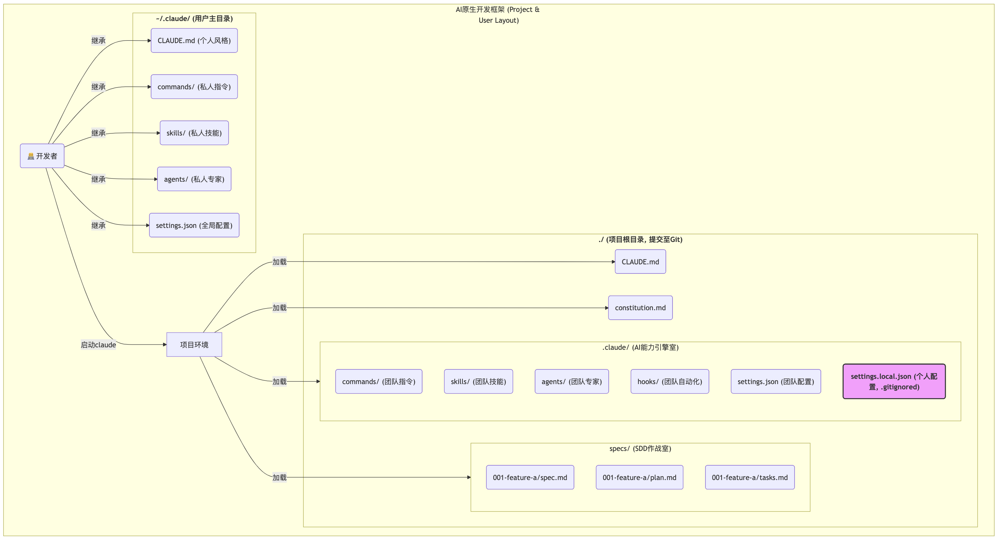

# Framework
一个精心设计的“AI 协作框架”，能将团队的 AI 协作能力，从“游击战”提升到“体系作战”的高度。它提供了一个统一的“作战平台”，确保 AI 在任何时间、任何地点、由任何团队成员指挥时，都能表现出一致的、专业的、符合团队最佳实践的行为。

设计原则：
- 模块化：每一种 AI 能力（指令、技能、subagent 专家）都应该被封装在独立的、可维护的文件或目录中。
- 分层：清晰地区分不同作用域的配置，如团队共享 vs. 个人专属，项目级 vs. 全局。
- 可共享：框架的核心部分应该能够被轻松地提交到 Git 仓库，随项目一起分发。
- 可扩展：框架必须是“活”的，能够随着团队能力的提升以及经验的积累，方便地添加新的能力和规则。



在一个标准的团队项目中，你的根 .gitignore 文件应该至少包含：
```
# 忽略所有用户本地的Claude Code配置
.claude/settings.local.json

# 忽略IDE和系统文件
.vscode/
.idea/
*.DS_Store
```

.claude/settings.local.json 这个文件非常关键，它允许团队成员在不修改共享的 settings.json 的情况下，覆盖或添加自己私有的配置（比如换一个自己喜欢的主题）。


---

## 动手实践：初始化我们的 Go 项目 AI 协作框架

**第一步：创建并进入我们的项目目录**

**第二步：创建框架的“骨架”——目录结构**

执行以下命令，创建我们在蓝图中设计好的所有核心目录：
```bash
# 1. 创建AI能力引擎室
mkdir -p ./.claude/{commands,skills,agents,hooks}

# 2. 创建SDD作战室
mkdir -p ./specs

# 3. 创建.gitignore文件，并写入核心忽略规则
echo ".claude/settings.local.json" > .gitignore
echo ".vscode/" >> .gitignore
echo ".idea/" >> .gitignore
echo "*.DS_Store" >> .gitignore
echo "/my-issue2md-project" >> .gitignore # 忽略构建产物（假设与目录同名）
```

**第三步：注入“灵魂”与“大脑”——填充核心记忆文件**

1. 创建并填充 constitution.md (项目宪法)
```
# issue2md 项目开发宪法
# Version: 1.0, Ratified: $(date +%Y-%m-%d)

本文件定义了本项目不可动摇的核心开发原则。所有AI Agent在进行技术规划和代码实现时，必须无条件遵循。

---

## 第一条：简单性原则 (Simplicity First)
**核心：** 遵循Go语言的“少即是多”哲学。绝不进行不必要的抽象，绝不引入非必需的依赖。
- **1.1 (YAGNI):** 只实现`spec.md`中明确要求的功能。
- **1.2 (标准库优先):** 必须优先使用Go标准库，例如Web服务使用`net/http`。
- **1.3 (反过度工程):** 简单的函数和数据结构优于复杂的接口和继承体系。

---

## 第二条：测试先行铁律 (Test-First Imperative) - 不可协商
**核心：** 所有新功能或Bug修复，都必须从编写一个（或多个）失败的测试开始。
- **2.1 (TDD循环):** 严格遵循“Red-Green-Refactor”循环。
- **2.2 (表格驱动):** 单元测试必须优先采用表格驱动测试（Table-Driven Tests）的风格。
- **2.3 (拒绝Mocks):** 优先编写集成测试，使用真实的依赖。

---

## 第三条：明确性原则 (Clarity and Explicitness)
**核心：** 代码的首要目的是让人类易于理解。
- **3.1 (错误处理):** **不可协商**：所有错误都必须被显式处理。错误传递时必须使用`fmt.Errorf("...: %w", err)`进行包装。
- **3.2 (无全局变量):** 绝不允许使用全局变量来传递状态，所有依赖必须通过函数参数或结构体成员显式注入。

---

## 治理 (Governance)
本宪法具有最高优先级，其效力高于任何`CLAUDE.md`或单次会话中的指令。
```
这份文件是我们为 AI 设定的不可动摇的架构铁律


2. 创建并填充CLAUDE.md (项目操作手册)
```
# ==================================
# issue2md 项目上下文总入口
# ==================================

# --- 核心原则导入 (最高优先级) ---
# 明确导入项目宪法，确保AI在思考任何问题前，都已加载核心原则。
@./constitution.md

# --- 核心使命与角色设定 ---
你是一个资深的Go语言工程师，正在协助我开发一个名为 "issue2md" 的工具。
你的所有行动都必须严格遵守上面导入的项目宪法。

---
## 1. 技术栈与环境
- **语言**: Go (版本 >= 1.24)
- **构建与测试**:
  - 使用 `Makefile` 进行标准化操作。
  - 运行所有测试: `make test`
  - 构建Web服务: `make web`

---
## 2. Git与版本控制
- **Commit Message规范**: 严格遵循 Conventional Commits 规范。
  - 格式: `<type>(<scope>): <subject>`
  - 当被要求生成commit message时，必须遵循此格式。

---
## 3. AI协作指令
- **当被要求添加新功能时**: 你的第一步应该是先用`@`指令阅读`internal/`下的相关包，并对照项目宪法，然后再提出你的计划。
- **当被要求编写测试时**: 你应该优先编写**表格驱动测试（Table-Driven Tests）**。
- **当被要求构建项目时**: 你应该优先提议使用`Makefile`中定义好的命令。
```
这份文件是 AI 执行具体任务时的“SOP（标准操作流程）”。


**第四步：建立“安全护栏”——填充 settings.json**

我们为框架注入安全性和标准化配置。把在第 09 讲设计的 permissions 配置作为团队的共享基线。
```
cat <<'EOF' > ./.claude/settings.json
{
  "permissions": {
    "defaultMode": "plan",
    "allow": [
      "Read(*.go)",
      "Read(go.mod)",
      "Read(Makefile)",
      "Read(README.md)",
      "Read(constitution.md)",
      "Read(specs/**)",
      "Grep",
      "Glob",
      "LS",
      "Bash(go:version)",
      "Bash(go:list:*)",
      "Bash(go:build:*)",
      "Bash(go:test:*)",
      "Bash(gofmt:*)",
      "Bash(goimports:*)",
      "Bash(golangci-lint:run:*)"
    ],
    "ask": [
      "Write",
      "Edit",
      "MultiEdit",
      "Bash(go:get:*)",
      "Bash(go:mod:tidy)",
      "Bash(git:add:*)",
      "Bash(git:commit:*)"
    ],
    "deny": [
      "Read(./.env*)",
      "Read(*.pem)",
      "Read(*.key)",
      "Bash(rm:*)",
      "Bash(git:push:*)",
      "WebFetch"
    ]
  }
}
EOF
```

**第五步：初始化用户级框架（可选，但强烈推荐）**

项目级框架已经就绪。为了获得最佳体验，我们还应该确保我们的用户级框架也已初始化。如果你的 ~/.claude 目录还不存在，可以运行以下命令:
```bash
# --- 初始化用户级框架 (如果不存在) ---
mkdir -p ~/.claude/{commands,skills,agents}
touch ~/.claude/settings.json
touch ~/.claude/CLAUDE.md
```

**第六步：验证框架**

在你的项目根目录中，启动 Claude Code：
```bash
claude
```
启动后，输入 /memory 命令并回车。

此时，Claude Code 会打开一个编辑器，显示它当前加载的所有上下文。你应该能清晰地看到，我们刚刚编写的 constitution.md 和 CLAUDE.md 的内容，都已经被自动加载了进来。

这意味着，从此刻起，你在这个项目中的任何一次 AI 对话，都会在我们设计的这个强大、安全、规范化的框架之上进行。AI 不再是一个“一张白纸”的通用模型，而是一个从启动第一秒就“入职”了我们项目的、了解我们技术哲学和操作规范的“资深团队成员”。

在接下来的实战篇中，我们将不断地向这个我们亲手搭建的框架中，“填充”进我们自己的指令、技能、专家和规则，让它随着我们的项目一同成长，变得越来越强大。


**第七步：将框架纳入版本控制**

我们刚刚构建的这一切——目录结构、constitution.md、CLAUDE.md、settings.json——并不仅仅是一堆配置文件。它们共同构成了我们团队的 AI 协作基础设施。就像 Dockerfile 或 CI/CD 配置一样，它们是项目的核心资产，必须被纳入版本控制。