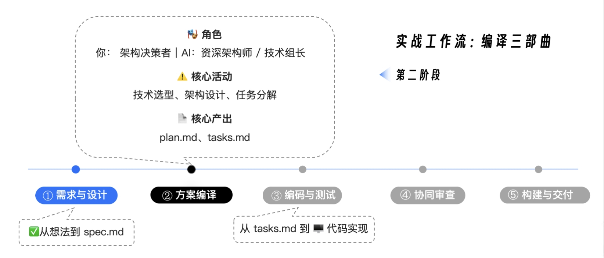

# plan and task



## plan
plan.md 是连接“做什么”（WHAT）和“怎么做”（HOW）的关键桥梁。在这个阶段，我们将扮演架构决策者，为 AI 提供关键的技术约束；而 AI 则将扮演资深架构师，负责将这些约束与 spec.md 的需求相结合，生成一份完整的技术实现蓝图。

生成plan.md prompt:
```
**Prompt 1: 生成技术方案**

`@./specs/001-core-functionality/spec.md`

你现在是`issue2md`项目的首席架构师。你的任务是基于我提供的`spec.md`以及我们已有的`constitution.md`（你已自动加载），为项目生成一份详细的技术实现方案（`plan.md`）。

**技术栈约束 (必须遵循):**

- **语言**: Node.JS (>=20)
- **Web框架**: 使用 Fastify 框架。
- **Markdown输出处理**: 尽量不使用任何第三方库。
- **数据存储**: 本项目初期**不需要数据库**，所有数据通过API实时获取。

**方案内容要求 (必须包含):**

1.  **技术上下文总结:** 明确上述技术选型。
2.  **“合宪性”审查:** 逐条对照`constitution.md`的原则，检查并确认本技术方案符合所有条款（特别是包内聚、错误处理、TDD）。
3.  **项目结构细化:** 明确`xxx`, `yyy`等包的具体职责和依赖关系。
4.  **核心数据结构:** 定义在模块间流转的核心 `class`，必须包含Spec中要求的所有字段（Title, Author, Reactions等）。
5.  **接口设计:** 定义`xxx`包对外暴露的关键Interface。

请严格按照`@./.claude/templates/plan-template.md`的模板格式来组织你的输出（如果模板不存在，请自行设计一个结构清晰的Markdown格式）。

完成后，将生成的`plan.md`内容写入到`./specs/001-core-functionality/plan.md`文件中。
```

这个 Prompt 的精妙之处在于：
- 引用新 Spec：明确指向在[第17讲](./17.%20spec.md)生成的 spec.md。
- 架构决策：我们作为决策者，明确了“无数据库”、“标准库优先”等关键架构属性。
- 合宪性审查：强制 AI 对照“宪法”自检，这是保证架构不跑偏的关键。
- 数据结构要求：特别强调了要包含 Spec 中新加入的 Reactions 等字段。


AI 在接收到指令后，会开始它的“方案编译”工作。它会分析 spec.md 中的需求，并结合我们的技术约束，生成一份详尽的 plan.md。

请记住，AI 生成的这份 plan.md，目前仅仅是一份“待确认的草稿”。在你输入回车批准写入之前或者哪怕是已经写入磁盘之后，也请务必花费一定时间仔细阅读它。

我们不要吝啬这份审查时间。在规范和设计阶段发现并修正一个错误，成本几乎为零；但如果等到代码写了一半才发现架构跑偏了，那返工的成本将是巨大的。人工审查，是确保意图被精确执行的唯一保障。

---

## task
有了 plan.md，我们距离可执行的代码，还差最后一步：将宏观的设计，分解为微观的、原子化的、带依赖关系的施工步骤。这就是 tasks.md 的使命。在这个阶段，AI 将扮演一个经验丰富的“技术组长”的角色。

这个阶段的 Prompt 不需要太多的技术细节，因为细节都在 plan.md 里了。我们需要重点强调的是执行顺序和任务粒度。
```
**Prompt 2: 生成任务列表**

方案非常完美。

现在，请扮演技术组长。请仔细阅读 `@./specs/001-core-functionality/spec.md` 和 `@./specs/001-core-functionality/plan.md`。

你的目标是将 `plan.md`中描述的技术方案，分解成一个**详尽的、原子化的、有依赖关系的、可被AI直接执行的任务列表**。

**关键要求：**
1.  **任务粒度：** 每个任务应该只涉及一个主要文件的修改或创建一个新文件。不要出现“实现所有功能”这种大任务。
2.  **TDD强制：** 根据`constitution.md`的“测试先行铁律”，**必须**先生成测试任务，后生成实现任务。
3.  **并行标记：** 对于没有依赖关系的任务，请标记 `[P]`。
4.  **阶段划分：** 即便`plan.md`中包含了粗略的阶段划分，也要以下面的为准。
    *   **Phase 1: Foundation** (数据结构定义)
    *   **Phase 2: GitHub Fetcher** (API交互逻辑，TDD)
    *   **Phase 3: Markdown Converter** (转换逻辑，TDD)
    *   **Phase 4: CLI Assembly** (命令行入口集成)

完成后，将生成的任务列表写入到`./specs/001-core-functionality/tasks.md`文件中。
```
AI 会全面地分析 plan.md，并尝试生成一份极其详尽的 tasks.md.
这份 tasks.md 文件，就是 AI 在下一阶段进行编码时，将要严格遵循的“剧本”。

同样地，这份 tasks.md 也需要你的严格审查。你只需要检查关键路径和依赖关系。
- TDD 顺序对吗？ 确实是先 Test 后 Code 吗？核心逻辑遗漏了吗？ 
- 比如 Reactions 的处理是否被列入了计划？
- 依赖是否合理？CLI Assembly 是否正确地排在了所有核心逻辑实现之后？

如果发现问题，不要犹豫，直接用自然语言反馈给 AI：“任务 Txxx 的依赖关系不对，请调整。” 让它重新生成，直到你满意为止。记住，你才是指挥官，AI 只是你的参谋长。

---

## 进阶技巧：定制你的模板库
前面没有使用预设的模板文件，而是通过 Prompt 直接描述了格式要求。但在实际的团队开发中，为了保证产出的一致性，我强烈建议你构建一套标准化的模板库。

你可以参考业界优秀的开源项目（如 spec-kit 或 openspec），提取它们 plan.md 和 tasks.md 的结构精华，定制成适合你团队的模板文件（如 plan-template.md），并存放在项目的 ./.claude/templates/ 目录下。

这样，在未来的工作中，你只需要在 Prompt 中简单地引用 @./.claude/templates/plan-template.md，AI 就能心领神会，为你生成格式完美的文档了。