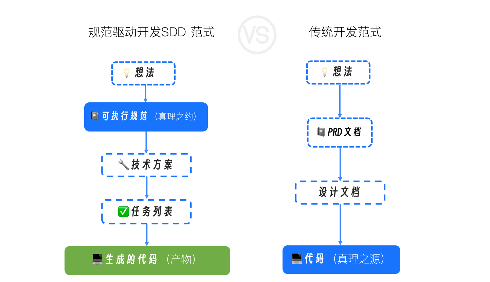
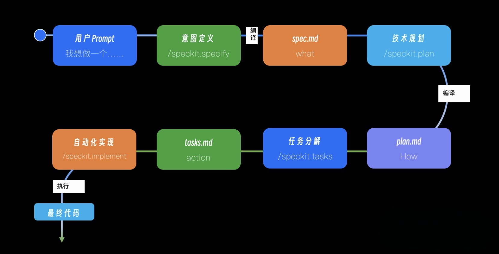
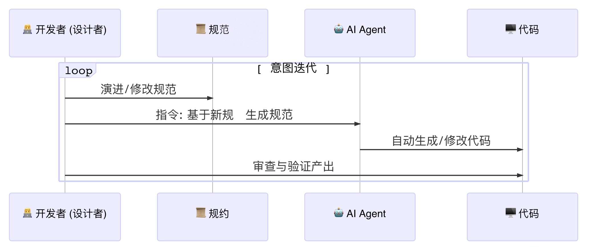

# Specification-Driven Development
在 AI 原生开发范式中，一份高质量的、可被机器精确理解的规范（Specification），是驱动整个开发工作流的起点和核心引擎。没有它，AI 的强大能力就如同无的之矢，无法精准地作用于我们的工程目标。

最核心的方法论：规范驱动开发（Spec-Driven Development, SDD）。你将理解它为何是 AI 原生开发的“第一性原理”，并学会运用它的核心产物—— spec.md、plan.md 和 tasks.md，将一个模糊的软件构想，一步步精确地“编译”成高质量的实现。

---

## 软件开发中“失落的翻译”问题
在传统的开发流程中，我们是这样工作的：
- 产品经理将业务构想，翻译成一份自然语言描述的 PRD（产品需求文档）。
- 架构师和开发者阅读 PRD，进行“人脑编译”，将其翻译成技术设计文档。
- 开发者再次进行“人脑编译”，将设计文档翻译成一行行具体的代码。

这个过程充满了“失落的翻译”。每一次“翻译”，都不可避免地引入了信息的损耗、歧义和主观臆断。PRD 中的一句“界面需要响应迅速”，到了开发者这里，可能被理解成“API 响应时间小于 500ms”，也可能被忽略。

更糟糕的是，这些文档（PRD、设计文档）与最终的“真理之源”——代码，是完全脱节的。一旦项目开始迭代，代码飞速演进，而文档却被遗忘在角落，迅速腐烂，变成“代码考古”的障碍。

几十年来，我们发明了敏捷、Scrum、UML 等无数方法和工具，试图弥合这条鸿沟，但收效甚微。因为我们始终默认了一个前提：文档是代码的“指南”，而代码才是“真理”。

---

## SDD 的核心思想
规范驱动开发（SDD）的核心思想，可以用一句话来概括：实现一次“权力的反转”。

在 SDD 范式中，不再是文档服务于代码，而是代码服务于规范。那份结构化的、无歧义的、可被机器理解的规范，取代了代码，成为了项目唯一的、至高无上的“真理之源”（Single Source of Truth）。

代码，则降级为这份“真理之源”在某个特定技术栈（比如 Go + Gin + PostgreSQL）下的一个自动渲染产物或编译结果。

- 维护软件的核心，从“修改代码”，变成了“演进规范”。
- 调试 Bug 的核心，从“修复错误代码”，变成了“修正产生错误代码的规范或方案”。
- 技术重构的核心，从“大规模迁移代码”，变成了“基于同一份规范，生成一个全新技术栈的实现”。

要实现它，就要求我们的“规范”必须具备一个前所未有的特性：可被机器精确理解和执行。

---

## 编译意图：AI Agent 扮演的新角色
在 AI 原生开发中，“编译”指的是一个由 AI 驱动的、将高层级、模糊的、非结构化的人类意图，逐步转换、细化，并最终固化为低层级、精确的、结构化的机器可执行指令（即代码）的全过程。

在这个过程中，AI Agent 扮演了多个“编译器”的角色：
- 需求编译器：将你用自然语言描述的模糊想法，“编译”成一份结构化的、无歧义的需求规范（spec.md）。
- 方案编译器：将需求规范与你的技术约束（如使用 Go 语言）相结合，“编译”成一份详尽的技术实现蓝图（plan.md）。
- 任务编译器：将技术蓝图，“编译”成一份带依赖关系的、原子化的任务指令集（tasks.md）。
- 代码编译器（生成器）：最终，它根据任务指令集，生成最终的可执行代码。

---

## SDD 工作流的四个通用阶段
让我们看看一个真实的、业界领先的开源项目——GitHub 的 spec-kit 是如何通过一系列标准化的 Slash Commands（斜杠指令）来实现四个阶段的。

- 意图输入（/speckit.specify）：你向 AI Agent 输入一个自然语言的想法：“Build an application that can help me organize my photos...”。
- “编译”成规范（spec.md）：AI Agent 扮演产品经理的角色，与你互动（或基于内置模板），将你的模糊想法“编译”成一份结构化的 spec.md。同时，它会自动为你创建一个新的 Git 分支，如 001-photo-albums。
- 技术选型（/speckit.plan）：你进入技术决策阶段，告诉 AI：“The application uses Vite…vanilla HTML, CSS, and JavaScript…SQLite database.”。
- “编译”成方案 (plan.md)：AI Agent 扮演架构师的角色，将技术选型与 spec.md 的需求结合，生成一份详尽的 plan.md。生成任务列表 (/speckit.tasks)：你下达指令，不需额外参数。
- “编译”成“字节码” (tasks.md)：AI Agent 扮演技术组长的角色，它读取 plan.md，将其分解为上百个具体的、带依赖关系和并行标记的原子任务，生成 tasks.md。执行实现 (/speckit.implement)：你下达最终执行指令。
- “执行”字节码（Code）：AI Agent 像一个勤奋的程序员，严格按照 tasks.md 的指令列表，逐一完成编码、测试、创建文件等所有工作，最终交付可运行的应用程序。

在 SDD 范式下，开发循环被提升到了一个更高的维度，变成了一个以“规范”为中心的 Spec -> Generate -> Validate 循环。

开发者的主要工作不再是直接编写和重构海量代码，而是：
- 演进规范：思考并修改 spec.md 来响应需求变化。
- 触发生成：指挥 AI Agent 基于新的规范重新生成实现。
- 审查验证：验收 AI 的产出是否符合规范的意图。