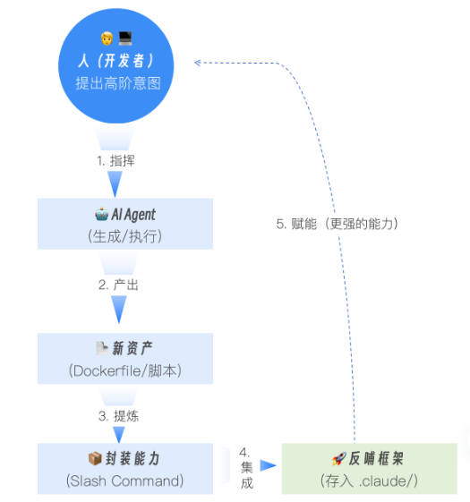

# CI/CD
我们的核心目标，不仅仅是为项目构建起完整的 DevOps 基础设施，更重要的是，我们要学会如何将这些新生成的构建能力，封装并沉淀回我们自己的“AI 驾驶舱”框架中，让我们的 AI 伙伴变得越来越强大。

## 第一步：容器化 —— 让 AI 生成优化的 Dockerfile
一个好的 Dockerfile，不仅要能成功构建应用，更要追求镜像体积小、构建速度快、安全性高。

```
**你现在是一位资深的 DevOps 工程师，专精于 Node.js 应用的容器化。**

请为我们的 issue2md Node.js 项目，编写一个 Dockerfile。如果 Dockerfile 已存在，请审查并重写我们项目现有的 Dockerfile。

**必须遵循以下生产级最佳实践：**

1.  **多阶段构建 (Multi-stage Build):**
    *   使用一个包含完整构建工具链的 builder 阶段（例如 node:18-alpine 或 node:20）来安装依赖 (npm install 或 yarn install) 并构建应用（如果需要编译 TypeScript 或构建前端资源）。
    *   使用一个极度精简的最终阶段。推荐使用 node:18-alpine 或 node:20-alpine 的精简版，甚至 distroless 镜像。该阶段应只包含运行应用所需的代码和依赖，通过从 builder 阶段拷贝 node_modules 和构建产物来实现，以确保镜像体积最小化。

2.  **依赖缓存优化:**
    *   **关键点**：在构建阶段，必须先单独拷贝 package.json 和 package-lock.json (或 yarn.lock) 到镜像中并执行依赖安装，**然后再**拷贝源代码。
    *   这样做可以利用 Docker 的层缓存机制：只要 package.json 和锁文件不改变，npm install 这一层就不会重新执行，从而极大地加速后续构建。

3.  **安全性:**
    *   在最终运行阶段，**严禁**以 root 用户身份运行应用。
    *   必须在 Dockerfile 中创建一个专用的非 root 用户，并切换到该用户来执行应用。
    *   确保最终镜像不包含开发依赖（如 devDependencies），除非应用确实需要它们在运行时存在（通常不需要）。

4.  **项目结构分析:**
    *   请分析我们项目的结构（@.）。
    *   假设入口文件为 src/index.js 或 dist/index.js（或者根据实际构建产物调整）。
    *   如果项目包含 TypeScript，请确保构建阶段包含编译步骤（npm run build）。

请基于上述要求，生成这份优化后的 Dockerfile，并覆盖写入。
```
💡 补充说明（供你参考）

为了让你更清楚这个 Prompt 生成的 Dockerfile 应该是什么样的，这里有一个简单的逻辑示例：

1.  **第一阶段 (builder):**
    *   FROM node:18-alpine as builder
    *   COPY package*.json ./ (先拷贝清单文件)
    *   RUN npm ci --only=production (安装生产依赖，利用缓存)
    *   COPY . . (拷贝源码)
    *   RUN npm run build (如果需要编译 TS)

2.  **第二阶段 (final):**
    *   FROM node:18-alpine (轻量基础镜像)
    *   COPY --from=builder /app/node_modules ./node_modules (只拷贝依赖)
    *   COPY --from=builder /app/dist ./dist (只拷贝构建产物)
    *   RUN addgroup -g 1001 -S nodejs && adduser -S nextjs -u 1001 (创建非 root 用户)
    *   USER 1001 (切换用户)
    *   CMD ["node", "dist/index.js"] (启动应用)

把这个新的 Prompt 交给 AI，它就能生成符合标准的 Node.js Dockerfile 了。

这个 Prompt 的价值在于：
- 设定专家角色：资深的DevOps工程师，引导 AI 使用更专业的知识库。
- 明确要求“最佳实践”：多阶段构建, 依赖缓存, 非root用户，这些关键词直接将 AI 的思考方向，锁定在了“生产级”的标准上。
- 赋予上下文感知能力：@. 让 AI 能够分析项目结构，从而编写出真正符合我们项目实际的构建指令（比如正确找到两个 cmd 入口）。


AI 会分析你的请求，并提议创建一个Dockerfile。在你批准后，一份高质量的、蕴含了 DevOps 最佳实践的配置文件就诞生了。

你可以让 AI 执行镜像构建，或你在另外一个终端窗口手工执行构建，以验证 Dockerfile 的有效性：
```bash
docker build -t issue2md:latest .
```

---

## 第二步：标准化构建 —— 让 AI 编写通用的 Makefile
Dockerfile 解决了“如何打包”的问题，但我们还需要一个更通用的“任务入口”，来标准化我们项目的所有日常操作（测试、构建、运行、清理等）。这正是 Makefile 的用武之地。
```
很好。现在，请继续扮演DevOps工程师的角色，为我们的项目创建一个 `Makefile`。

这份 `Makefile` 需要包含以下几个核心目标 (targets):

*   `build`: 编译`issue2md-cli`和`issue2md-web`两个二进制文件。
*   `test`: 运行所有的单元测试。
*   `lint`: 运行`golangci-lint`进行静态检查。
*   `docker-build`: 使用我们刚才创建的`Dockerfile`来构建容器镜像，镜像tag应为`issue2md:latest`。
*   `clean`: 清理所有构建产物。

如果`Makefile`已存在，也要按上面核心目标对其进行审查，如有不符，请重写并覆盖当前`Makefile`。

请确保 `Makefile` 的编写遵循最佳实践，例如使用`.PHONY`来声明伪目标。
```
AI 会尝试按核心目标要求，为你生成一份结构清晰、功能完备的 Makefile.


现在，任何团队成员，只需运行 make test, make docker-build 等简单命令，就能执行复杂的工程任务了。

---

## 第三步（升华）：扩展“驾驶舱”——将新能力沉淀回框架
将我们刚刚生成的这些强大的 DevOps 能力，封装成新的 Slash Commands.

### 1. 创建/build指令
```
请帮我在创建一个自定义的项目级的slash command文件 `.claude/commands/build.md`。

这个指令的作用是：调用`make build`来构建项目。如果构建失败，它应该自动分析错误原因。

`allowed-tools` 应该包含 `Bash(make:build)`。
```

### 2. 创建/docker-build指令
```
再创建一个 `/.claude/commands/docker-build.md`。

这个指令的作用是：调用 `make docker-build`。它应该接受一个参数 `$1` 作为镜像的 Tag。如果用户没有提供参数，默认使用 `latest`。

`allowed-tools` 应该包含 `Bash(docker:*)`, `Bash(make:docker-build)`。
```

完成这一步，才到了我们这一讲真正的“画龙点睛”之笔。它实现了能力的完美闭环：



---

## 第四步：持续集成 —— 让 AI 生成 CI/CD 流水线
有了标准化的构建脚本，实现持续集成（CI）就变得水到渠成了。我们将使用 GitHub Actions，并让 AI 为我们编写流水线配置文件
```
非常棒！最后一步，我们需要为这个项目设置一套CI/CD流水线。

请为我们创建一个GitHub Actions工作流配置文件，路径为`.github/workflows/ci.yml`。

**这个流水线需要实现以下功能：**
1.  **触发条件：** 当有代码被推送到`main`分支，或者有新的Pull Request被创建时触发。
2.  **核心任务：** 在一个Ubuntu环境中，它需要依次执行以下步骤：
    *   Checkout代码。
    *   设置Go环境。
    *   运行`make test`。
    *   运行`make lint`。
    *   运行`make build`。
3.  **健壮性：** 确保任何一步失败，整个流水线都会失败。
```
AI 会为你生成一份格式完全正确的ci.yml文件。

我们甚至可以在这个 CI 流程中，加入一个 Step：
```
- name: AI Code Analysis (on failure)
  if: failure()
  run: |
    # 当构建失败时，自动唤起AI分析错误日志
    cat build.log | claude -p "分析这份构建日志，找出失败原因"
```
这将让你的 CI 流水线不仅仅是报错，还能自动诊断。这正是 AI 原生 DevOps 的魅力所在