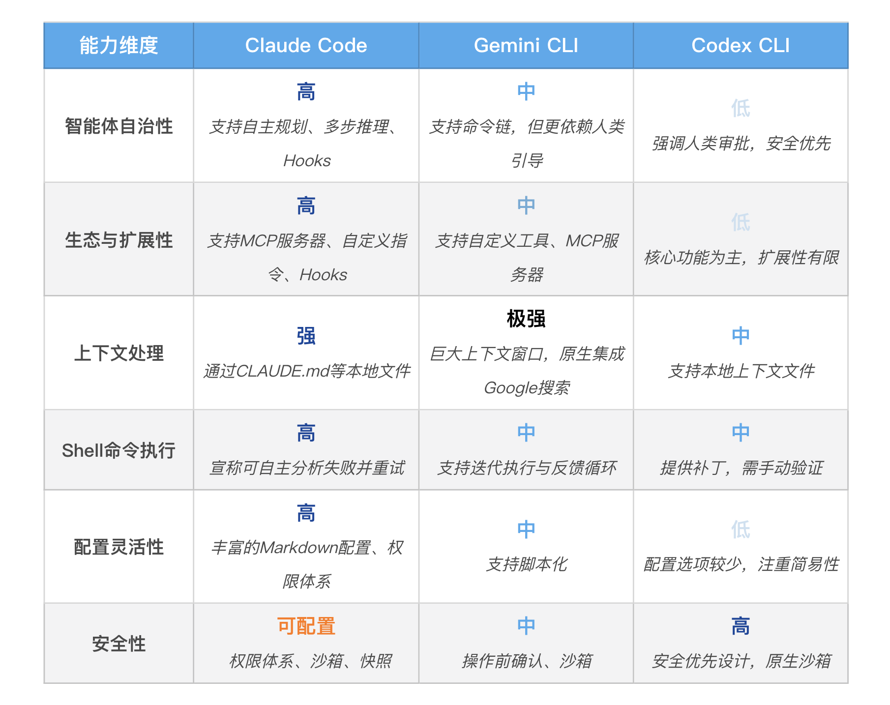

# Why Claude Code

## 三大主流 Coding Agent 的真实对决
从技术层面看，三款主流工具的安装都遵循了现代 CLI 工具的标准流程，通常只需一行 npm install 命令即可完成。真正的差异，体现在它们背后所代表的 AI 生态的准入门槛上：

- Claude Code：流程相对直接，npm install 后通过 login 命令完成 Anthropic 账户的授权即可。其生态的门槛主要体现在商业化定位上，需要用户拥有付费账户。
- Gemini CLI：虽然工具本身免费且额度慷慨，但其账号体系与 Google Cloud 深度绑定。对于个人开发者可能一步到位，但对于已有 Google Workspace 的企业用户，有时会触发一系列额外的 GCP 项目配置、API 启用等流程，存在一定的“配置成本”。
- Codex CLI：同样依赖其背后的 OpenAI 账号体系。社区中有反馈指出，其账户的安全验证级别有时会要求提供身份证明等现实世界的信息，这对于希望快速上手体验的开发者而言，可能会构成一个意料之外的“验证成本”。

---

从设计哲学看

- Claude Code：为“自治”而生的工作流引擎（Workflow Engine），它的设计核心是“Agentic Autonomy”（智能体自治）。它并非被设计成一个简单的问答工具，而是被构建用来深刻理解项目上下文，并具备前瞻性地规划和执行复杂任务。从其一开始就内置的 Hooks（钩子）、完整的仓库导航能力、Git 集成等丰富功能中，我们可以清晰地看到它的目标：成为一个可以独立规划、执行，甚至重试多步工作流的“虚拟团队成员”。
- Gemini CLI：灵活的“对话式上下文引擎” (Conversational Context Engine)，它的核心优势在于流式的、富上下文的交互。得益于 Gemini Pro 模型宣称的巨大上下文窗口和与 Google 搜索的天然集成，它极其擅长处理“大规模上下文的重构”和“需要外部知识检索”的任务。它的设计哲学更像一个可以随时调动海量信息、与你进行深度对话的“超级大脑”，而非一个完全自主的行动者。
- Codex CLI：安全第一的“精准编辑助手” (Precision Editing Assistant)，它的设计哲学是安全和清晰。它专注于 patch-based（基于补丁）和diff-based（基于差异）的文件编辑。官方反复强调，在执行任何修改前，它都会以最清晰的方式向你展示变更，并等待你的批准。其内置的强大沙箱安全机制也印证了这一点，但这也相应地牺牲了自主规划和扩展的能力。它更像一个值得信赖、但需要你一步步明确指导的“外科医生”。

---

能力与适用场景分析

- Claude Code 的定位是一个高度自主且可扩展的“工作流引擎”。它拥有最丰富的自定义能力（如 Hooks）和最强的自主行为（如自我修正），这使得它在执行端到端的复杂任务，如“自主调试测试失败”或“根据 CLAUDE.md 进行项目级重构”时，理论上具备最高的天花板。
- Gemini CLI 则像一个知识渊博且善于对话的“上下文专家”。它最大的优势在于能够一次性消化海量的本地代码或通过搜索获取外部文档，这让它在需要大规模上下文理解的任务，如“对整个仓库进行一次跨多文件的变量名重构”或“基于外部 API 文档编写客户端代码”时，表现得尤为突出。
- Codex CLI 的角色更像一个精准、可靠且注重安全的“编辑助手”。它的设计哲学是“每一步都清晰可控”。它在跨文件代码补丁生成和提供可靠的核心编辑功能方面表现稳定。当你的核心需求是获得精准、安全的代码修改建议，并且你希望对每一步变更都有完全的控制权时，它的简洁性和沙箱机制就成为了优势。

三款工具都在快速迭代，未来它们的功能或许会逐渐趋同，难分伯仲。

---

## Why Claude Code
- 为了学习最完整的方法论：我们的目标，不是教会你某个特定工具的 API，而是让你掌握一整套AI 原生开发的工作流和工程思想。从我们的分析中可以清晰地看到，Claude Code 是目前唯一一个将这套思想（从上下文管理CLAUDE.md、安全控制、到能力扩展 Hooks/MCP、再到自主规划）实现得最完整、最体系化的工具。学习它，就像是在学习一门设计精良的“语言”。你掌握了这门语言的“语法”和“范式”，将来即便切换到其他工具，底层的思想也是完全通用的。
- 为了掌握“事实标准”的缔造者：Claude Code 不仅是功能最丰富的，它更是这个领域的开创者和“游戏规则”的定义者。它是业界第一个真正意义上的命令行 AI 智能体（CLI Coding Agent）。我们现在已经习以为常的许多交互模式，比如用@注入文件上下文、用!执行 Shell 命令、用/发起斜杠指令，其最初的范式定义和推广都源于 Claude Code。后续出现的许多同类工具，在初期都或多或少地借鉴和效仿了它的设计。因此，深入学习 Claude Code，就是在学习这套交互范式的“源代码”，能让你理解其设计的本源和精髓。
- 为了触及最高的能力天花板：Sub-agent（智能分身）、Hooks（自动化之触）、Checkpointing（快照回滚）……这些目前仍是 Claude Code 独创或独有的高级特性，正是我们将 AI 智能体从一个“玩具”变为一个“生产级引擎”的关键。如果我们的目标是构建复杂的、健壮的自动化系统，那么我们必须去学习和实践这些代表了行业最高水准的功能。学，就学最强的。
- 为了拥抱最繁荣的生态核心：正因为其先发优势、强大的能力和广泛的用户基础，Claude Code 已成为 AI 编程社区中使用最多、用途最广的 CLI Coding Agent。这形成了一个正向的生态循环：强大的工具吸引了海量的用户实践，而海量的实践又催生了更丰富的第三方工具和更好的模型支持。一个典型的例子就是，像国内的智谱 AI 等大模型公司，都提供了专门的技术和文档，来支持开发者将它们的模型无缝对接到 Claude Code 的客户端上。这意味着，掌握 Claude Code，你不仅是在学习一个工具，更是在接入一个以它为核心的、不断发展的 AI 开发生态。

尽管 Claude Code 的客户端代码并不开源，但它引领的开发范式以及其缔造者 Anthropic 所定义的开放协议（如 MCP），已经成为了整个行业共同的技术财富。

---

## 成本
一个开发者圈内广为人知的词是“Hungry for Tokens”（对 Token 的饥渴）。像 Claude Code 和 Gemini CLI 这类强大的工具，因为需要加载大量上下文来做出高质量决策，其 Token 消耗是巨大的。

幸运的是，我们有一个切实可行的“平替”方案来解决这个问题。我们可以采用一种“偷天换日”的策略：保留 Claude Code 强大的客户端工具，但将其连接到国内更易访问、成本更低的 AI 模型服务上，比如智谱 AI。

当然，其中的取舍（Trade-off）在于代码生成质量的差异。