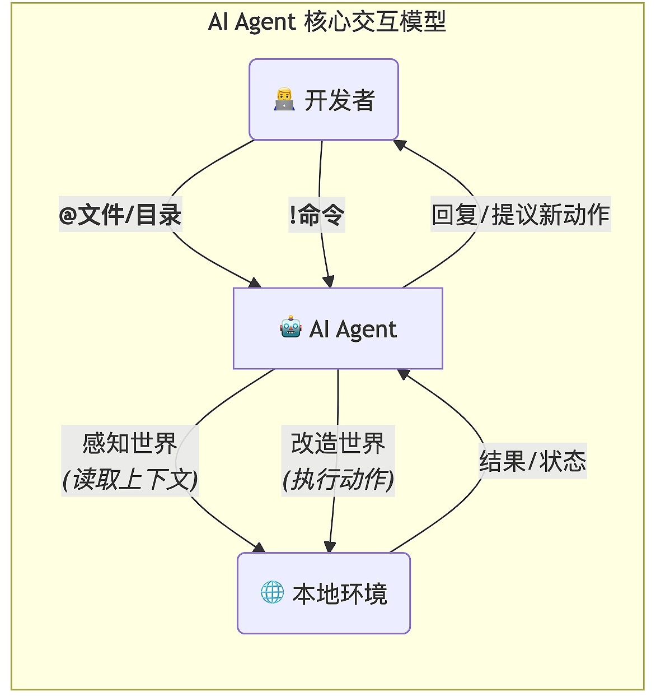

# Claude Code core model
Claude Code（以及大多数优秀的 Coding Agent）的核心交互模型，就建立在两个极其简单却异常强大的符号之上：@ 和 !。
- @ 代表上下文（Context），是 AI 用来“感知”世界的眼睛和耳朵。
- ! 代表行动（Action），是 AI 用来“改造”世界的双手。



@ 和 !，正是将高效的人类协作模式，完美地复刻到了人机交互之中。

- @ 指令：它将“提供上下文”这个动作，从一个模糊的、需要靠复制粘贴完成的任务，变成了一个精确的、可追溯的、结构化的指令。当你输入 @main.go 时，你和 AI 之间就建立了一个明确的契约：“我们接下来的对话，是围绕main.go这个文件的当前状态展开的。”
- ! 指令：它将“执行动作”这个环节，从一个需要你切换窗口、手动操作的流程，无缝地融入到了对话流之中。它打通了 AI 的“大脑”（语言模型）和你的本地环境之间的“隔膜”，让 AI 的思考可以直接转化为真实世界的影响。

---

## 精通 @ 指令
@ 指令让 AI 不再是一个“健忘的外部顾问”，而是成为了一个能够主动观察你整个项目的“全局架构师”。

@ 指令的几种常见用法：

### 1. 引用单个文件：最精准的上下文
```
语法：@/path/to/your/file
```
Claude Code 拥有强大的路径自动补全功能。你只需输入 @，就会自动列出当前目录下的文件和目录列表（如下图所示）；输入和文件名的前几个字母，然后按下 Tab 键，它也会像 IDE 一样为你补全路径。

---

实战场景 1：代码解释
```
> @Dockerfile
> 帮我逐行解释一下这个Dockerfile的作用，特别是多阶段构建的逻辑。
```

实战场景 2：基于代码生成测试
```
> @utils/math.go
> 为这个文件里的 Add 函数编写一份完整的单元测试，使用Go语言的testing包，并覆盖正常、负数和零这几种情况。
```

---

### 2. 引用整个目录：开启“上帝视角”
```
语法： @/path/to/your/directory/
```
当 AI“看到”一个目录时，它并不会把所有文件的内容都无脑地塞进上下文。

Claude Code 的 @ 指令在处理目录时，表现得极其智能。默认情况下，@ 指令是 Git 感知的。这意味着它会：
- 自动查找并读取你项目根目录下的 .gitignore 文件。
- 在遍历你指定的目录时，自动忽略所有匹配 .gitignore 规则的文件和目录。

你完全不用担心它会把 node_modules/、vendor/、编译产物或 .git/ 目录本身这些“上下文噪音”喂给模型。它提供给 AI 的，永远是干净、纯粹的源代码和重要资产。

---

实战场景 3：项目概览与技术栈分析

你刚刚克隆了一个新的开源项目，想快速上手。我们可以将当前目录作为上下文喂给 Claude Code,
我们向 Claude Code 表述意图，Claude Code 会结合整个目录上下文给出答案：
```
这是一个Python项目，请帮我分析它的整体结构、核心功能、主要依赖以及如何运行起来
```

---

实战场景 4：大规模代码重构

假设你想对 issue2md 项目中的 internal/github/ 包进行重构，将所有调用 Github RESTful API 的地方换为基于 GitHub GraphQL API 的调用，我们可以基于 GitHub 这个目录的上下文提出我们的重构要求：
```
> @internal/github/
> 帮我将internal/github/下的所有调用Github RESTful API的代码都换成基于GitHub GraphQL API的调用
```
AI 会一次性读取 api 包下的所有文件，理解它们之间的相互关系，然后为你提供一个完整的、系统性的重构方案，并可以在你的授权后，直接生成修改后的所有文件内容。这是单个文件上下文完全无法做到的。

---

## 精通 ! 指令：赋予 AI 改造世界的力量
如果说 @ 是 AI 的“眼睛”，那么 ! 就是 AI 的“双手”。它打通了 AI 的“思考”与本地环境“执行”之间的壁垒，但同时又通过精巧的设计，保证了操作的绝对安全。

### 1. 在对话中执行单行命令
这是 ! 最直接的用法。你可以在与 AI 的对话流中，随时执行任何你想执行的 Shell 命令，而无需退出 Claude Code。
```
语法：! <your_shell_command>
```

---

实战场景 1：即时验证与查询
```
> !go list -m github.com/redis/go-redis/v9
```
终端会直接执行这条命令，并返回结果。你可以立即知道依赖是否存在，然后继续你的对话。

---

实战场景 2：将命令输出作为上下文

! 指令的输出，会自动成为下一轮对话的上下文，这是一个极其强大的特性。

假设你想让 AI 帮你写一个 Git Commit Message。
```
! git add README-zh-TW.md 
  ⎿  (No content)

! git diff --staged 
  ⎿  diff --git a/README-zh-TW.md b/README-zh-TW.md
     new file mode 100644
     index 0000000..33e9064
     … +58 lines (ctrl+o to expand)
```
终端会显示所有已暂存的代码变更。

```
> 根据上面的diff内容，帮我写一条符合Conventional Commits规范的commit message。 

● 基于这个 diff 内容，我建议使用以下符合 Conventional Commits 规范的 commit message：

  docs: add Traditional Chinese README (README-zh-TW.md)

  这条 commit message 的说明：
  - docs: 类型表示这是对文档的修改
  - add 表示新增了一个文件
  - Traditional Chinese README 简洁描述了文件内容
  - (README-zh-TW.md) 指明了具体的文件名

  如果你想更详细一些，也可以使用：

  docs: add Traditional Chinese translation of README

  - Convert simplified Chinese to traditional Chinese
  - Add README-zh-TW.md for traditional Chinese users
  - Maintain consistent formatting and structure
```
Claude Code 会“阅读”上一条 ! 命令的输出，并为你生成一条高质量的、与你的代码变更完全匹配的提交信息。

---

### 2. 让 AI 提议并执行命令
这才是 ! 指令的“AI 原生”用法。我们不再是自己执行命令，而是让 AI 来决定何时需要执行命令，以及执行什么命令。当 AI 认为需要通过执行 Shell 命令来获取信息或完成任务时，它会使用一个特殊的“工具调用”（Tool Call）来向你提议。

---

实战场景 3：AI 自主进行环境检查

你向 Claude Code 提了一个高层级的任务：“帮我分析这个项目的外部模块依赖” 。

AI 会给出后续的本地操作建议，但此时需要你的授权。** 这种“提议 - 审批”机制，是保障 ! 指令安全的核心。**AI 永远不会在你不知情的情况下，擅自执行任何 rm -rf / 这样的危险命令。你，永远是那个掌握最终执行权的“司令官”。除非你在启动 claude 时，开启了 SOLO 机制，即使用 claude --dangerously-skip-permissions，这样在新开启的 Claude Code 会话中将默认忽略掉任何需要你授权的环节。