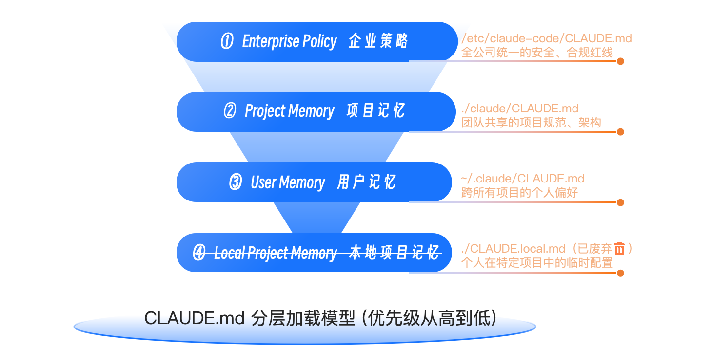

# Claude.md and Agent.md
通过 CLAUDE.md 和 AGENTS.md，为 AI 伙伴打造一个持久的、分层的、可共享的“记忆宫殿”，让它从一个过目就忘的通用助手，进化成一个真正懂你项目的领域专家。

@ 指令提供的上下文，我称之为“短期工作记忆”（Short-term Working Memory）。它非常适合处理当前任务，但一旦任务结束或对话切换，这些记忆就会被“清空”。而 CLAUDE.md（以及同类的 AGENTS.md）提供的，则是“长期记忆”（Long-term Memory）。它是一种在会话开始时自动加载、高优先级的背景知识。

---

## Claude.md
CLAUDE.md 的价值在于，它将那些高频、普适、关乎项目核心规范的指令，从需要开发者反复输入的“动态提示”，沉淀为了 AI Agent 会自动遵循的“静态配置”。这不仅仅是效率的提升，更是人机协作模式的规范化和工程化。

我们可以用一个比喻来理解它们的区别：
- @file.go 就像你指着一段代码对同事说：“看一下这个”。这段代码是你们当前对话上下文的焦点。
- CLAUDE.md 则像是你们团队共享的《团队开发规范手册》。你的同事入职第一天就读过，并且已经内化为自己的工作习惯。你不需要每次讨论时都提醒他：“记得要写单元测试。”

### “巴别塔困境”：项目私约的局限性
像 CLAUDE.md 这样由特定工具定义的上下文文件，我称之为“项目私约”（Project-specific Contract）。它非常强大，能够让你与 Claude Code 这一特定的 AI Agent 进行高效协作。

然而，随着命令行 AI Agent 生态的“百花齐放”，一个潜在的“巴别塔困境”也开始显现：
- Claude Code 有自己的 CLAUDE.md。
- Gemini CLI 有 GEMINI.md。
- CRUSH 有 CRUSH.md。

未来出现的每一个新的 Agent，都可能带来自己的一套上下文配置文件（XX.md）

如果每个项目都需要为不同的 Agent 维护一套不同的“私约”，那么我们刚刚从“复制粘贴上下文”的泥潭中挣扎出来，又将陷入“维护多套 AI Agent 配置”的新泥潭。这种碎片化，极大地阻碍了 AI 原生开发方法论的沉淀和迁移。我们迫切需要一座能让所有 Agent 都听懂““通用语”的“灯塔”。

---

## AGENTS.md：从“项目私约”到“行业标准”的演进
AGENTS.md 应运而生。它不再是某一家公司的“私有协议”，而是由 OpenAI、Google 等多家 AI 巨头和社区共同倡议的一个开放标准。

它的核心理念极其简单而深刻：为 AI Agent 创建一个专属的、标准化的 README.md 文件，即AGENTS.md，专门存放那些写给 AI Agent 看的、结构化的核心指令。

一个典型的 AGENTS.md 可能长这样。让我们以一个 Go Web 服务项目为例：
```
# AGENTS.md for project "go-webapp-demo"

## 1. Development Environment
- **Language**: Go (>= 1.25.0)
- **Primary Framework**: Gin (`github.com/gin-gonic/gin`)
- **Database ORM**: GORM (`gorm.io/gorm`)
- **To run locally**: Use `go run ./cmd/server/main.go`
- **To add a dependency**: Use `go get <package_path>`

## 2. Testing Instructions
- **Run all tests**: Execute `make test` or `go test -v ./...`
- **Run tests for a specific package**: `go test -v ./internal/handlers`
- **Code Coverage**: Generate coverage report with `make coverage`
- **Linting**: Before committing, run `make lint`. This will execute `golangci-lint run`.

## 3. Git & Pull Request (PR) Workflow
- **Commit Message Format**: Strictly follow Conventional Commits. Example: `feat(api): add user registration endpoint`
- **Branching**: All new features must be developed in branches named `feature/<feature-name>`.
- **PR Title**: The PR title must reference the corresponding Jira issue ID. Example: `[PROJ-123] feat(api): Add User Registration`
- **Code Review**: Before requesting a review, ensure all tests pass and the linter is clean.
```
- 环境与启动：AI 一眼就能知道这是个 Go 项目，用了什么框架，以及如何把它跑起来。
- 测试与质量：AI 清楚地知道如何验证自己的代码修改（make test）和如何保证代码质量（make lint）。
- 协同规范：当 AI 被要求生成 Commit Message 或 PR 时，它会严格遵循我们定义的格式，确保与团队的工作流保持一致。

AGENTS.md 就像一张“项目说明书”，但它的读者不再是人类，而是 AI Agent。它用一种结构化的、无歧义的语言，为我们接下来的人机协作，设定了清晰的“游戏规则”。

AGENTS.md 的愿景，正是要打破“巴别塔”，成为一个跨 Agent 的“行业标准”。无论你今天用的是 Claude Code，明天用的是 Gemini CLI，还是后天社区推出的新工具，它们都应该能自动地、优先地去寻找并理解 AGENTS.md。

---

## CLAUDE.md 与 AGENTS.md 的关系
一个重要的技术事实：截至目前，Claude Code 并没有在其文档中声明对 AGENTS.md 的原生、自动发现支持。 它的核心上下文机制，依然是 CLAUDE.md。因此，现阶段的最佳实践，是让它们协同工作。

- AGENTS.md 作为“公有契约”：将那些通用的、不依赖于特定 Agent 功能的核心指令放在AGENTS.md中。例如项目技术栈、构建 / 测试命令、Git 规范等。这份文件是你希望任何一个 AI Agent 都能理解的基础信息。
- CLAUDE.md 作为“私有扩展”：将那些依赖于 Claude Code 特有高级功能的指令放在 CLAUDE.md 中。例如，定义一个只有 Claude Code 才能理解的 Sub-agent，或者配置一个 Hook。

然后，你可以在你的 CLAUDE.md 中，通过 @ 导入语法，将 AGENTS.md 的内容包含进来：

./.claude/CLAUDE.md：
```
# 导入通用的AI Agent协作标准
@../AGENTS.md

# --- 以下是Claude Code专属的高级指令 ---

## Sub-agent定义
- 当需要进行安全审查时，请调用`security-reviewer` sub-agent。

## Hooks配置
- 在每次代码编辑后，自动运行`gofmt`。
```

---

## 深入 CLAUDE.md：强大的分层加载机制与 @ 导入语法

### 分层加载机制
启动 Claude Code 时，它会像剥洋葱一样，从外到内，依次加载四个不同层级的 CLAUDE.md 文件，并将它们的内容拼接在一起，形成最终的“长期记忆”。



- 企业级的安全合规策略拥有最高优先级，任何项目或个人都无法覆盖。
- 团队共享的项目规范是第二优先级，它为整个团队的协作设定了基线。
- 你个人的全局偏好是第三优先级，它允许你在不违反团队规范的前提下，加入自己的习惯，并且该偏好对个人用户下的所有项目均有效。
- CLAUDE.local.md 已经废弃

---

### 查找机制：强大的递归与动态加载

**递归向上查找**：当你启动 Claude Code 时，它会从你当前所在的目录（cwd）开始，一路向上递归，直到项目的根目录（通常是 .git 所在的目录）或者你的用户主目录。在这个过程中，它会加载并拼接沿途遇到的所有 CLAUDE.md 文件。

这个机制在大型 monorepo 项目中尤其强大。它允许你构建一个“级联上下文”模型：
- 在项目根目录定义全局的、适用于所有子项目的规范。
- 在每个微服务或子包的目录中，定义该模块特有的、更具体的规范。

**动态向下发现**： Claude Code 还会动态地发现你当前工作目录下方子目录中的 CLAUDE.md 文件。** 但与向上查找不同，这些“子上下文”并不会在启动时全部加载。它们只有在 AI Agent 通过 @ 指令或 Read 工具，实际去读取那个子目录下的文件时，才会被动态地加载进来。