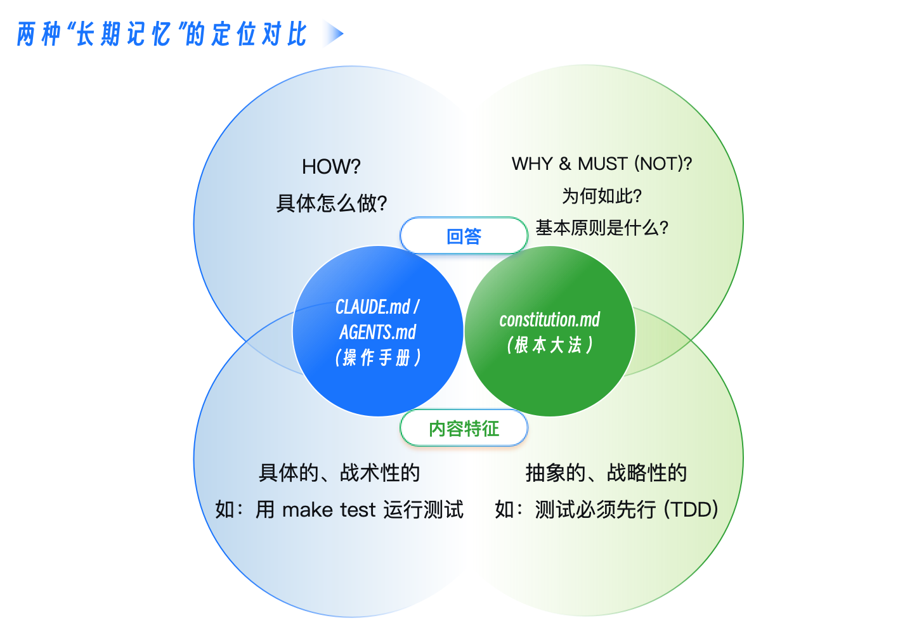
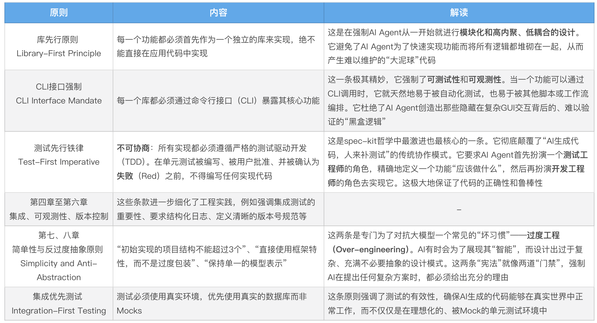

# constitution.md
一些新的、更深层次的问题浮现了：
- 当面对一个需求，AI Agent 提出了两种技术方案——一个简单直接但可能留下技术债，另一个结构优雅但实现复杂，它应该如何抉择？
- 当为了快速实现功能，AI Agent 想要引入一个新的、我们团队从未用过的第三方库时，它应该被允许吗？
- 当 AI Agent 生成的代码虽然通过了所有测试，但其设计模式却与我们项目长期坚持的“保持简单、避免过度抽象”的哲学相悖时，我们该如何约束它？

这些问题，已经超出了“工作手册”能够回答的范畴。它们不关乎“如何做”，而关乎“应该怎样做”和“绝不能怎样做”。它们触及了一个项目的核心价值观和架构哲学。

如果说 CLAUDE.md 是交给 AI Agent 的 **“操作指南”，那么 constitution.md 就是我们与 AI Agent 共同签署的“原则契约”**



它们的差异体现在三个核心维度：

一是抽象层级不同， CLAUDE.md 是低层级的、具体的。它直接告诉 AI Agent“运行这个命令”“遵循这个格式”。constitution.md 是高层级的、抽象的。它不关心具体的命令，而是定义了“测试必须先于代码”“保持简单，避免不必要的抽象”等根本性原则。

二是强制力不同，CLAUDE.md 是指导性的。AI Agent 会参考它来完成任务，但在某些情况下可能会有变通。constitution.md 具有绝对的否决权。任何与“宪法”中“NON-NEGOTIABLE”（不可协商）条款相冲突的计划或实现，都应被视为“违宪”而被驳回。AI Agent 在进行技术规划时，必须首先对照“宪法”进行自检。

三是可变性不同，CLAUDE.md 是相对易变的。随着我们引入新的工具、升级依赖，这份“操作手册”会经常更新。constitution.md 是高度稳定的。它代表了项目的核心技术哲学，除非项目发生重大的战略转向，否则不应轻易修改。

---

## spec-kit 的架构哲学
constitution.md 这个概念，最早由 GitHub 的 spec-kit 项目提出并系统化。

spec-kit 的[规范驱动开发](https://github.com/github/spec-kit/blob/main/spec-driven.md)说明中，这份“宪法”被分为了九条核心“法案”来举例说明。



一份Go语言的constitution.md示例：
```
# issue2md 项目开发宪法
# Version: 1.0, Ratified: 2025-10-20

本文件定义了本项目不可动摇的核心开发原则。所有AI Agent在进行技术规划和代码实现时，必须无条件遵循。

---

## 第一条：简单性原则 (Simplicity First)

**核心：** 遵循Go语言的“少即是多”哲学。绝不进行不必要的抽象，绝不引入非必需的依赖。

- **1.1 (YAGNI):** 你不需要它（You Ain't Gonna Need It）。只实现`spec.md`中明确要求的功能。
- **1.2 (标准库优先):** 除非有极其充分的理由，否则必须优先使用Go标准库。例如，Web服务使用`net/http`，而不是Gin或Echo。
- **1.3 (反过度工程):** 避免复杂的设计模式。简单的函数和数据结构优于复杂的接口和继承体系。

---

## 第二条：测试先行铁律 (Test-First Imperative) - 不可协商

**核心：** 所有新功能或Bug修复，都必须从编写一个（或多个）失败的测试开始。

- **2.1 (TDD循环):** 严格遵循“Red-Green-Refactor”（编写失败测试-让测试通过-重构）的循环。
- **2.2 (表格驱动):** 单元测试必须优先采用表格驱动测试（Table-Driven Tests）的风格，以覆盖多种输入和边界情况。
- **2.3 (拒绝Mocks):** 优先编写集成测试，使用真实的依赖或fake object（如内存中的GitHub API模拟服务器），而不是过度依赖Mock。

---

## 第三条：明确性原则 (Clarity and Explicitness)

**核心：** 代码的首要目的是让人类易于理解，其次才是让机器执行。

- **3.1 (错误处理):** **不可协商**：所有错误都必须被显式处理。绝不允许使用`_`丢弃错误。错误传递时必须使用`fmt.Errorf("...: %w", err)`进行包装。
- **3.2 (无全局变量):** 绝不允许使用全局变量来传递状态。所有依赖必须通过函数参数或结构体成员显式注入。
- **3.3 (注释的意义):** 注释应该解释“为什么”，而不是“是什么”。所有公共API都必须有清晰的GoDoc注释。

---

## 第四条：单一职责原则 (Single Responsibility)

**核心：** 每个包、每个文件、每个函数都应该只做好一件事。

- **4.1 (包的内聚):** `internal`目录下的各个包应保持高度内聚和低耦合。例如，`github`包只负责与GitHub API交互，绝不能包含Markdown转换逻辑。
- **4.2 (接口隔离):** 定义小的、目标明确的接口，而不是大而全的“上帝接口”。

---
## 治理 (Governance)

本宪法具有最高优先级，其效力高于任何`CLAUDE.md`或单次会话中的指令。任何计划（`plan.md`）在生成时，都必须首先进行“合宪性审查”。
```

---

## AI 如何理解并遵循“宪法”？
你可能会问，AI Agent 真的能理解并像人类一样遵循这些抽象的原则吗？答案是肯定的，但这需要一个 **“机制 + 引导”** 的双重保障

机制保障（通过 plan.md模板）：最可靠的方式，是将“合宪性审查”变成一个强制性的流程节点。在 spec-kit 的实践中，plan.md 的模板里包含了一个名为“Constitution Check”的章节，里面有多个“Gate（门禁）”。

一个 plan.md 的模板可能是这样的：
```
## Constitution Check (合宪性审查)

*GATE: 必须在进行技术方案设计前通过。*

- **[ ] 简单性门禁 (第一条):** 是否优先使用了标准库？是否避免了不必要的抽象？
- **[ ] 测试先行门禁 (第二条):** 计划中是否包含了“先写测试”的步骤？
- **[ ] 明确性门禁 (第三条):** 是否明确了依赖注入的方式，而非全局变量？

*如果任何门禁未通过，必须在下方“复杂性追踪”部分给出充分理由。*
```
当 AI Agent 被要求生成 /plan 时，它看到这个模板，就会被强制地去对照 constitution.md 的条款，逐一进行检查和打勾。这就将抽象的原则，转化为了一个具体、可执行的清单。


引导保障（通过 CLAUDE.md和提示）： 我们还可以在 CLAUDE.md 中，明确地提醒 AI。就像我们上面编写的：
```
当被要求添加新功能时: 你的第一步应该是先用 @指令阅读 internal/ 下的相关包，并对照 constitution.md的原则，然后再提出你的计划。
```
通过这种“机制 + 引导”的方式，我们就为“宪法”的执行，上了一道双保险。