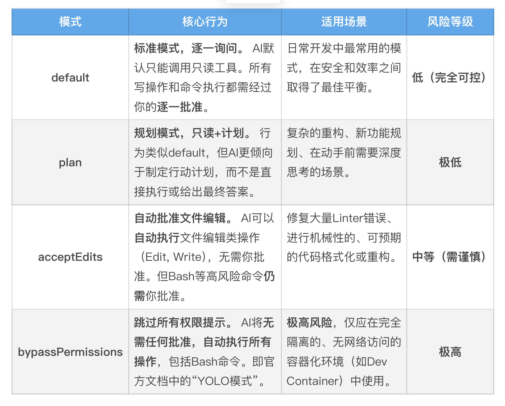
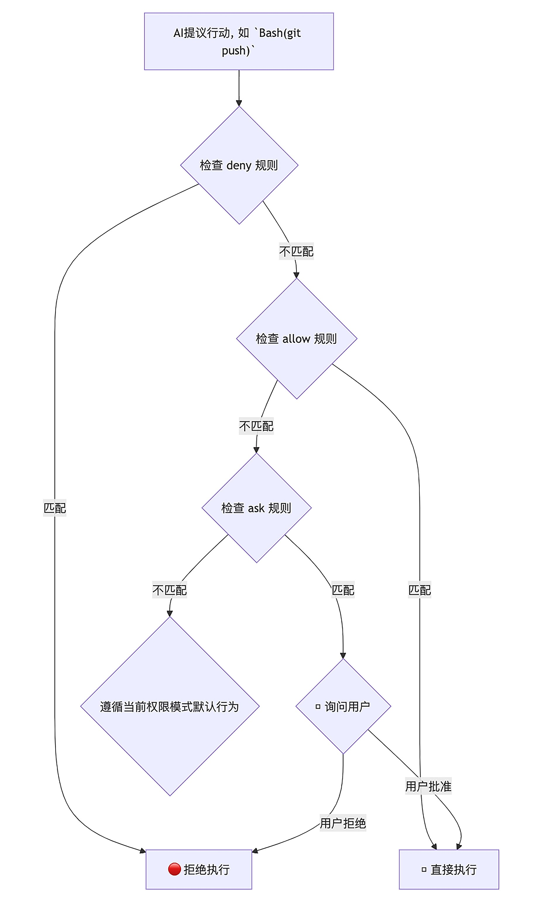

# Cornerstone of security
如果 AI 误解了我的指令“清理一下临时文件”，而去执行了 rm -rf / 怎么办？如果它在分析代码时不小心读取了 .env 文件，并将我的生产环境密钥泄露到它的训练数据中怎么办？

Claude Code 的整个安全哲学，就建立在这样一种务实而审慎的思想之上：默认不信任，逐步授权，全程监督。这通过其精密的权限体系（Permissions）和强大的沙箱机制（Sandboxing）实现。

---

## 权限系统（Permissions）
三个核心原则：
- 默认最小权限：默认情况下，AI 是“只读”的，就像一个只能观察、不能动手的顾问。
- 显式授权：任何可能改变你系统状态的操作（写文件、执行命令），都必须经过你的明确批准。
- 用户主权：最终的控制权永远在你手中。你可以选择单次批准，也可以通过配置，将你信任的、安全的操作设置为自动批准。

Claude Code 为你预设了四种核心权限模式（Permission Modes），让你可以在不同场景下，快速切换整体的安全级别。



可以通过 Shift+Tab 快捷键在启动的 Claude Code 会话中循环，在 default、plan 和 acceptEdits 模式间切换。

四大模式提供了宏观的控制，而真正的精髓，在于你可以**通过 settings.json 文件，制定细致入微的权限规则**。这些规则，就是你为 AI 设定的在这个项目中必须遵守的“法律条文”。

规则的决策流程非常清晰：deny 拥有最高否决权，其次是 allow，最后是 ask 和当前权限模式的默认行为。



settings.json 文件存在于多个层级（企业、用户、项目），并遵循高优先级覆盖低优先级的原则。这意味着，你可以在项目级的 ./.claude/settings.json 中为团队设定一套标准权限，而团队成员也可以在自己的 ~/.claude/settings.json 中添加个人化的、更严格的规则。

在你配置完规则后，如何确认它们已经正确生效了呢？最直接的方法就是使用 /permissions 这个内置的 Slash Command。

```
> /permissions
```
这个命令会打开一个交互式的界面，清晰地列出当前所有生效的 allow、deny、ask 等规则，这是你调试和验证权限配置的“神器”。


**Read/Edit/Write：控制文件访问**，你可以使用类似 .gitignore 的语法，精确地控制 AI 能读写哪些文件。这是保护项目敏感信息、防止 AI 意外破坏核心配置的第一道铁索:
```json
{
  "permissions": {
    "deny": [
      "Read(./.env*)",       // 禁止读取任何.env文件
      "Read(./secrets/**)",    // 禁止读取secrets目录下的所有文件
      "Read(~/.ssh/*)",       // 禁止读取用户ssh密钥
      "Read(//etc/passwd)",     // 禁止读取系统敏感文件
      "Write(./go.mod)",       // 禁止修改go.mod文件
      "Edit(/docs/**)"        // 禁止编辑docs目录下的文件 (相对于settings.json位置)
    ]
  }
}
```
【重要】Read/Edit 规则的路径模式非常讲究：
- path 或 ./path：相对于当前工作目录。例如：Read(*.env) 会匹配当前目录下的.env文件。
- /path：相对于 settings.json 文件所在目录。例如：在项目级的 ./.claude/settings.json 中，Deny(Read(/config/**)) 会禁止读取项目根目录下的 config 文件夹。
- ~/path：相对于用户主目录。例如：Deny(Read(~/.ssh/id_rsa)) 会禁止 AI 读取你的 SSH 私钥。
- //path：文件系统的绝对路径。例如：Deny(Read(//etc/passwd)) 会禁止 AI 读取系统的密码文件 /etc/passwd。请务必区分，错误的路径模式可能会导致你的安全规则失效！


**Bash：控制命令执行 Bash 工具是 AI 能力最强的“武器”，也是风险最高的**。Claude Code 为其设计了基于前缀匹配的规则。
```json
{
  "permissions": {
    "allow": [
      "Bash(go:test:*)",      // 总是允许执行 `go test` 及其任何子命令
      "Bash(npm:run:lint)"    // 总是允许执行 `npm run lint`
    ],
    "ask": [
      "Bash(git:commit:*)"   // 执行 `git commit` 时总是询问
    ],
    "deny": [
      "Bash(rm:-rf:*)",       // 绝对禁止 `rm -rf`
      "Bash(git:push:--force)" // 绝对禁止强制推送
    ]
  }
}
```

**WebFetch 和 MCP：控制外部连接，你可以为可信的网络域和 MCP 服务器开启绿色通道**。
```json
{
  "permissions": {
    "allow": [
      "WebFetch(domain:*.golang.org)",     // 总是允许访问Go官方文档
      "mcp__github"                        // 总是允许使用名为'github'的MCP服务器的所有工具
    ],
    "ask": [
      "mcp__jira__create_issue"            // 调用jira服务器的create_issue工具时询问
    ]
  }
}
```

---

## 沙箱机制（Sandboxing）
权限体系防范的是“已知的未知”，而沙箱防范的是“未知的未知”。它不再是应用层面的规则检查，而是深入到操作系统（OS）层面，为 AI 的所有高风险操作，构建了一个坚不可摧的“数字囚笼”。

使用 /sandbox 命令，Claude Code 会将当前会话的所有操作限制在沙箱中。
```
> /sandbox
  ⎿  Error: Sandbox requires socat and bwrap. Please install these packages.
```
如果遇到报错，按照提示安装依赖包，然后重新运行 /sandbox 命令。会出现两个选项：

选项 2： Sandbox BashTool, with regular permissions（推荐，最安全）
- 含义：启用沙箱，并且所有 Bash 命令的执行，都严格遵循 permissions 体系。这意味着，即使一个 Bash 命令在沙箱的安全边界内，如果它没有命中 allow 规则，Claude Code 依然会弹窗向你请求批准。
- 选择建议：对于大多数项目，尤其是涉及生产环境代码、敏感数据或团队协作的场景，强烈推荐选择这个模式。它为你提供了最坚固的“法律 + 监狱”双重防护


选项 1：Sandbox BashTool, with auto-allow in accept edits mode（效率优先）
- 含义：启用沙箱，但是做了一个效率上的妥协。当你处于 acceptEdits 这个更信任的权限模式时，对于那些在沙箱安全边界内的 Bash 命令，Claude Code 将不再询问你，直接自动执行。
- 选择建议：如果你正在一个完全可信的、非关键的个人项目中工作，并且你对沙箱的边界配置非常有信心，希望最大化地提升 AI 的自主工作效率，那么可以选择这个模式。但请务必记住，这在一定程度上牺牲了单次操作的审批权，以换取更高的自动化效率。