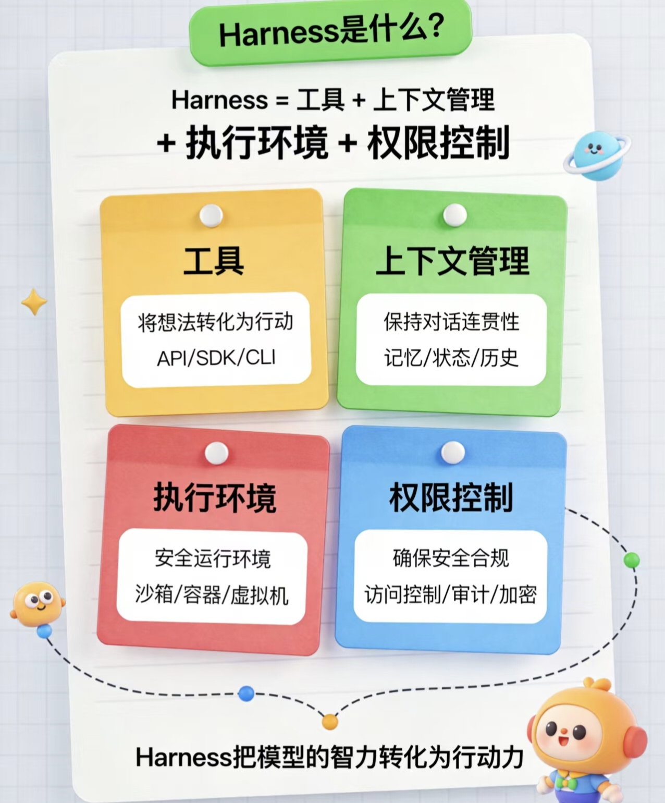

# 🐴 Harness 是什么？一文看懂

---

## 先说一个比喻

> 想象一匹千里马（AI 模型），它跑得很快，但如果没有**缰绳、马鞍、马蹄铁**，它就只是一匹野马——跑不了预定的路，也完不成任务。
>
> **Harness 就是那套"缰绳 + 马鞍"**，让 AI 模型能沿着你设定的方向，稳定、可靠地完成复杂任务。


再看下harness到底是什么？


---

## 🤔 为什么需要 Harness？

以前大家做 AI 开发，主要关注两件事：

| 阶段 | 关注点 | 解释 |
|:----:|:------:|:-----|
| 第一阶段 | **Prompt Engineering** | 怎么跟 AI "说话"，写好提示词 |
| 第二阶段 | **Context Engineering** | 怎么给 AI "喂信息"，管理上下文 |
| **现在** | **Harness Engineering** | 怎么给 AI 搭"运行环境"，让它真正干活 |


**一句话：** 光有聪明的大脑不够，还得有眼睛、耳朵、手脚，才能真正做事。

---

## 🧩 Harness 的 5 个核心组成部分

```
┌─────────────────────────────────────────┐
│              AI Agent                    │
│                                         │
│  ① 系统提示词  →  告诉 AI "你是谁"       │
│  ② 工具/技能   →  AI 能用什么"工具箱"   │
│  ③ 基础设施    →  AI 的"办公场地"       │
│  ④ 编排逻辑    →  AI 的"工作流程"       │
│  ⑤ 钩子/中间件 →  AI 的"质量把关人"     │
└─────────────────────────────────────────┘
```

### ① 系统提示词
给 AI 定好"岗位职责"——你是一个代码助手、你是一个客服、你的边界在哪里。

### ② 工具 / 技能 / MCP
AI 能调用的外部能力，比如：搜索网页、读写文件、执行代码、查数据库。没有工具，AI 只能"说"，不能"做"。

### ③ 基础设施
AI 工作的"办公场地"：文件系统、沙箱环境、浏览器等。就像员工需要电脑、办公室才能工作。

### ④ 编排逻辑
复杂任务怎么拆分？多个 AI 子任务怎么协作？谁先做谁后做？这是 AI 的"项目管理系统"。

### ⑤ 钩子 / 中间件
自动做质量检查：上下文太长了要压缩、代码写完要检查、任务中断了要续写。相当于"自动质检员"。

---

## 💡 一个震撼的数据

> **普林斯顿大学 SWE-Agent 论文**证明：
>
> **同一个 GPT-4 模型**，只改了 Harness 的接口设计（没有换模型！），性能从 **3.97%** 提升到 **12.47%**，**相对提升 64%**！

这说明：**模型只是基础，Harness 才是决定 AI 能不能真正干活的关键。**

---

## 🏗️ Claude Code 的 Harness 架构长什么样？

Claude Code（Anthropic 的 AI 编程助手）是目前 Harness 工程的最佳实践案例，它的架构分 4 层：

### 第 1 层：主循环（大脑的思考方式）

```
while (任务未完成) {
    思考 → 调用工具 → 观察结果 → 继续思考
}
```

就像人做事一样：想一步、做一步、看结果、再想下一步。简单但有效。

**特点：**
- 单线程主循环，避免复杂的对话分支
- 支持异步双缓冲队列，用户可随时插入新指令

### 第 2 层：工具引擎（手脚）

- 读写文件、执行命令、搜索代码
- 通过 **MCP 协议**连接数据库、API 等外部服务
- 支持"子 Agent"并行处理多个子任务

### 第 3 层：记忆与规划（记性）

| 类型 | 说明 |
|:----:|:-----|
| 短期记忆 | 当前对话的上下文 |
| 长期记忆 | 项目文档、历史决策 |
| 任务规划 | 把大任务拆成小步骤 |

### 第 4 层：安全护栏（刹车）

- 危险操作需要人工确认
- 防止 AI 做出不可逆的破坏性操作
- 控制递归深度，防止 AI "失控"

---

## 📊 Harness vs 传统开发方式

| 对比维度 | 传统 AI 调用 | Harness 工程 |
|:--------:|:------------:|:-------------:|
| AI 能做什么 | 回答问题 | 自主完成任务 |
| 任务复杂度 | 单轮对话 | 多步骤长周期 |
| 出错处理 | 人工干预 | 自动重试/纠错 |
| 可控性 | 低 | 高（有护栏） |
| 适合场景 | 问答、生成 | 编程、自动化、Agent |

---

## 🎯 核心公式

```
模型（大脑）+ Harness（身体）= 真正的 Agent
```

| 组件 | 作用 |
|:----:|:-----|
| 模型 = 大脑 | 做决策 |
| Harness = 眼睛、耳朵、手脚 | 感知和执行 |

**Agent 永远都是那个模型本身。而我们程序员要做的，是给这个大脑配上"身体"——这就是 Harness 工程。**

---

## 📚 总结

> **Prompt Engineering** 教你怎么"跟 AI 说话"
>
> **Context Engineering** 教你怎么"给 AI 喂信息"
>
> **Harness Engineering** 教你怎么"让 AI 真正干活"

**Harness 是 2026 年 AI Agent 工程化的核心趋势，OpenAI 和 Anthropic 都已经在正式使用这个概念。对于开发者来说，*会搭 Harness，才算真正会用 AI*。**

---

## 🔗 相关资源

- 原文链接：https://time.geekbang.com/column/article/958033
- Claude Code 源码分析：多 Agent 系统 vs 单线程主循环
- MCP (Model Context Protocol)：连接外部服务的标准协议

---

*整理日期：2026年4月1日*
