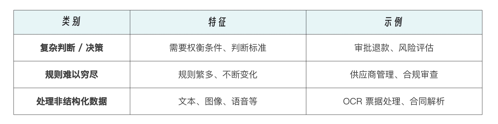

# 什么是Agent
OpenAI 在白皮书里给出了严谨的定义：Agents 是那种能够代表用户自主执行多步任务的系统。它不仅理解指令，还可以决定流程、调用工具、纠错甚至在必要时把控制权交回给用户。

Agent 本质上是赋予了大模型使用工具并采取行动的开发范式。

Agent 工具调用的能力让大模型不再仅限于生成文本，而是可以执行实际操作，例如查询数据库、调用 API、创建可视化图表、发送邮件，检索和处理文档等等一系列任务。这大大扩展了 AI 应用的范围和价值。

Agent 平台里的助理不是只有聊天能力，它还能做很多事。比如客服助理自带有客服能力，用户跟这个助理聊天的时候就是在跟一个客服聊天。你还可以自建和扩展助理的能力，比如这个客服助理的退款功能就是自定义的，它可以自动识别订单号，发起退款流程。

退款功能先要要用到私有数据库。那很多公有的能力比如搜索数据等如何实现呢？这就要靠 Agent 平台的另外一个核心概念，插件能力。

比如搜索能力可以用 Google Web Search 插件，上面提到的退款流程则需要用到 Database 插件。

Agent 智能体开发效率高，就是因为这些平台提供了大量插件能力和多种大模型提供的接入能力。

助理可以看做 Agent 应用的界面，比如例子里的客服助理。但你其实就是在和大模型在聊天，只不过在你和大模型之间还有一个代理程序，它就是 Agent。我们可以把 Agent 看做大模型的代理人。

在 Agent 平台里还有一个重要概念就是工作流。助理负责识别具体的业务逻辑并调取工作流，一个工作流其实就是一个原有业务逻辑。比如客服里的退货业务，实际上工作流是被动配合助理的。
几个概念综合起来，内部的实现就很容易理解了，由外到内一共四层关系：助理 -> 工作流 -> 插件 -> 知识库。

可以这样理解，工作流就是传统应用里的独立功能的函数或程序，那插件呢，就是传统程序里的系统库函数，知识库就是传统数据库。

Agent 底层的架构流程图:

总之，一个 Agent 要具备以下特性：
- 利用 LLM 来管理工作流、做决策。
- 能判定工作流是否完成。
- 能遇错就中断或回退，并邀请人工干预。
- 拥有访问外部工具 (APIs、数据库、服务等) 的能力。

---

## Agent 代理层的核心
Agent 代理层的核心有两点
- 一是基于上下文的用户意图识别
- 二是调用自定义的工作流完成业务逻辑。

意图识别和参数识别的具体实现方法有两种，可以通过微调大模型实现，也可以通过提示词实现，思想都是想通的。

微调的优势:
- 更好的整合性: 微调后的模型可以更自然地将插件能力融入到自身的知识和推理过程中,而不是单纯依赖提示词触发。
- 性能提升: 经过微调,模型可以更准确地判断何时使用插件,减少不必要的调用,提高效率。
- 上下文理解: 微调模型可以基于更广泛的上下文来决定是否使用插件,而不仅仅依赖特定的触发词。
- 灵活性: 可以根据具体应用场景定制模型的插件使用行为。

微调的劣势:
- 成本高: 微调过程需要大量的计算资源和时间,相比简单的提示词方案成本更高。
- 复杂性: 需要设计合适的微调数据集和训练策略,这个过程比编写提示词更为复杂。
- 可能的过拟合: 如果微调不当,模型可能过度依赖特定插件或在不恰当的场景使用插件。
- 更新困难: 当需要添加或修改插件时,可能需要重新进行微调,而提示词方案则更容易更新。

相比之下,提示词方案的主要优势在于实施简单、成本低、易于更新。但它可能缺乏灵活性,且在复杂场景下的表现可能不如经过微调的模型。

---

## Agent 的适用场景
OpenAI 白皮书里明确提出：只有在以下几类场景下，Agent 才是真正有意义的选择：

作为对比，我们来看看不适合用 Agent 的场景有哪些:
- 纯粹的简单操作（如定时发邮件）。
- 完全确定性、可写死判断的流程。
- 对资源敏感、成本极度考究的场景。

一句话：先问自己，这个流程“是否超出传统自动化的范畴”，如果答案是“是”，那才值得用 Agent。

举例来说，当你说“我最近睡不好”，普通机器人可能回复：“你可以试试冥想。”
而一个 Agent 化的“心语”会主动服务：
- 感知：识别出睡眠问题 + 持续性 + 情绪低落。
- 规划：判断是否需要获取历史睡眠记录、是否建议专业咨询、是否设置提醒。
- 行动：查询用户日志、调用冥想音频接口、发送每日晚安提醒。
- 反思：一周后回访，询问“你最近睡眠有改善吗？需要调整建议吗？”