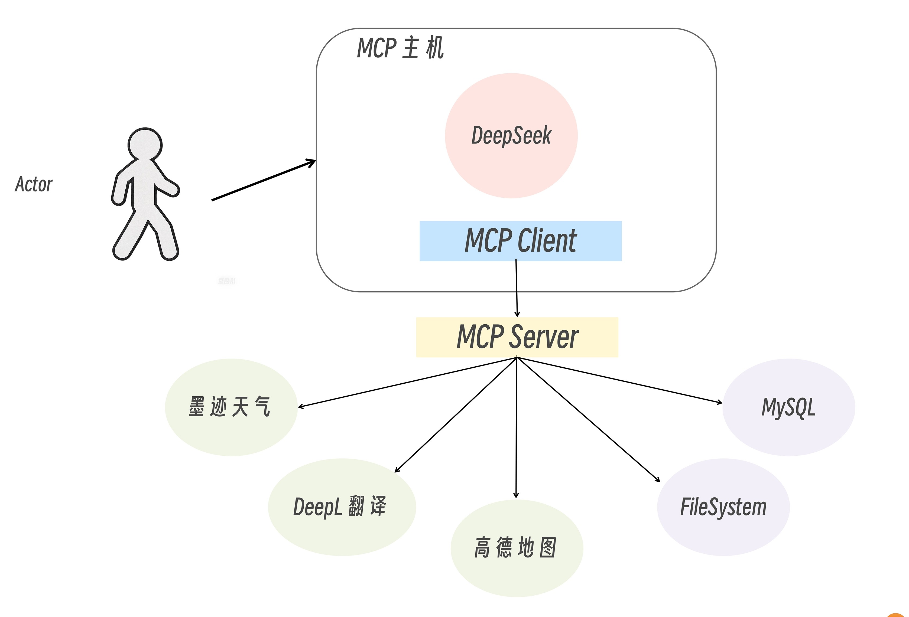
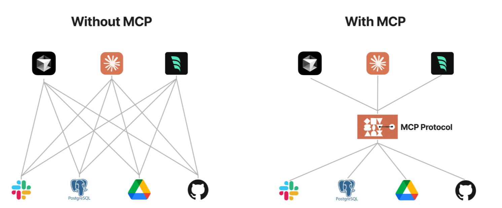
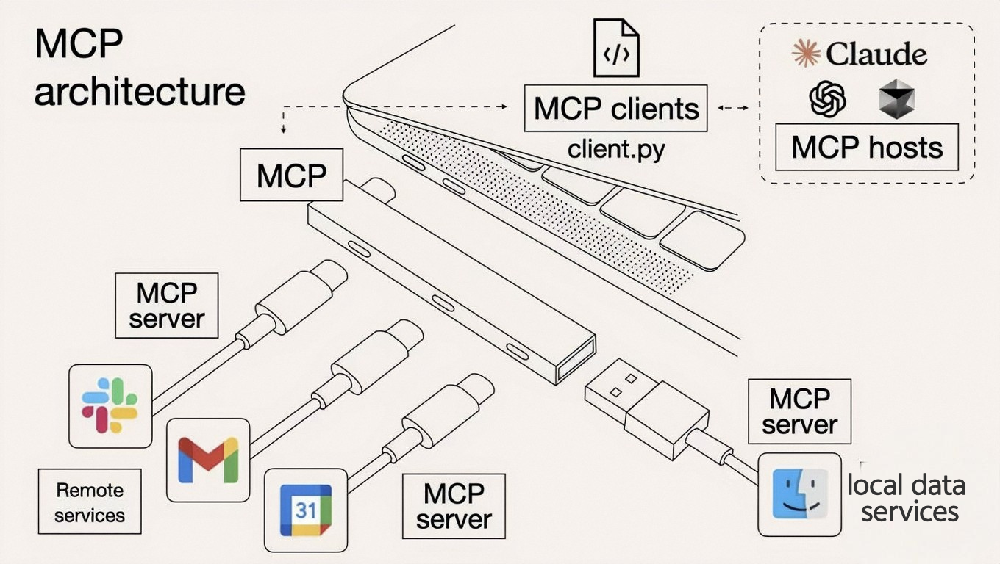
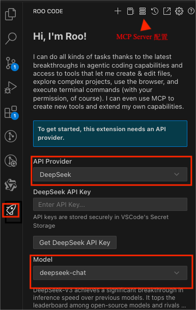

# 什么是MCP
Anthropic（Claude 模型的母公司）  推出了模型上下文协议 MCP，该协议旨在统一大型语言模型（LLM）与外部数据源和工具之间的通信协议。

MCP 主要是为了解决当前 AI 模型因数据孤岛限制，无法充分发挥潜力的难题，MCP 使得 AI 应用能够安全地访问和操作本地及远程数据，为 AI 应用提供了连接万物的接口。它通过标准化接口实现“即插即用”的交互模式，类似于“AI领域的USB-C接口”。



MCP 采用的是经典的客户端 - 服务器架构:
- MCP 主机（MCP Hosts）：发起请求的 LLM 应用程序（例如 Claude Desktop、IDE 或 AI 工具）。
  - MCP 客户端（MCP Clients）：在主机程序内部，与 MCP server 保持 1:1 的连接。
- MCP 服务器（MCP Servers）：为 MCP client 提供上下文、工具和 prompt 信息。
- 本地资源（Local Resources）：本地计算机中可供 MCP server 安全访问的资源（例如文件、数据库）。
- 远程资源（Remote Resources）：MCP server 可以连接到的远程资源（例如通过 API）。


MCP 把工具调用程序做成了一个 C-S 架构，工具的实际调用由 MCP Server 来完成。



MCP Server 相对比较独立，可以独立开发，独立部署，可以远程部署，也可以本地部署。它可以提供三种类型的功能：
- 资源（Resources）：表示服务器希望提供给客户端的任何类型的只读数据。这可能包括文件内容、数据库记录、图片、日志等等。
- 工具（Tools）：可以被 LLM 调用的函数（需要用户批准），与我们在 Agent 和 Function Calling 中使用的 Tool 是一样的，就是写程序去调用外部服务。
- 提示（Prompts）：预先编写的模板，帮助用户完成特定任务。

现在在 [MCP 官方 GitHub](https://github.com/modelcontextprotocol/servers) 上，有很多用户贡献了对接各种系统和应用的 MCP Server，比如对接本地文件系统的 MCP Server，对接 MySQL 的 MCP Server 等等。

当用户发送 prompt（例如：我要查询北京的天气） 到 MCP Hosts 时，MCP Hosts 会调用 MCP Client 与 MCP Server 进行通信，获取当前 MCP Server 具备哪些能力，然后连同用户的 prompt 一起发送给大模型，大模型就可以针对用户的提问，决定何时使用这些能力了。这个过程就类似，我们填充 ReAct 模板，发送给大模型。

当大模型选择了合适的能力后，MCP Hosts 会调用 MCP Cient 与 MCP Server 进行通信，由 MCP Server 调用工具或者读取资源后，反馈给 MCP Client，然后再由 MCP Hosts 反馈给大模型，由大模型判断是否能解决用户的问题。如果解决了，则会生成自然语言响应，最终由 MCP Hosts 将响应展示给用户。

最后，可以通过下图来类比理解MCP：


---

## MCP Client 与 Server 交互的三个阶段
整个交互流程可以分为三个阶段。
- 握手初始化：Host 的 MCP Client 向 Server 发起 initialize 请求，双方交换协议版本与能力列表，并用 initialized 通知确认；
- 正常通信：Client/Server 可双向发起 Request–Response（同步调用）或单向 Notification（异步事件），大模型应用只需按需调用 Client 的接口；
- 优雅收尾：通信完成后，任意一端可调用 close() 或因底层通道断开而触发连接关闭。

当前，Client和Server通过JSON-RPC 2.0进行通信。

Client 和 Server 之间可以传递下列类型的 MCP 消息类型：
- 1.Request：期待收到响应。
- 2.Result：请求成功的响应。
- 3.Error：请求失败时返回。
- 4.Notification：单向消息，无需响应。

通过这种分层设计，MCP 将“业务逻辑”与“上下文 / 工具管理”解耦：Host 只管“我需要哪些信息 / 能力”；Server 负责“我怎样取到或实现这些能力”。

最终，在 Host 内部，大模型得到的不再是死板的 API 返回值，而是经过精心组织的上下文提示，能够更灵活、更安全地调用外部工具、访问数据源，这样就扩展了大模型能力，让它可以对接更多复杂场景。

---

## MCP实战
由于 Claude Desktop 需要魔法上网，这里就不选择它了，选择 cline。

在 VsCode 扩展商店里，输入 “cline”，排名前两名的就是 Roo Code（原名 Roo Cline） 以及 Cline。Cline 是原版的，而 Roo Code 是一个哥们觉得 Cline 做的不好，然后自己基于 Cline 又加了扩展功能，现在几乎每天都在更新版本。这里选择安装 Roo Code，然后点击左侧的小火箭，然后配置选择的模型为 deepseek.



示例：通过  PostgreSQL MCP Server 使 DeepSeek 能够基于 PostgreSQL 中的数据来回答问题。MCP Server 支持 NodeJS 和 python 两种语言开发，本次案例使用的是 MCP 官方提供的  PostgreSQL MCP Server，其开发语言是 NodeJS ，需要根据自己的操作系统提前安装好 NodeJS。

首先，用 docker 启动 PostgreSQL 服务：
```shell
docker run -d --name postgres \
  -e POSTGRES_PASSWORD=postgres -p 5432:5432 \
  docker.1ms.run/postgres:latest
```
之后使用如下命令进入到容器内并打开 postgres 客户端。
```shell
docker exec -it postgres psql -U postgres
```

创建数据表和插入数据：
```sql
-- 创建数据库
CREATE DATABASE achievement;

-- 连接到新创建的数据库
\c achievement;

-- 创建用户信息 users 表
CREATE TABLE users (
    user_id SERIAL PRIMARY KEY,
    name VARCHAR(50) NOT NULL,
    email VARCHAR(100) UNIQUE NOT NULL
);

-- 创建绩效得分 score 表
CREATE TABLE score (
    score_id SERIAL PRIMARY KEY,
    score DECIMAL(10, 2) NOT NULL,
    user_id INT REFERENCES users(user_id)
);

-- 插入示例数据
INSERT INTO users (name, email) VALUES
('张三', 'zs@example.com'),
('李四', 'ls@example.com'),
('王五', 'ww@example.com');

INSERT INTO score (score, user_id) VALUES
(87.75, 1),
(97.50, 2),
(93.25, 3);
```
接下来，在 Roo Cline 中配置 PostgreSQL MCP Server 的连接信息，点击上方的服务器按钮，会进入到 MCP Server 的配置页面。

之后点击 Edit MCP Settings，会打开一个配置文件，我们需要在该文件中填写连接信息:
```json
{
  "mcpServers": {
    "postgres": {
      "command": "npx",
      "args": [
        "-y",
        "@modelcontextprotocol/server-postgres",
        "postgresql://postgres:postgres@<你的postgres所在的服务器的IP>:5432/achievement"
      ]
    }
  }
}
```
完成配置后，会在左侧看到已连接的 MCP Server，并且会列出支持的 Tools 和 Resources。

接下啦，我们进行测试。首先，我们提问“数据库里有哪些表？”

可以看到，大模型请求了 MCP Server，之后使用了 一条 SQL 查询语句查出了数据可中的表。

我们接下来，来一个难一点的案例，提问“张三，李四，王五的绩效谁高？”在我们的数据库中有 users 和 score 两张表，users 存储了人员姓名和邮箱信息，score 表存储了人员的绩效得分，查询绩效分时需要使用 users 表的主键去查询，因此这是一个两个表联合查询的案例。

这个过程，都是大模型自动生成SQL去查询的，而不需要我们去写SQL语句。


---

## 示例
参考 achievement/main.py

---

## 其它参考
https://zhuanlan.zhihu.com/p/29001189476