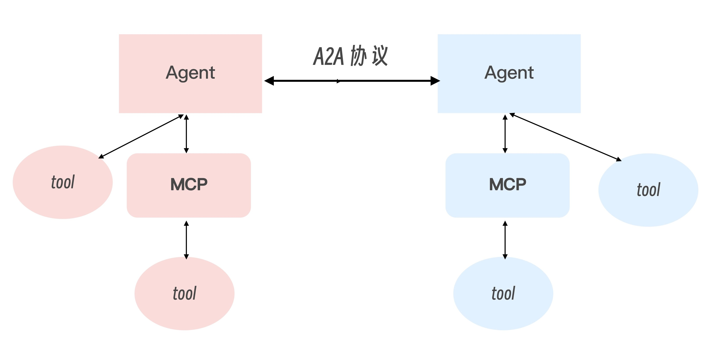
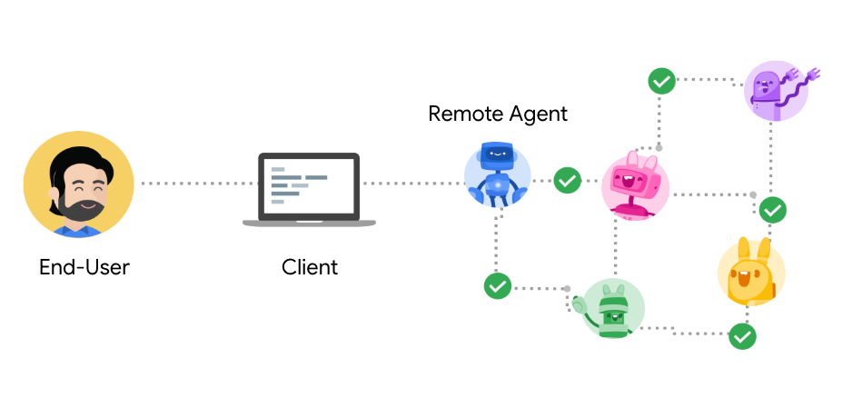
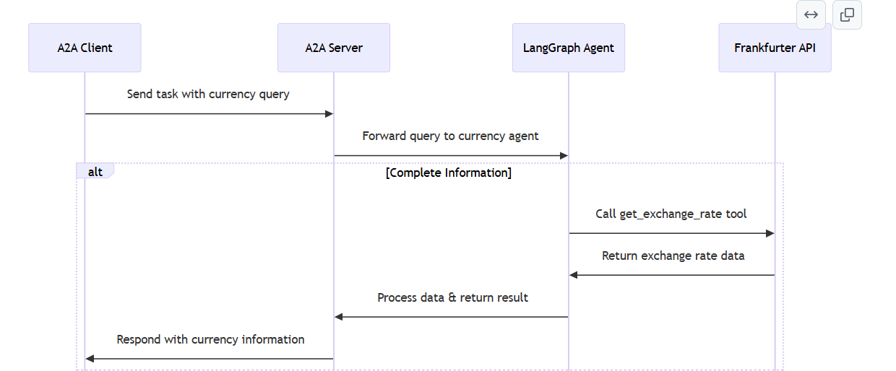

# A2A
（2025 年 4 月 9 日），Google 发布了一个名为 Agent To Agent 的协议，简称 A2A。

A2A 是一个与 Agent 有关的协议，对于各路人马创建的 Agent，A2A 提供了一种统一的封装方式。这样一来，不同来源的 Agent 能够实现互相调用，从而打破彼此之间的隔阂，避免 Agent 成为孤立的“信息孤岛”，这对推动 Agent 之间的协同合作与生态发展很有价值。

最近比较火的 MCP 也是这种大一统标准化的思路。当然，A2A和MCP 属于不同层面的协议，解决的问题也不同，因此可以做到互补。

---

## 示意图


每一个独立的 Agent 都可以去调用自身的工具，调用工具的方法可以是传统的调用方式，也可以是 MCP。而 Agent 与 Agent 之间，还可以通过 Agent 之间进行互相调用。

比如上图中，左边的 Agent 可以是一个体育助手，调用的“懂球帝”工具，右侧的 Agent 可以是一个地图助手，具备高德地图的功能。如果没有 A2A，则它们都是独立的。但有了 A2A，此时我向左边的 Agent 询问“北京鼓楼附近哪有烤鸭店？”，左边的 Agent 就会把问题转到右边的 Agent 的去完成。这便是大家都遵循协议、形成标准化的好处。

---

## A2A的协议角色


A2A 协议定义了三个角色。
- 用户（User）：最终用户（人类或服务），使用 Agent 系统完成任务。
- 客户端（Client）：代表用户向远程 Agent 请求行动的实体。
- 远程 Agent（Remote Agent）：作为 A2A 服务器的“黑盒”Agent。

需要注意的是，在 A2A 框架中，客户端（Client）通常也是一个具有一定决策能力 Agent。它代表用户行事 ，可以是应用程序、服务或另一个 AI Agent，负责选择合适的远程 Agent 来完成特定任务，管理与远程 Agent 的通信、认证和任务状态。

而远程 Agent（Remote Agent）则是执行实际任务的 Agent，作为“黑盒”存在 ，提供特定领域的专业能力，通过 AgentCard 声明自己的技能和接口，保持内部工作机制的不透明性。

这种设计使得 A2A 成为一个真正的 Agent-to-Agent 协议，而不仅仅是客户端 - 服务器架构的变种。

其中一个 Agent 可以同时是某些交互中的 Client，又在其他交互中作为 Remote Agent。例如，一个负责旅行规划的 Agent 可能作为 Client 向地图 Agent、酒店预订 Agent 和航班查询 Agent 发送请求，然后整合这些信息为用户提供完整的旅行方案。这种灵活的角色设计使得 A2A 协议能够支持复杂的 Agent 生态系统，实现 Agent 之间的专业分工和协作。

---

## A2A 协议的核心对象
文档里有几个对象，是我们要重点关注的：

第一个是 **Agent Card**：

可以理解为是 Agent 的名片，描述该 Agent 的能力和认证机制。也就是说一个 Agent 想要让另一个 Agent 了解自己的名称、能力等，就需要在名片上写清楚。Client 可以通过这些信息选择最适合的 Agent 来完成任务。
```json
//agent card
{
  "name": "Google Maps Agent",
  "description": "Plan routes, remember places, and generate directions",
  "url": "https://maps-agent.google.com",
  "provider": {
    "organization": "Google",
    "url": "https://google.com"
  },
  "version": "1.0.0",
  "authentication": {
    "schemes": "OAuth2"
  },
  "defaultInputModes": ["text/plain"],
  "defaultOutputModes": ["text/plain", "application/html"],
  "capabilities": {
    "streaming": true,
    "pushNotifications": false
  },
  "skills": [
    {
      "id": "route-planner",
      "name": "Route planning",
      "description": "Helps plan routing between two locations",
      "tags": ["maps", "routing", "navigation"],
      "examples": [
        "plan my route from Sunnyvale to Mountain View",
        "what's the commute time from Sunnyvale to San Francisco at 9AM",
        "create turn by turn directions from Sunnyvale to Mountain View"
      ],
      // can return a video of the route
      "outputModes": ["application/html", "video/mp4"]
    },
    {
      "id": "custom-map",
      "name": "My Map",
      "description": "Manage a custom map with your own saved places",
      "tags": ["custom-map", "saved-places"],
      "examples": [
        "show me my favorite restaurants on the map",
        "create a visual of all places I've visited in the past year"
      ],
      "outputModes": ["application/html"]
    }
  ]
}
```

第二是 **Task** 的概念

Task 可以理解为是一间洽谈室，由乙方（发起调用请求的 Agent）邀请甲方（接收调用请求的 Agent）进行会晤。但是会晤的结果（状态）是什么，是甲方立马执行，还是拒绝，还是安排到以后执行等等，这些细节都是由甲方说了算的。一个 Task 代表一个需要完成的任务，包含状态、历史记录和结果。

```ts
type TaskState =
  | "submitted"
  | "working"
  | "input-required"
  | "completed"
  | "canceled"
  | "failed"
  | "unknown";

interface Task {
  id: string; // unique identifier for the task
  sessionId: string; // client-generated id for the session holding the task.
  status: TaskStatus; // current status of the task
  history?: Message[];
  artifacts?: Artifact[]; // collection of artifacts created by the agent.
  metadata?: Record<string, any>; // extension metadata
}
// TaskState and accompanying message.
interface TaskStatus {
  state: TaskState;
  message?: Message; //additional status updates for client
  timestamp?: string; // ISO datetime value
}
```
文档给出了 Task 的所有状态集合。至于前面所说的，乙方如何邀请甲方等等动作，则是一个个的接口，需要我们继承实现。
```ts
// sent by server during sendSubscribe or subscribe requests
interface TaskStatusUpdateEvent {
  id: string;
  status: TaskStatus;
  final: boolean; //indicates the end of the event stream
  metadata?: Record<string, any>;
}
// sent by server during sendSubscribe or subscribe requests
interface TaskArtifactUpdateEvent {
  id: string;
  artifact: Artifact;
  metadata?: Record<string, any>;
}
// Sent by the client to the agent to create, continue, or restart a task.
interface TaskSendParams {
  id: string;
  sessionId?: string; //server creates a new sessionId for new tasks if not set
  message: Message;
  historyLength?: number; //number of recent messages to be retrieved
  // where the server should send notifications when disconnected.
  pushNotification?: PushNotificationConfig;
  metadata?: Record<string, any>; // extension metadata
}
```

---

## Artifact（成果）
Artifact 是 Remote Agent 生成的任务结果。Artifact 可以有多个部分（parts），可以是文本、图像等。

---

## Message（消息）
Message 用于 Client 和 Remote Agent 之间的通信，可以包含指令、状态更新等内容。一个 Message 可以包含多个 parts，用于传递不同类型的内容。

---

## A2A 协议的典型工作流程如下：
- 能力发现：每个 Agent 通过一个 JSON 格式的 “Agent Card” 公布自己能执行的能力（如检索文档、调度会议等）。
- 任务管理：Agent 间围绕一个 “task” 对象展开协作。该对象有生命周期、状态更新和最终产物（artifact），支持即时完成与长跑任务两种模式。
- 消息协作：双方可互发消息，携带上下文、用户指令或中间产物；消息中包含若干 “parts”，每个 part 都指明内容类型，便于双方就 UI 呈现形式（如图片、表单、视频）进行协商。
- 状态同步：通过 SSE 等机制，Client Agent 与 Remote Agent 保持实时状态同步，确保用户看到最新的进度和结果。

---

## 示例
示例地址：https://github.com/google/A2A/blob/main/samples/python/agents/langgraph/README.md

根据 README 我们就会知道，这个代码就是用 LangGraph 实现了一个 ReAct Agent，该 Agent 能调用一个计算汇率的工具。之后允许客户端使用 A2A 协议调用这个 Agent。



可以看到，A2A 实际上类似 MCP，也是一个 C-S 架构。如果想通过 A2A 去调用另一个 Agent，则首先需要实现一个 A2A 客户端。而被调用的 Agent，则需要实现一个 A2A Server，才能与客户端建立连接。

先由 A2A Client 向 A2A Server 发送消息，比如用户的 query。Server 收到消息后就会发送给 Agent，由 Agent 执行选择工具，调用工具的流程。之后将工具执行结果返给 Server，由 Server 再返给 Client。

---

## references
- https://github.com/google/A2A
- https://google.github.io/A2A/#/documentation?id=agent-card-1
- https://google.github.io/A2A/#/documentation?id=core-objects