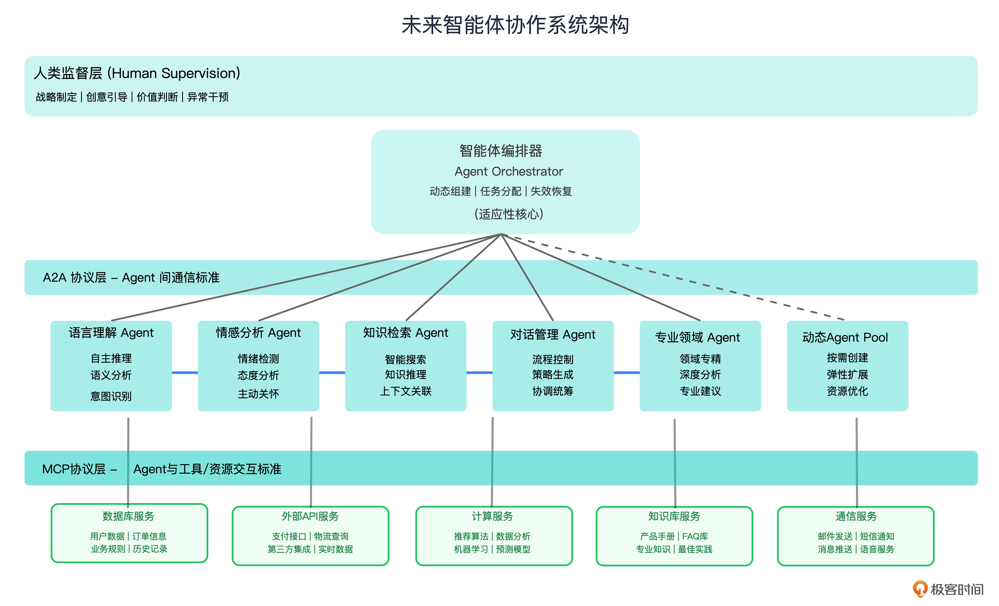

# AI 时代的智能体协作架构（2020s- 未来）
演进：单体架构 -> 微服务架构 -> AI智能体架构

从硬编码调用链到 LLM 驱动的架构本质上有和不同呢？答案是：传统系统的调用顺序是人写死的，开发者明确告诉系统“先干这个，再干那个”。

大模型出现后，调用链的设计开始由模型的推理能力动态决定，模型可以根据上下文选择调用哪个 API ，模型可以临时组合调用顺序。问题是，传统 API 调用对模型来说没有统一语义，每接入一个新工具都需要大量“胶水代码”适配。

这种架构有什么特点呢？
- 智能化节点：每个节点不再是简单的数据处理器，而是具备推理和决策能力的智能体。
- 动态协作：智能体之间能够自主发现、协商和协作。
- 上下文感知：系统能够理解和适应复杂的业务上下文。

新的架构模型呼唤新的协议和新的技术来驱动，而 MCP 与 A2A 协议正是架构演进的催化剂。

---

## 3 个核心特征
未来的智能体协作系统不再是静态的程序集合，而是一个能够自我组织、自我修复、自我演进的智能生态系统。就像一个优秀的团队，能够根据项目需要灵活调整人员配置，在成员离开时快速补充，在面临新挑战时主动学习新技能。



未来的智能体协作架构，将具备自主性、涌现性和适应性三个核心特征。

### 1. 自主性
在智能体协作架构中，每个 Agent 都具有主动性和自主决策能力。
```py
# 智能体：主动推理
class UserManagementAgent:
    async def handle_request(self, task: Task):
        # 基于上下文和目标进行推理
        context = await self.analyze_context(task)
        strategy = await self.plan_execution(context)
        
        if strategy.needs_collaboration:
            # 主动寻求其他Agent的帮助
            partners = await self.discover_agents(strategy.required_capabilities)
            result = await self.coordinate_execution(partners, strategy)
        else:
            result = await self.execute_locally(strategy)
            
        return result
```
智能体作为主动的思考者，通过上下文分析 analyze_context() 考虑当前任务的背景、历史记录、用户偏好等；通过策略规划 plan_execution() 基于分析结果制定最优的执行策略；同时，还能判断是否需要协作，并主动寻找合适的合作伙伴，基于动态适应根据实际情况选择不同的执行路径。

### 2. 涌现性
在智能体协作架构中，系统的整体能力往往超过各个 Agent 能力的简单叠加。这种涌现性来源于 Agent 之间的复杂交互。

举个例子，在一个智能客服系统中语言理解 Agent 专注于自然语言处理；知识检索 Agent 擅长从知识库中查找信息；情感分析 Agent 能够识别用户情绪；对话管理 Agent 负责整体对话流程控制。

一旦智能客服系统中的 Agent 协作起来，当用户询问“我的订单怎么还没发货？我很着急！”时，系统展现的处理能力远超任何单个 Agent。

### 3. 适应性
智能体协作架构的另一个重要特征是强适应性。系统能够实现动态重组，即根据任务需要临时组建 Agent 团队；同时动态能力扩展，因为新的 Agent 可以随时加入系统，当某个 Agent 失效时，其他 Agent 可以接管其职责。

```py
class AgentOrchestrator:
    def __init__(self):
        self.agent_registry = {}
        self.capability_map = {}
    
    async def handle_complex_task(self, task: ComplexTask):
        # 动态分析任务需求
        required_capabilities = await self.analyze_requirements(task)
        
        # 动态组建团队
        team = await self.assemble_team(required_capabilities)
        
        # 自适应执行策略
        if len(team) == 1:
            return await self.single_agent_execution(team[0], task)
        else:
            return await self.multi_agent_collaboration(team, task)
    
    async def assemble_team(self, capabilities):
        team = []
        for capability in capabilities:
            # 寻找最适合的Agent
            best_agent = await self.find_best_agent(capability)
            if best_agent:
                team.append(best_agent)
            else:
                # 如果没有现成的Agent，可以动态创建或请求外部帮助
                new_agent = await self.create_or_request_agent(capability)
                team.append(new_agent)
        return team
```
未来 Agent 协作系统适应性的实际效果包括任务复杂度自适应，简单任务由单 Agent 处理完成，中等任务则 2-3 个 Agent 协作，复杂任务则需要动态组建 Agent 团队来完成。

同时，通过资源利用优化，闲时 Agent 进入休眠状态，忙时自动扩展 Agent 数量，突发情况临时调用外部 Agent。

自适应系统架构中的学习型 Agent 从历史任务中学习，能力持续演进，也通过能力发现自动识别新的 Agent 能力，通过无缝集成新的 Agent 类型进行生态扩展。