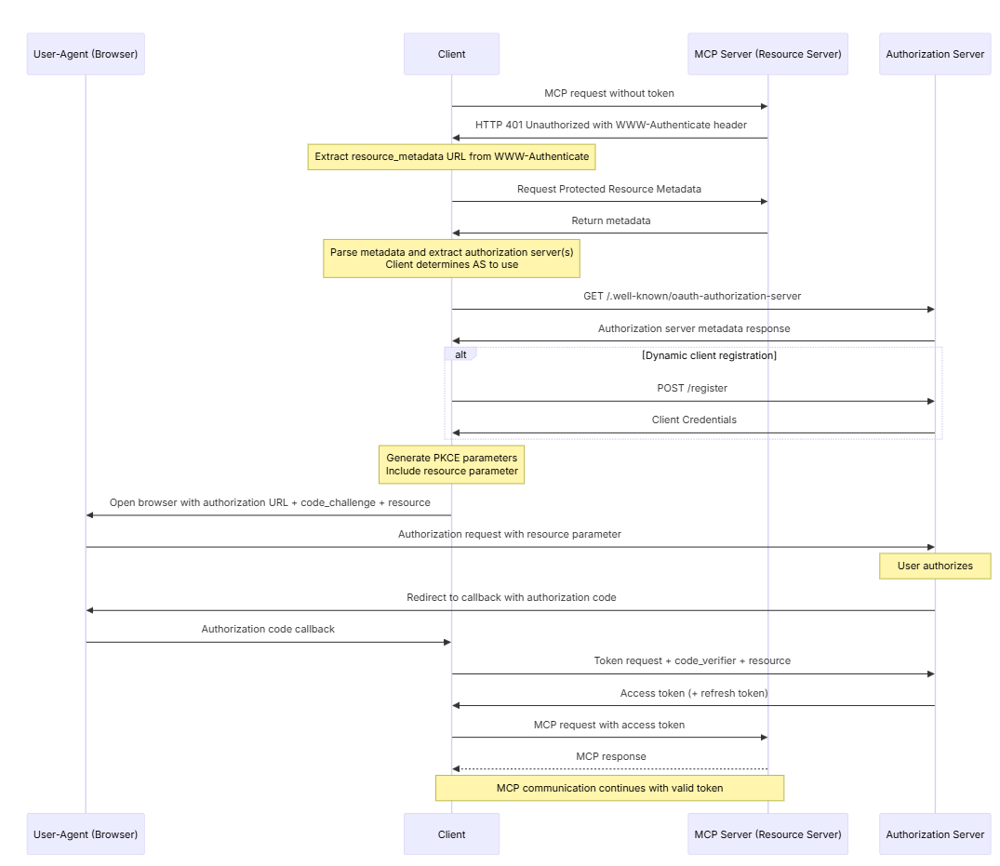

# MCP Permission
在智能体时代，授权的内涵发生了根本性变化:
- 从静态到动态：传统系统的权限通常是预先配置的，而智能体的权限需要根据任务动态调整。
- 从直接到委托：用户不再直接操作系统，而是委托智能体代为执行，这引入了委托授权的复杂性。
- 从单点到链式：一个任务可能涉及多个智能体的协作，权限需要在智能体链条中安全传递。

现在的模型或 Agent 不止需要“看”数据，还会“代表用户去行动”；它们常常是跨主语、跨系统、跨组织的。于是我们不只要“能连”，更要回答：替谁连、连到哪、凭什么连、连多长时间、连完算谁的账。

---

## MCP 的授权机制：为 AI 工具访问把关
如何确保智能体只能访问完成任务所必需的资源？如何防止权限在智能体之间的传递中被放大或滥用？如何在保证安全的同时不影响用户体验？

MCP 的授权机制建立在 OAuth 2.1 之上，专门为 HTTP 传输设计，让 MCP 客户端能够代表资源所有者向受限的 MCP 服务器发起请求。

MCP 在其授权页面开宗明义地提出下面的核心设计理念：
```
The Model Context Protocol provides authorization capabilities at the transport level, enabling MCP clients to make requests to restricted MCP servers on behalf of resource owners. This specification defines the authorization flow for HTTP-based transports.
```
at the transport level（在传输层级别），意思是授权机制不是在应用逻辑层面，而是在网络传输层面实现。为什么这样设计？有三个考量。
- 协议无关性： 无论使用 HTTP、WebSocket 还是其他传输方式，都能统一处理授权。
- 透明性： 应用层的 MCP 工具不需要关心授权细节。
- 安全性： 在数据传输之前就完成权限验证。

MCP clients to make requests to restricted MCP servers, 此处 restricted 的含义为不是所有人都能访问，需要授权的 MCP 服务器。
```
MCP Client（客户端）
├── Claude、GPT等AI模型
├── AI应用或Agent
└── 开发者工具

MCP Server（服务器）
├── 文件系统访问服务
├── 数据库查询服务
├── API集成服务
└── 其他受保护的资源服务
```


第三个关键点是 on behalf of resource owners（代表资源所有者）
```
用户（资源所有者）→ 授权给AI模型 → 访问用户的文件/数据库/API
```
举例来说，AI 查询企业数据库的场景：
```
参与者：
- 资源所有者：企业员工李四
- MCP Client：企业AI助手
- MCP Server：CRM数据库服务

流程：
1. 李四请AI助手分析销售数据
2. 李四通过OAuth流程授权AI助手
3. AI助手代表李四向CRM数据库发起查询
4. 数据库服务验证权限后返回李四有权查看的数据
```
上述设计从技术架构意义上，成功实现了授权与业务分离。也就是说，没有 MCP 授权时，AI 模型直接调用各种 API，每个 API 都要单独处理权限；有了 MCP 授权时，AI 模型先通过 MCP 传输层（统一授权），然后通过 MCP 服务器访问底层资源。

MCP 建立了一个标准化的“代理授权”框架，让 AI 能够安全地、可控地代表用户访问各种受保护的资源，而授权验证发生在网络传输层面，确保了安全性和透明性。这种设计特别适合 AI 时代的需求——AI 需要访问很多用户资源，但用户必须能够精确控制 AI 能做什么、不能做什么。

---

## MCP 的 OAuth 实现
```py
# MCP授权流程示例
class MCPAuthFlow:
    async def connect_to_server(self, server_url: str):
        # 1. 服务器返回401，附带资源元数据URL
        response = await self.initial_request(server_url)
        if response.status == 401:
            metadata_url = self.extract_metadata_url(response.headers['WWW-Authenticate'])
            
        # 2. 获取资源服务器元数据
        resource_metadata = await self.fetch_metadata(metadata_url)
        auth_servers = resource_metadata['authorization_servers']
        
        # 3. 发现授权服务器配置
        auth_server = auth_servers[0]  # 选择第一个授权服务器
        auth_config = await self.fetch_auth_server_metadata(auth_server)
        
        # 4. 动态客户端注册（如果需要）
        if not self.has_client_id:
            client_info = await self.dynamic_registration(
                auth_config['registration_endpoint'],
                {
                    "client_name": "MCP Client",
                    "redirect_uris": ["http://localhost:8080/callback"],
                    "grant_types": ["authorization_code"],
                    "response_types": ["code"]
                }
            )
            self.client_id = client_info['client_id']
        
        # 5. 启动授权码流程（使用PKCE）
        code_verifier = self.generate_code_verifier()
        code_challenge = self.generate_code_challenge(code_verifier)
        
        auth_url = self.build_auth_url(
            auth_config['authorization_endpoint'],
            client_id=self.client_id,
            redirect_uri="http://localhost:8080/callback",
            code_challenge=code_challenge,
            resource=server_url  # 关键：指定目标资源
        )
        
        # 6. 用户授权后，交换访问令牌
        authorization_code = await self.wait_for_callback()
        
        token = await self.exchange_token(
            auth_config['token_endpoint'],
            code=authorization_code,
            code_verifier=code_verifier,
            resource=server_url  # 再次指定资源
        )
        
        # 7. 使用令牌访问MCP服务器
        return await self.connect_with_token(server_url, token)
```
MCP 强制要求客户端在授权请求和令牌请求中都包含 resource 参数，明确指定令牌的使用目标。这个看似简单的要求，实际上建立了一道重要的安全防线。
```py
# 错误的做法：令牌可以被用于任何服务
token = get_generic_token()
call_any_service(token)  # 危险！

# MCP的做法：令牌绑定到特定资源
token = get_token_for_resource("https://mcp.example.com/weather")
# 这个令牌只能用于weather服务，不能用于其他服务
```
MCP 的安全不仅依赖客户端的正确行为，服务器端也必须进行严格的验证。你可以参考后面的这个例子来看看如何实现双向的信任验证。
```py
class MCPServer:
    async def validate_request(self, request: Request):
        # 1. 提取令牌
        auth_header = request.headers.get('Authorization')
        if not auth_header or not auth_header.startswith('Bearer '):
            return Response(status=401, headers={'WWW-Authenticate': 'Bearer'})
        
        token = auth_header[7:]
        
        # 2. 验证令牌有效性
        try:
            claims = await self.verify_token(token)
        except TokenInvalidError:
            return Response(status=401)
        
        # 3. 关键：验证受众（audience）
        if self.server_url not in claims.get('aud', []):
            # 令牌不是为本服务器颁发的
            return Response(status=403, body="Token not intended for this resource")
        
        # 4. 验证权限范围
        required_scope = self.get_required_scope(request.path)
        if not self.has_scope(claims.get('scope', ''), required_scope):
            return Response(status=403, body="Insufficient scope")
        
        # 5. 执行请求
        return await self.process_request(request, claims)
```
MCP授权流程如下：



- 客户端发起请求（MCP request without token），但没有携带有效 Token。 MCP 服务器返回 401 Unauthorized，并带上 WWW-Authenticate 头，告诉客户端去哪里获取授权。这就好比你去大楼刷卡进门，但没带门禁卡，保安拦下你，并告诉你，请去前台（授权服务器）登记。
- 获取授权服务器信息。客户端根据 WWW-Authenticate 提供的 resource_metadata URL，去请求受保护的元数据。元数据里包含可用的授权服务器（Authorization Server） 信息。客户端决定用哪个授权服务器。 这相当于你去前台，前台告诉你“这栋楼的门禁由某个安保部门负责”。
- 客户端注册，这步是可选的。如果客户端是“新来”的，会进行动态注册（POST /register），拿到一份 client credentials。这是客户端向授权服务器说明自己身份的过程。这相当于你第一次来大楼，要在前台登记，留下注册信息，然后拿到一张临时访客卡。
接着是生成 PKCE 参数 & 用户授权。客户端生成 PKCE 参数（code_challenge/code_verifier）增强安全性，然后通过浏览器重定向到授权服务器，发起授权请求。用户在浏览器端确认授权。也就是你把访客申请表交给前台，前台再询问真正的业主（用户），“要不要允许这位访客进入？”
- 随后是授权码回调 & 换取 Token 环节。 用户同意后，授权服务器返回授权码（Authorization Code）给客户端。客户端再用授权码 + PKCE 参数，去换取 Access Token（访问令牌） 和可选的 Refresh Token。这相当于业主同意后，前台给你一张有效的临时门禁卡（（Access Token）。
- 最后就是携带 Token 访问资源，客户端带着 Access Token 再次访问 MCP 服务器。这次验证通过，正常返回数据。之后的通信都会带上有效 Token，直到 Token 过期。这好比你拿到门禁卡后，就能顺利刷卡进出大楼，，直到卡过期失效。

---

## MCP 的核心安全原则
MCP 明确禁止令牌透传（Token Passthrough），即 MCP 服务器绝不能将收到的令牌转发给上游 API。这是为了防止“混淆代理人”（Confused Deputy）问题：
```py
# 危险的做法：令牌透传
class BadMCPServer:
    async def handle_request(self, request, user_token):
        # 错误：直接使用用户令牌调用上游API
        upstream_response = await call_upstream_api(
            headers={'Authorization': f'Bearer {user_token}'}
        )
        return upstream_response


# 正确的做法：令牌交换
class SecureMCPServer:
    async def handle_request(self, request, user_token):
        # 验证用户令牌
        user_claims = await self.verify_token(user_token)
        
        # 使用服务器自己的凭据获取新令牌
        upstream_token = await self.get_upstream_token(
            scope=self.map_to_upstream_scope(user_claims)
        )
        
        # 使用新令牌调用上游API
        upstream_response = await call_upstream_api(
            headers={'Authorization': f'Bearer {upstream_token}'}
        )
```
此外，MCP 客户端必须使用 Authorization 请求头字段，并且授权必须包含在每个 HTTP 请求中，即使它们是同一逻辑会话的一部分。访问令牌绝不能包含在 URI 查询字符串中:
```
# 正确的方式
GET /tools/weather HTTP/1.1
Authorization: ls/weather?token=eyJhbGciOiJSUzI1NiIs... HTTP/1.1
```

---

## MCP 的第三方授权
MCP 服务器可以支持通过第三方授权服务器进行委托授权。在这个流程中，MCP 服务器既充当 OAuth 客户端（对第三方认证服务器），又充当 OAuth 授权服务器（对 MCP 客户端）。

例子：
```
用户 --> Claude Desktop --> MCP Server (Gmail) --> Google OAuth
         (MCP Client)       (OAuth Server+Client)   (Third-party Auth)
```
- 用户在 Claude Desktop 中说：“帮我查看邮件”。
- Claude Desktop（MCP Client）向 Gmail MCP Server 发送请求。
- Gmail MCP Server 发现需要 Google 授权，引导用户到 Google 登录。
- 用户在 Google 完成授权。
- Gmail MCP Server 获得 Google 的访问令牌。
- Gmail MCP Server 向 Claude Desktop 颁发 MCP 令牌。
- Claude Desktop 使用 MCP 令牌访问邮件。