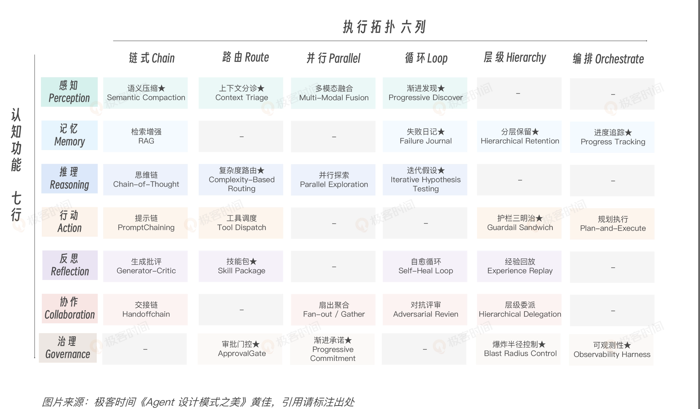
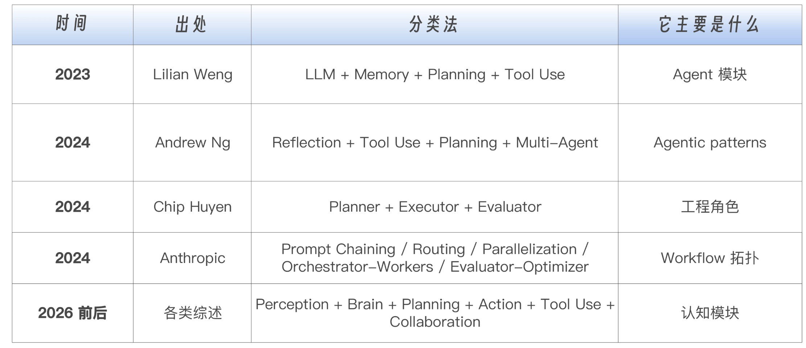
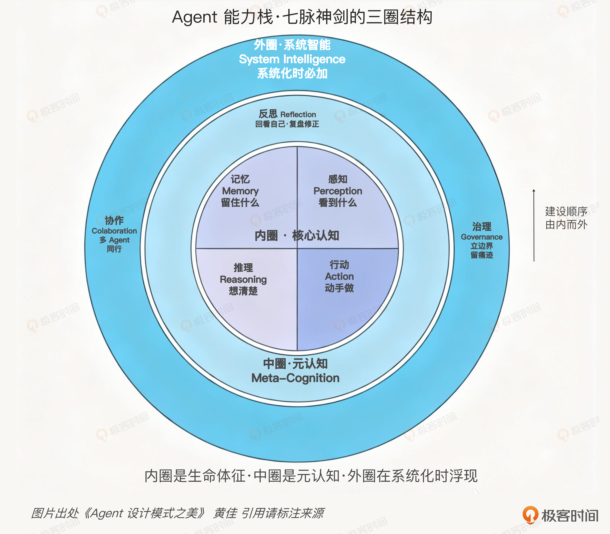
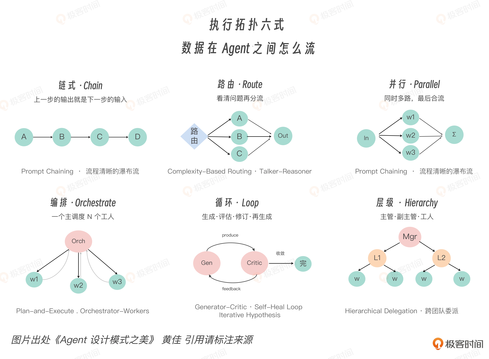

# Pattern Advance
Agent 架构，就是在不确定性之下设计有界资源的分配。

## 模式演进的根因：三种不确定性
第一种 输出不确定 (Output uncertainty)

同一个 prompt，模型跑十次，可能给十种不同答案。你过去以为 retry 会得到同样结果，传统软件的 retry 假设幂等，失败重跑应该得同样结果。但在 LLM 上，LLM 调用的重试可能得到完全不一样的答案，引出新的行为分支。这就让熔断器（Circuit Breaker）、幂等键（Idempotency-Key）这些经典工程模式整套要重新装一遍。

第二种 行为不确定 (Behavioral uncertainty)

Agent 不只是给你一个答案，它还会自己决定要不要调用工具、先调用哪个工具、要不要问澄清问题、要不要继续展开思考。它的行为轨迹，不再是代码里写死的流程图。一个 ReAct Agent 在 Reasoning 和 Acting 之间循环切换，循环长度、循环内容、每一步具体做什么，都不是 设计阶段就能预测的。

第三种 环境不确定 (Environmental uncertainty)

Agent 操作的世界本身在变。一个浏览网页的 Agent，今天看到的页面布局明天可能变了；一个写代码的 Agent，它上次读过的 Codebase 这次可能已经被同事改过。世界不会停下来等 Agent。

传统软件工程把不确定性当边缘情况来处理，try-catch 一下、retry 几次、超时报错。大家会觉得我加个 retry、schema 校验，后者加个 timeout 就稳了。这思路是 try-catch 思路，它治不了 Agent 系统。

Agent 工程必须**把不确定性当作默认运行条件**。也就是说，要从一开始就默认系统会漂、会偏、会重复、会失控，在这个前提下设计结构，不能等出了问题再打补丁。

---

## 真正的新地基：Harness
地基（前提）变了，软件工程系统的重心也就不同了。当系统的关键决策越来越多地在运行时由模型作出时，工程师的工作重心就发生了迁移。过去我们主要是在写功能逻辑，现在我们越来越多是在**设计边界条件**。

也就是说，工程师定义的范围扩展了。除了“系统做什么”，还要定义：
- 模型在什么上下文下思考；
- 模型能看到哪些信息；
- 模型能调哪些工具；
- 模型在什么条件下必须停下来；
- 模型做错以后，系统如何把它拉回来；
- 模型做过什么，谁来留痕，谁来审计。

这一整层，不是 prompt。这一整层，就是 Harness(-> catalyst/LLMEngineering/Harness)。

Harness 在模型思考之前、之中、之后，给它立边界、留痕迹、做审计。它不替代模型思考。

更口语一点说，就是：模型负责花钱，Harness 负责管账。

到了 Agent 世界里，token 是钱，context 是钱，工具调用是钱，wall-clock 是钱，用户信任是钱，不可逆动作的风险也是钱。模型天然擅长生成可能性，但它不天然擅长节制。它会花，会试，会探索，会走弯路。真正的问题是它花到哪里、花多少、什么时候该停——模型会花是默认前提。于是 Harness 的意义就出现了：它不负责创造智能，它负责约束智能的开销与后果。

Agent 时代逼着我们去驯服模型的运行时决策。而驯服这件事，靠的就是整套 Harness 工程。

---

新一代工程师最重要的能力，是能把企业的流程、知识、权限、风险、审计，沉淀成一套 Agent 可以消化、可以复用、可以持续迭代的 Harness 结构。写几个只存在于 PPT 展示、看起来很炫的 Agent demo 谁都能做，再包一层 Workflow 也算不上真正的工程能力。你做的是企业未来的智能操作系统外壳。

---

## 双轴正交框架的提出：这一代的“GoF 词汇”
- 第一条轴，叫认知功能。 也就是 Agent 到底在做什么：感知、记忆、推理、行动、反思、协作、治理。它是在看、记、想、做、反思、协作，还是治理自己。
- 另一条轴，叫执行拓扑。 回答数据和控制怎么流动：链式、路由、并行、编排、循环、层级。它是链式传下去、路由选出去、并行撒出去、集中编排、循环收敛，还是层级委派。

前者回答的是：资源花在哪里。后者回答的是：资源怎么花出去。Model spends, harness budgets。模型负责花 token、花工具调用、花时间、花信任；Harness 负责决定它怎么花、能花多少、花完留下什么账。

Agent 时代的设计模式，不再只是在回答最终的代码长什么样，而是在回答“一个不确定的模型，在有限资源里，应该把注意力、记忆、推理、工具、权限和责任分别放到哪里”。

我们将解决三件事。
- 第一，为什么现有的 Agent 模式分类不够全面、解决不了具体问题，业界 5 类主流说法为什么都只摸到了局部。
- 第二，把两根轴要表达的内容讲透。纵轴不是随便列 7 个名词，它背后是 Agent 能力从个体认知到系统智能的层级；横轴也不是流程图集合，它背后是错误、成本、延迟和责任在系统里的传播路径。
- 第三，把这张图变成拿来即用的工程工具：拿到一个业务需求，怎么查表、选模式；看到一个开源框架，怎么判断它覆盖了哪些格；评审一个 Agent 架构，怎么问出真正的问题。

Circuit Breaker，Saga，后来的 Sidecar、Bulkhead、Idempotency Key、Reconciliation Loop，这些都是“问题 → 模式”的组织方式。网络会挂，所以要熔断；跨服务事务会失败，所以要补偿；横切关注点散落，所以抽成 sidecar。这种“见招拆招”在分布式时代很有效，因为问题高度可命名：延迟、故障、重试、幂等、隔离、观测。但 

Agent 时代只靠问题清单不够。原因很简单：Agent 模式之间的组合密度更高。一个生产级 Agent 很少只用一个模式。代码评审 Agent 可能同时有上下文分诊、分层记忆、复杂度路由、工具调度、生成批评、审批门控、可观测性。它们是互相影响的预算系统，不能当成并排摆着的零件来看：上下文分诊影响推理质量，推理路径影响工具调用，工具结果影响反思，反思又可能触发重新检索或重新计划。

如果没有坐标，架构评审会变成一堆松散术语。有人说我们要加 reflection，但他说不清是生成批评（Generator-Critic）、自愈循环（Self-Heal Loop），还是跨会话经验回放。有人说我们要上多模态智能体，但他说不清是扇出 / 汇聚（Parallel fan-out）、编排器 - 工作者（Orchestrator-Workers），还是真正的层级委派。词汇越热，歧义越大。

我不只是要问：我想让 Agent 做什么？我还要问：我想怎样组织 Agent 的行为？

当 What 和 How 这两个问题交叉在一起时，第三个问题才真正浮现出来—— Why：为什么我在这个场景下需要这个模式？

---

### 业界分类的三个盲区

这些分类都对，但它们不是同一层的东西。Weng 在数模块，Anthropic 在数 Workflow，Andrew Ng 在数常见 Agentic Design Pattern，Chip Huyen 更像在数工程角色。

把这些分类叠在一起，会发现三个共同盲区。
- 第一个盲区是感知。 很多分类默认 LLM 拿到的 input 已经是正确 input，但生产系统最先死的往往就是 input。200K context 装不下整个 codebase，检索回来的 100 个 chunk 有 70 个是噪声，日志流一秒几千行，多模态输入没有统一接收口。Agent 要做的是在有限窗口里决定“什么值得看”，“看见一切再思考”根本不可能。感知不是前处理的小步骤，它是注意力预算的第一道闸。
- 第二个盲区是反思。Reflection 经常被折进 Reasoning，好像只是推理的一种技巧。而 Reflexion 论文里，语言反馈和经验记忆让 coding benchmark 的表现明显提升，这说明反思是把“一次性回答”推进到“可迭代改进”的关键机制，远不只是锦上添花。因此工程上它应该独立成脉。Reasoning 产出候选答案，Reflection 判断候选答案是否站得住 Reasoning 是生成方向，Reflection 是纠偏方向。
- 第三个盲区是治理。 Demo 可以没有治理，工程却不能没有治理。一个能读文件、改代码、发邮件、操作云资源的 Agent，如果没有审批门控（Approval Gate）、爆炸半径控制（Blast Radius Control）、审计追踪（Audit Trail）、trace 和权限边界，它就是一个事故候选——根本谈不上是工程系统。2025 年 Anthropic 披露的 agentic cyber misuse 案例之后，这件事不再是理论风险：当 Agent 能跨多步自主行动，治理就必须和行动能力一起设计，而不是上线前临时补丁。

这三个盲区指向同一个问题：行业早期太关注模型“里面”发生了什么，太少系统化讨论模型“周围”应该怎么布置。

---

### 纵轴：感知七脉  
纵轴叫认知功能。它问的问题很朴素：一个 Agent 到底在做什么？

七大认知功能：Perception / Memory / Reasoning / Action / Reflection / Collaboration / Governance。

内圈是核心认知：感知、记忆、推理、行动。没有这四件事，Agent 就会退化成聊天机器人或固定脚本。它不能主动选择信息，不能跨步骤保持状态，不能根据观察调整判断，也不能改变外部世界。

中圈是元认知：反思。反思的本质是把上一步的产物变成下一步的对象，它不只是多想一会儿。它让 Agent 从“生成答案”进入“审查答案”，从“执行计划”进入“检查计划是否仍然成立”。没有反思，Agent 的输出永远像初稿；有了反思，Agent 才开始像一个会返工的工程师。

外圈是系统智能：协作和治理。协作让 Agent 从单体扩展成组织，治理让 Agent 从能力展示变成可上线系统。单 Agent demo 可以暂时没有外圈；真正进入企业流程，外圈缺一不可。协作没有隔离，会制造上下文污染和责任混乱；治理没有跟上，能力越强风险越大。

内圈让 Agent 能用，中圈让 Agent 可靠，外圈让 Agent 能上线。

正确路径通常更朴素一些：先跑通内圈，再加反思稳定质量，最后加协作和治理扩大规模。每个项目不需要在第一天就七脉全满，但架构师必须第一天就知道七脉在哪里。你可以暂时不实现某一脉，但不能假装它不存在。

---

### 横轴：拓扑六式
如果说认知功能决定 Agent 在花哪一种资源，那么执行拓扑决定这种资源如何在系统里传播。数据怎么从一个节点到另一个节点，控制权怎么交接，错误怎么扩散，延迟怎么叠加，责任怎么落地，这些都由拓扑决定。

Anthropic 在 Building Effective Agents 里列出的 Prompt Chaining、Routing、Parallelization、Orchestrator-Workers、Evaluator-Optimizer，本质是在讲 workflow 拓扑。Google ADK 的 SequentialAgent、ParallelAgent、LoopAgent 也是拓扑。OpenAI Agents SDK 的 Handoffs、Guardrails、Tracing，更偏协作和治理拓扑。LangGraph 用有向图、条件边和 state graph 把这些拓扑进一步泛化。

这些框架的共同点是它们都在回答“流怎么走”。

六式分别是 Chain、Route、Parallel、Orchestrate、Loop、Hierarchy。为了方便记忆，也可以提炼为六个动词：传、选、撒、协、转、分。