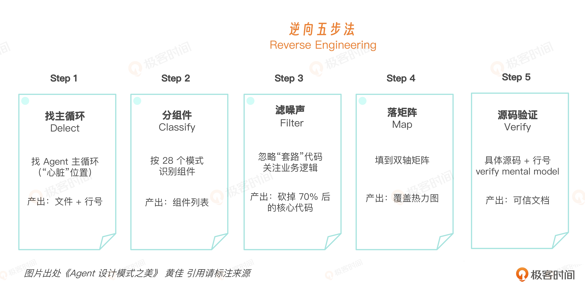
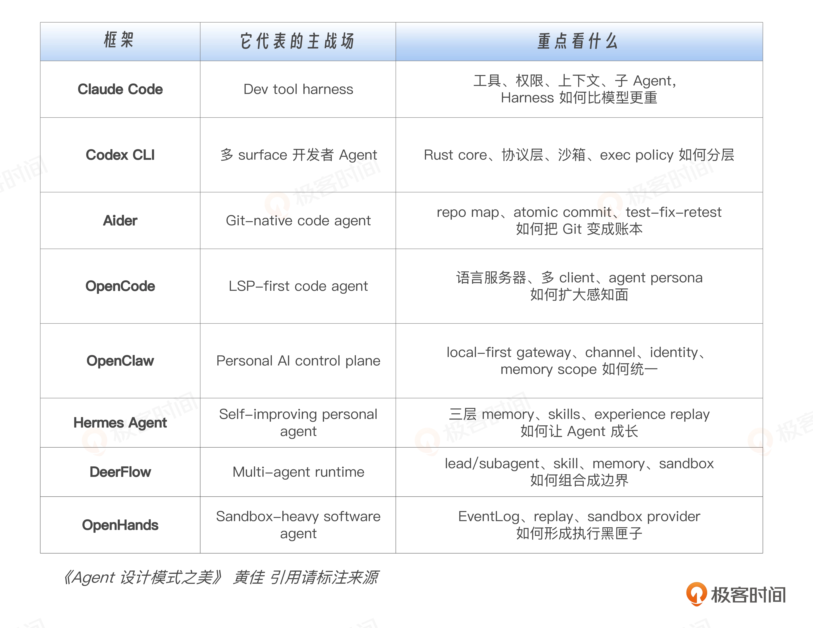
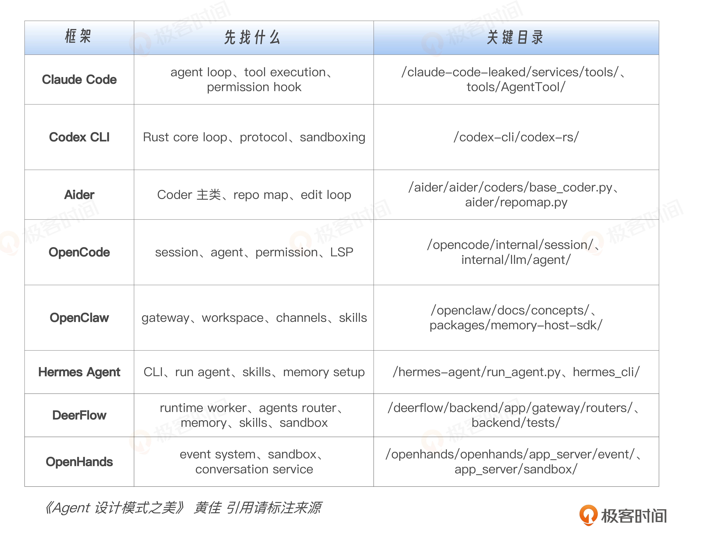
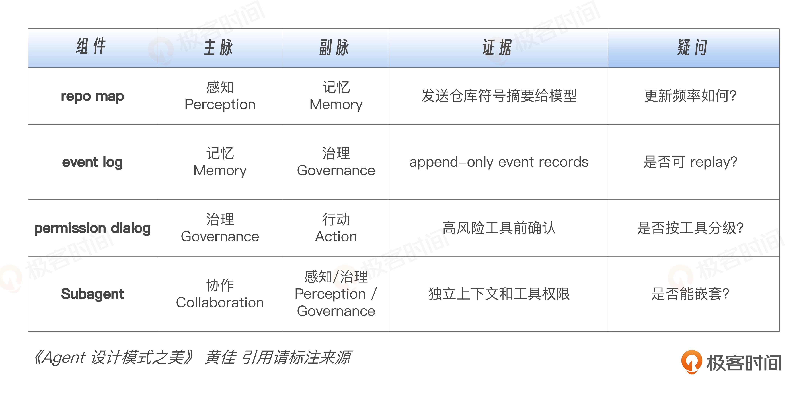
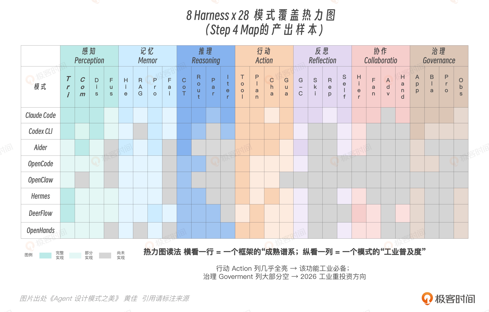

# 逆向五步法
第三块地基：怎么看懂真实工业系统。

比如我们打开一个 50 万行的 Agent 工程仓库，还是不知道从哪里下手，那些概念就停留在白板上。工程师真正要练出来的能力，是把一个陌生系统拆成可验证的结构图。

这就是逆向五步法。其实也就是**通过 5 个具体步骤来做逆向工程，剖析成熟的 Harness 框架**。
```
Detect / Classify / Filter / Map / Verify 
找主循环，分组件，滤噪声，落矩阵，源码验证。
```


用 8 个 Agent Harness 当样本：Claude Code、Codex CLI、Aider、OpenCode、OpenClaw、Hermes Agent、DeerFlow、OpenHands。

8 个框架只是素材。真正的主角是庖丁用来解牛的那把刀。我们是用这把刀来对市场上的各种 Harness 进行横切。8 个框架会变，版本会变，目录结构也可能变。但只要 Agent 还需要感知、记忆、推理、行动、反思、协作和治理，逆向五步法就仍然适用。

从中既能看到 Agent Harness 的共同骨架，也能看到不同场景下的取舍。

Agent 工程正在从“模型会不会调用工具”转向“模型如何被放进一个可靠运行时”。

可以把这 8 个框架当成八块标本，你可以参考后面这张表。



这 8 个样本放在一起，刚好形成一个坐标系：左边是开发者工作流，右边是个人与组织工作流；整体上既包含感知和记忆，也有行动和治理，同时用协议、事件、沙箱、权限把模型的不确定性包起来。我更愿意把它当成一次标本观察。产品很快过期，而标本背后的工程理念却能长存。我们真正要学的是它们为什么这样设计。

---

## 为什么需要“逆向五步法”？
因为我们读 Agent 框架源码或许会掉进一些坑。

第一个坑，README 幻觉。README 通常告诉你这个项目“能做什么”，但很少告诉你它“为什么这样做”。你读完以后，可能知道它支持工具调用、支持多 Agent、支持沙箱执行，但你仍然不知道：主循环在哪里？状态怎么传？上下文怎么装配？权限在哪里被卡住？换句话说，我们看到了功能清单，却没有看清系统骨架。

第二个坑，关键词漫游。很多人一上来就开始 grep：agent、tool、memory、context。结果跳出来几百个文件，每个文件看两眼，都像是重点。看了一圈以后，脑子里只剩下一堆碎片：这里有个工具注册，那里有个 memory class，那边还有个 planner。你以为自己在逆向架构，其实只是在源码景点观光打卡。

第三个坑，从入口函数一路钻到底。因为大型项目里，70% 的代码可能都是配置、日志、类型定义、序列化、适配器、UI glue、兼容层。你从 main() 开始顺着调用栈往下钻，很容易钻进一条很漫长但不关键的支路。费了半天劲，文件看了很多，却忘了自己最初到底想找什么。

真正卡住大家的是缺少一个预期框架。逆向工程的第一原则是：先知道一个 Agent Harness 理论上应该长什么样，再去源码里验证它实际什么样。有了预期框架，源码阅读才能按图索骥。

一个 Agent Harness 理论上应该长什么样？其实它的骨架很稳定。
- 它一定有一个主循环，负责接收输入、装配上下文、调用模型、处理工具结果，并决定下一步怎么走。
- 它一定有上下文管理，否则 token window 很快就会失控，模型也会不知道该记住什么、丢掉什么。
- 它一定有工具注册和调度，否则模型的行动空间就没有边界，不知道哪些工具能用、怎么用、什么时候用。
- 它一定有某种状态或事件记录，否则长任务无法恢复，出了问题也没法调试、回放和审计。
- 它一定有治理边界，哪怕很弱，也会以权限、沙箱、确认、日志、策略等形式出现。因为只要 Agent 能行动，就必须回答一个问题：它被允许做到哪一步？

所谓逆向五步法，就是把这五个预期变成一套可执行流程：先找主循环，看 Agent 如何一轮一轮推进；再找上下文管理，看它如何控制模型看到什么；再找工具系统，看行动空间如何被注册、约束和调度；再找状态与事件记录，看系统如何支持恢复、调试和审计；最后找治理边界，看权限、沙箱、确认和日志在哪里真正生效。

---

## 逆向工程五步法实战
- 探测（Detect），先找主循环。
- 归类（Classify），把组件归到七脉。
- 降噪（Filter），主动丢掉 70% 噪声。
- 映射（Map），落到双轴矩阵。
- 验证（Verify），回到源码验证判断。

### Step 1 Detect：先找主循环
所有 Agent Harness 都有一个心脏。这个心脏通常藏在一段不断重复的运行循环里，未必是 README 里最显眼的概念，也未必是项目里最有名的类。
```
用户输入
  -> 构造上下文
  -> 调用模型
  -> 解析模型返回
  -> 分发工具 / 交给其他 Agent / 询问用户
  -> 收集执行结果
  -> 更新状态
  -> 继续下一轮，或者停止

---

input
  -> build context
  -> call model
  -> parse response
  -> dispatch tools / handoff / ask user
  -> collect observations
  -> update state
  -> continue or stop
```
第一步的目标很朴素，先回答三个问题：
- 用户输入从哪里进来？
- LLM 调用在哪里发生？
- 工具执行结果怎么回到下一轮上下文？

实操上，先 grep （搜索）这些词：
```
rg "tool_call|function_call|tool_use|ToolCall|Action|Observation" .
rg "while|loop|step|run|turn|conversation|session" .
rg "messages|context|history|state" .
```
然后你顺着两个方向交叉定位：
- 一个方向是入口：用户输入、session、conversation、turn。
- 另一个方向是模型调用：messages、model、completion、response、tool call。

真正的主循环，通常会同时碰到三件事：messages、model call、tool dispatch。只处理 UI 的文件大概率可以排除；只处理配置的文件也先放一边；某个具体工具的实现，通常只是主循环调用的一环。主循环一定是那个把“用户输入、模型思考、工具行动、结果返回”串起来的地方。

这一阶段的产出物，不需要精细。你只需要画一张很粗的图，最好不要超过 10 个框，比如后面这样。
```
User Input -> Session -> Context Builder -> LLM -> Tool Dispatcher
               ^                                  |
               |                                  v
             Event Log <- Observation <- Runtime / Sandbox
```

想要找到主线，就得学会“抓大放小”。对于我们的 8 个框架，可以这样建立第一层锚点：



---

### Step 2  Classify：把组件归到七脉
找到主循环之后，不要急着继续往下钻。不要急于刚找到一点线索，马上顺着调用栈一路钻到底。那样做容易钻进了某个序列化函数、配置类、UI 组件，再也出不来了。

正确做法是：先停一下，用上一讲的“认知七脉”对号入座，给主循环周围的组件做归类。
- 这个组件到底在帮 Agent 管什么资源？它是在决定 Agent 看见什么？那就是 Perception。
- 它是在决定 Agent 记住什么？那就是 Memory。
- 它是在组织推理步骤？那就是 Reasoning。
- 它是在执行工具和外部动作？那就是 Action。
- 它是在检查、修正、重试？那就是 Reflection。
- 它是在拆分任务、调度子 Agent？那就是 Collaboration。
- 它是在管理权限、审计、沙箱和边界？那就是 Governance。

注意，这里不要只看组件名字，而要看它在系统里真正做什么。比如 Aider 的 repo map，名字看起来像一个仓库索引，实际还决定哪些代码结构能进入 LLM 上下文，所以它首先是 Perception。同时，它也让 Agent 对整个代码仓库形成一种压缩后的持续认识，所以它也带一点 Memory。

一个组件可以跨多脉，但是第一遍不要太精细。先给每个组件找一个主脉，再在旁边标注副脉就可以。确定了这些之后，你就可以做一张类似这样的表，把源码从“文件堆”变成“认知结构”。



---

### Step 3  Filter：主动丢掉 70% 噪声
如果太老实的话，看到一个文件就想读懂，看到一个类就想追到底，看到一个参数就想查清楚，理解效率反而很低。大型 Agent Harness 里面，有大量代码很必要，但第一轮逆向不用先看。

比如 CLI 参数解析、UI 布局、错误文案、telemetry 上报适配、schema 类型定义、provider SDK 包装、serialization / deserialization、测试 fixture、平台兼容性分支等等，这些都有价值，这些东西可以后面再回来细看。整体理解大型工程时，不推荐第一轮考虑。第一轮你要抓模式结构，产品边角先放一边。

Filter 阶段有一个非常直接 的判断标准：这个文件会不会改变 Agent 的决策、上下文、状态、行动或权限？如果不会，先标成 boilerplate，暂时放一边。如果会，再继续问：它改变的是哪一类东西？
- 改变 Agent 看到什么，是 Perception。
- 改变 Agent 记住什么，是 Memory。
- 改变 Agent 怎么想，是 Reasoning。
- 改变 Agent 能做什么，是 Action。
- 改变 Agent 怎么纠错，是 Reflection。
- 改变任务由谁来做，是 Collaboration。
- 改变边界、权限和账本，是 Governance。

这一步做好之后，你读的对象会从源码本身转到控制面。此时你关心的是：这个系统到底在哪里控制上下文、控制行动、控制状态、控制权限。

比如，以Claude Code和Codex CLI为例，第一轮可以这样过滤：
- Claude Code：先不要陷进 UI。优先看工具注册、工具执行、权限、AgentTool、context 装配。
- Codex CLI：先不要陷进每个 crate。优先看 core、protocol、sandboxing、exec policy。

---

### Step 4 Map：落到双轴矩阵
这一步你需要逼自己说清楚：一个功能到底是哪个功能，采用哪种拓扑，失败模式是什么。

比如 OpenHands 有 EventLog 只是一个事实。但如果把它落到矩阵里，它就变成了三个工程判断：
- 第一，它解决 Memory 问题，因为系统状态来自一串事件，不再散落在对象内存里。
- 第二，它也解决 Governance 问题，因为事件可以审计、可以回放。
- 第三，它采用的是 Chain / append-only 的拓扑，优点是错误不会被悄悄覆盖，缺点是日志会膨胀，replay 成本需要管理。这样你对它的掌握程度，就从知道一个功能上升到了理解一个设计。

Map 阶段的最终产物，就是一张热力图。



横着看，你能看出一个框架的偏好。Aider 很专注，核心围绕代码上下文、编辑和提交。 OpenHands 更重沙箱、事件和运行时。Hermes 更重记忆、技能和用户模型。DeerFlow 更重协作、路由和执行环境。

竖着看，你能看出某个模式的工业普及度。Tool Dispatch 几乎所有框架都有。 Experience Replay 不是每家都有。Blast Radius 在 sandbox-heavy 的系统里很强，在普通 dev tool 里可能比较弱。Subagent / delegation 在不同框架里的成熟度差异很大。

---

### Step 5 Verify：每个判断都要能回到源码
Verify 的意思是，我们对一个框架做出的每个架构判断，都要有据可查
证据大致分三层。
- 第一层是源码。这是最强证据。比如 permission 模块、sandbox manager、event store、repo map 实现、tool dispatcher，这些都能直接证明系统怎么工作。
- 第二层是测试。测试也是强力证据。很多时候，测试比实现更清楚地暴露设计边界。比如 sandbox 怎么限制动作，Subagent 怎么传递上下文，memory 什么情况下写入，测试里往往写得特别明确。
- 第三层是官方文档。文档用来确认产品语义和公开承诺。比如某个框架官方说 subagent 有独立上下文，某个 sandbox provider 负责隔离执行环境，某个 repo map 用于压缩仓库结构，这些都可以作为辅助证据。

经过了最后这轮 Verify，我们就可以自信地说：这个框架很重治理，因为它在 sandbox provider、permission policy、event store 三个位置都把治理做成运行时机制。这就是工程论证和产品解读的区别。产品解读可以停留在概念层， 工程论证必须回到代码层。

上面这 5 步，做起来要比“让 AI 去分析吧”繁琐得多，但更有价值。有意识地让我们的思维进行摩擦，通过做“具体的难事儿”来在 AI 时代继续点亮我们的思维火花。

---

## 8个框架的5个共同地基
第一，主循环。各个框架名字不同，形态不同，但都要把用户输入、模型调用、工具结果、状态更新串起来。没有主循环，Agent 只是一次 LLM call。

第二，上下文管理。Claude Code 有上下文装配和子 Agent 隔离，Aider 有 repo map，OpenCode 有 LSP，Hermes 和 OpenClaw 有 memory，DeerFlow 有 skills 渐进加载。每个产品都围绕“有限 context 里放什么”给出了自己的答案。

第三，工具注册与执行。不管叫 tool、skill、runtime、action、provider，本质都是把模型意图翻译成可控外部动作。

第四，状态账本。Aider 是 Git，OpenHands 是 Event System，Hermes 是 memory/state，Codex 是 protocol/history，OpenClaw 是 gateway/session。没有账本，长任务不可恢复，错误不可复盘。

第五，治理边界。Permission、sandbox、approval、tool restriction、channel policy、memory scope、audit log，都在做治理。治理是一层穿过工具、状态、协作和执行环境的横切机制。

这 5 个地基告诉我们：做 Agent Harness 的核心工作，是在模型周围搭一个可靠运行环境。

---

## references
https://time.geekbang.org/column/article/982581