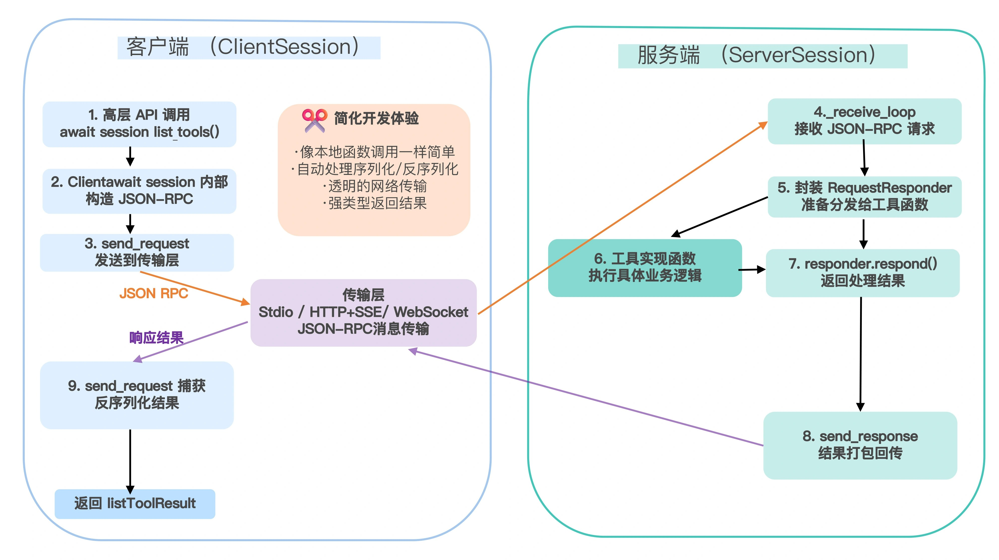

# 协议层的核心实现
协议层的核心实现，基于BaseSession、ClientSession 和 ServerSession 这三个基础类。

## BaseSession
通过 BaseSession 类实现底层协议层 (Protocol layer)

协议层负责消息的封装、请求 / 响应关联，以及高级通信模式的实现。其中的核心逻辑位于 BaseSession（定义在 mcp/shared/session.py）类，这里提供了所有 JSON-RPC 消息的读写、帧解析、请求–响应关联、通知分发的通用逻辑，是 MCP 协议层的通用实现，屏蔽了 JSON-RPC 消息的底层读写、请求–响应关联和通知分发细节。

BaseSession 类承担了对所有 JSON-RPC 消息的统一管理与生命周期控制。它通过一系列核心属性和方法来维护读写流、请求 ID、响应管道和后台任务栈，确保异步收发、请求–响应关联以及资源清理都井然有序。

它将“发送请求、等待响应”“发出单向通知”“接收并分发对端消息”这些通用逻辑全部封装，派生类（客户端或服务端的 Session）只需关注「收到请求／通知后如何处理」或「要发送哪些高层类型化消息」。

BaseSession 类的伪代码如下：
```python
class Session(BaseSession[RequestT, NotificationT, ResultT]):
    async def send_request(
        self,
        request: RequestT,
        result_type: type[Result]
    ) -> Result:
        """发送请求并等待响应。若响应包含错误，则抛出 McpError。"""
        # 请求发送和响应处理逻辑

    async def send_notification(
        self,
        notification: NotificationT
    ) -> None:
        """发送无需响应的单向通知。"""
        # 通知发送逻辑

    async def _received_request(
        self,
        responder: RequestResponder[ReceiveRequestT, ResultT]
    ) -> None:
        """处理对方发来的请求。"""
        # 收到请求后的业务处理

    async def _received_notification(
        self,
        notification: ReceiveNotificationT
    ) -> None:
        """处理对方发来的通知。"""
        # 收到通知后的业务处理
```
[源码位置](https://github.com/modelcontextprotocol/python-sdk/blob/main/src/mcp/shared/session.py)


### BaseSession的范型参数
这些类型参数一方面让方法签名更严谨（例如 send_request(request: SendRequestT)），另一方面在收到消息时将原始 JSONRPC 转成具体的 Pydantic 模型（ReceiveRequestT/ReceiveNotificationT），方便上层直接拿到结构化数据。
```python
Generic[
  SendRequestT,       # 我们能发出的 Request 类型
  SendNotificationT,  # 我们能发出的 Notification 类型
  SendResultT,        # 我们发出的 Response（Result）类型
  ReceiveRequestT,    # 我们会接收的 Request 类型
  ReceiveNotificationT# 我们会接收的 Notification 类型
  ReceiveResultT # 我们会接收的 Response（Result）类型
]
```

---

### BaseSession 类中的基本方法
BaseSession 类中有一系列协议实现方法，主要包括 send_request()、send_notification()、_send_response() 和 _receive_loop() 等，用于控制 MCP 基本交互流程。

#### 1. 发送请求：send_request()
发送请求方法完成的是如何把一个高层的 Pydantic 请求模型打包成 JSON-RPC 消息、发出去，并在底层管理好“谁发的请求”“等待谁的回应”这件事。

#### 2. 发送响应：
_send_response()当收到对端的请求时，基于成功或失败结果，及时生成正确的 JSON-RPC 响应或错误，并写回去。

#### 3. 发送通知：send_notification()
在 send_notification() 方法中，会将那些只需单向推送、不需要回复的事件（如日志、进度、资源变化）等静悄悄地发给对端而不阻塞。具体实现上，是在方法内部构造 JSONRPCNotification（无 ID），部分传输层可携带 related_request_id（比如把进度通知关联到某次调用）；同时直接写入 _write_stream，不等待任何响应。

#### 4. 消息接收循环：_receive_loop()_receive_loop() 
方法会不断从底层流里读入任意一方发来的 JSON-RPC 消息，按类型分流到“请求处理”“通知处理”或“回应分发”的正确管道里。

---

### 可重写的钩子方法
BaseSession 类中还定义了一系列的可重用钩子方法，将上面分流后的“该如何处理”留给子类去实现——比如 ClientSession、ServerSession 用于握手、工具调用分发、能力校验等。
```python
_received_request(self, responder)
_received_notification(self, notification)
_handle_incoming(self, req_or_notification_or_exception)
```
BaseSession 的子类（如 ServerSession、ClientSession）会重写这些方法，注入初始化握手逻辑、工具调用分发、事件转发等具体行为，而无需再触及底层 JSON-RPC 和并发细节。

---

总之，BaseSession 将 JSON-RPC 的消息帧化、ID 跟踪、并发读写、超时与错误处理都做好了。 上层只需继承并重写少数钩子，就能快速实现“MCP 客户端”或“MCP 服务端”的会话逻辑。

---

## 客户端 (ClientSession) 如何“完成”协议设计
[源码](https://github.com/modelcontextprotocol/python-sdk/blob/main/src/mcp/client/session.py)

在 ClientSession 中，初始化阶段通过构造函数将下游的读写流、超时设置以及各类回调（包括取样、列出根目录、日志和通用消息处理）注入会话实例。调用 initialize() 时，客户端首先向服务端发送一个 initialize 请求，并在收到 InitializeResult 后，再发出一条 InitializedNotification 通知，让握手完成。
```python
return await self.send_request(
    types.ClientRequest(types.ListResourcesRequest(method="resources/list")),
    types.ListResourcesResult,
)
```
在消息接收方面，ClientSession 重写了 _received_request(responder) 钩子，当服务端发来诸如 sampling/createMessage、roots/list 或 ping 等请求时，钩子会从 responder.request.root 中提取请求类型和参数，调用相应的回调（如 _sampling_callback 或 _list_roots_callback），并将返回值（可能是正常结果或 ErrorData）传给 responder.respond() 完成响应。

_received_notification(notification) 目前只对日志消息（LoggingMessageNotification）作出处理，其他非同步钩子捕获的消息和未在钩子中处理的所有请求、通知，都会统一委托给用户在构造时提供的 message_handler，以便在上层进行监控、界面更新或其他自定义处理。

---

## 服务端 (ServerSession) 如何“完成”协议设计
[源码](https://github.com/modelcontextprotocol/python-sdk/blob/main/src/mcp/server/session.py)

在 ServerSession 中，协议的握手逻辑被内嵌在 _received_request 和 _received_notification 两个钩子里：首次碰到来自客户端的 InitializeRequest，服务器会将请求参数保存到 self._client_params，随即利用 responder.respond(…) 返回包含服务端能力集、版本号和说明文字的 InitializeResult。当接收到 InitializedNotification 时，状态机才真正进入“Initialized”阶段，任何在未完成初始化前到来的其他请求或通知都会触发 RuntimeError，以确保交互顺序的正确性。

握手完成后，check_client_capability(cap) 方法会读取客户端在初始化时声明的能力集，并根据传入的能力需求判断哪些功能可用——例如是否允许发布 roots/list_changed 等通知，从而在后续工具调用中进行权限或兼容性检查。

为了让服务端调用体验更自然，ServerSession 提供了一系列高层接口：诸如 send_log_message(…)、send_resource_updated(uri)、send_tool_list_changed() 之类的方法，它们均转换成对应的 ServerNotification 并通过底层 send_notification 发送；同样地，create_message(…)、list_roots()、send_ping() 等方法封装了对 JSON-RPC 请求的构建与发送，让服务器可以像调用本地函数一样驱动模型取样、根列表查询或心跳检测。

至于上行消息的分发，ServerSession 在 _handle_incoming 中会将所有未由同步钩子处理的 RequestResponder 或 Notification 推送到自身维护的内存队列中，这正是框架层面通过 @server.call_tool()、@server.list_prompts() 等装饰器将队列内的请求与通知自动路由到用户业务函数的基础。



交互过程中，任何一方都只需像调用本地函数一样发起高层 API 调用。例如，客户端只要执行 await session.list_tools()，ClientSession 就会在内部构造一个 JSON-RPC 请求，将其通过 send_request 发出，并在 ServerSession 的 _receive_loop 中被接收，随后被封装成一个 RequestResponder 并交给注册在服务器端的工具实现函数处理；工具函数执行完成后调用 responder.respond()，ServerSession 底层的 _send_response 将结果打包回传，最后在客户端的 send_request 中被捕获并反序列化成 ListToolsResult 返回给调用者。