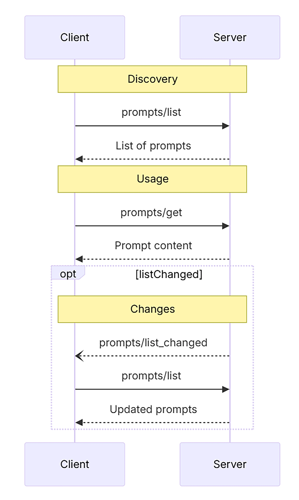

# MCP Prompt Template
MCP 的提示原语就是服务器提前定义的一套 Prompt 模板和交互流程，它们通过 MCP 暴露给客户端，允许用户或产品 UI 以一致的方式选择、填参并调用—— 也就是把服务端准备好的一套提示词和流程框架传给 LLM，让它可以随时使用。



MCP 中的提示具备以下几个关键特性：
- 参数化：支持动态参数输入（如编程语言、时间范围等） 。
- 资源整合：可嵌入资源上下文（如日志、文件等），供模型参考 。
- 多轮交互：支持构建多轮对话流程（如诊断型问答） 。
- 统一发现：通过 prompts/list 与 prompts/get 接口统一注册和调用 。
- 可视集成：支持在 UI 中呈现为 Slash 命令、快捷操作、菜单等形式。

其典型应用场景包括， 在产品内快速调用（如“生成摘要”“语法检查”“代码解释”）、Agent 触发特定工作流（如多轮 Debug 会话）的应用，以及教学、写作、编程等场景的可复用任务模板。

---

## MCP 协议中提示模板的技术实现

### 提示的定义与结构
在 MCP 中，提示是一种由服务器定义的模板，客户端可以发现这些模板，并以结构化的方式请求生成内容。

每个提示包括以下核心字段：
- name：提示的唯一标识符。
- description：可选的可读描述。
- arguments：自定义的可选参数列表。

```ts
{
  name: string;              // 提示的唯一标识符
  description?: string;      // 可选的人类可读描述
  arguments?: [              // 可选参数列表
    {
      name: string;
      description?: string;
      required?: boolean;
    }
  ]
}
```
支持提示的服务器必须在初始化期间声明该 prompts 功能：
```json
{
  "capabilities": {
    "prompts": {
      "listChanged": true
    }
  }
}
```

---

### 提示的消息类型
- role：用“用户”或“助手”来指示说话者。
- content：文本、图像、音频等内容。

文本：
```json
{
  "type": "text",
  "text": "The text content of the message"
}
```

图像：
```json
{
  "type": "image",
  "data": "base64-encoded-image-data",
  "mimeType": "image/png"
}
```

音频:
```json
{
  "type": "audio",
  "data": "base64-encoded-audio-data",
  "mimeType": "audio/wav"
}
```

嵌入式资源:嵌入式资源允许在消息中直接引用服务器端资源。
```json
{
  "type": "resource",
  "resource": {
    "uri": "resource://example",
    "mimeType": "text/plain",
    "text": "Resource content"
  }
}
```
嵌入式资源使提示能够将服务器管理的内容（如文档、代码示例或其他参考资料）无缝地直接合并到对话流中。

---

### 提示调用和通信流程
提示主要通过以下两个接口完成调用：
- prompts/list：列出所有可用提示 。
- prompts/get：获取指定提示并填入参数，生成完整消息序列 。

prompts/get request:
```
{
  "jsonrpc": "2.0",
  "id": 2,
  "method": "prompts/get",
  "params": {
    "name": "code_review",
    "arguments": {
      "code": "def hello():\n    print('world')"
    }
  }
}
```
response:
```json
{
  "jsonrpc": "2.0",
  "id": 2,
  "result": {
    "description": "Code review prompt",
    "messages": [
      {
        "role": "user",
        "content": {
          "type": "text",
          "text": "Please review this Python code:\ndef hello():\n    print('world')"
        }
      }
    ]
  }
}
```

当可用提示列表发生变化时，声明了 listChanged  功能的服务器应该发送如下通知:
```json
{
  "jsonrpc": "2.0",
  "method": "notifications/prompts/list_changed"
}
```

---

### 动态提示：嵌入资源与上下文
```json
{
  "role": "user",
  "content": {
    "type": "resource",
    "resource": {
      "uri": "logs://recent?timeframe=1h",
      "text": "[2024-03-14 15:32:11] ERROR: Connection timeout",
      "mimeType": "text/plain"
    }
  }
}
```
结合 file:/// 或 logs:// 等 URI schema，可以让提示对接日志、代码文件、文档段落等资源，直接引入外部知识。

---

### 多轮工作流：构建交互流程
提示还可以支持多轮对话工作流（workflow prompts），例如一个调试提示可能是这样的：
```py
{
    "role": "user",
    "content": {
        "type": "text",
        "text": f"Here's an error I'm seeing: {error}"
    }
},
{
    "role": "assistant",
    "content": {
        "type": "text",
        "text": "I'll help analyze this error. What have you tried so far?"
    }
},
{
    "role": "user",
    "content": {
        "type": "text",
        "text": "I've tried restarting the service, but it persists."
    }
}
```
这种提示通过代码逻辑生成多个 message，形成“半结构化工作流”，特别适合“教练式”“顾问式”场景，也就是哪些需要引导着用户一步步的完成工作的场景。