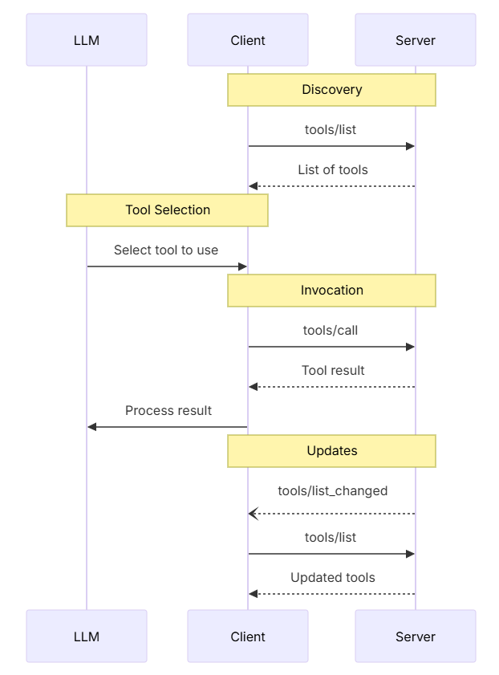
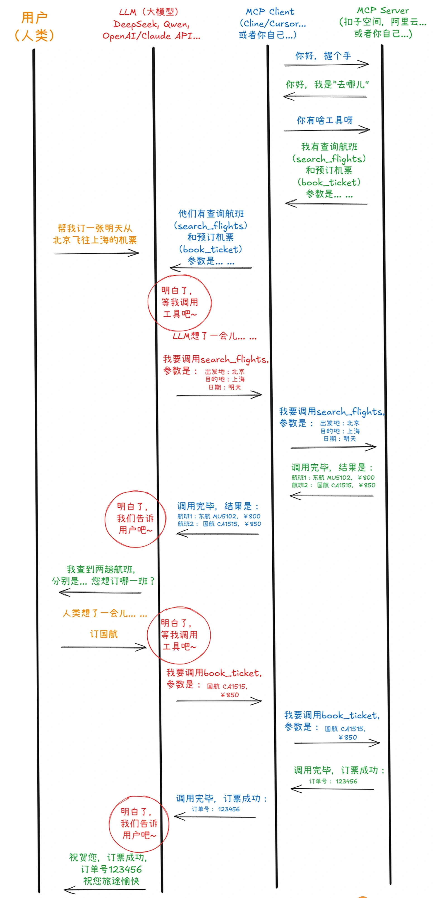

# MCP 工具
让“工具调用”流线化（更高效顺畅）、自动化，这是 MCP 协议的最核心价值所在。



## MCP 中的工具原语设计与实现
工具使模型能够与外部系统交互，例如查询数据库、调用 API 或执行计算。每个工具通过唯一的名称进行标识，并包含描述其模式的元数据。

---

### 服务器的工具定义
要提供工具给客户端调用，服务器首先必须声明 tools 能力：
```json
{
  "capabilities": {
    "tools": {
      "listChanged": true
    }
  }
}
```
listChanged 参数指示服务器在可用工具列表发生变化时是否会发出通知。

工具定义包含以下要素。
- name：工具的唯一标识符。
- description：人类可读的功能描述。
- inputSchema：定义预期参数的 JSON Schema。
- annotations（可选）：描述工具行为的扩展属性

---

### 客户端的工具发现
客户端发送 tools/list 消息请求工具列表。
```json
{
  "jsonrpc": "2.0",
  "id": 1,
  "method": "tools/list",
  "params": {
    "cursor": "optional-cursor-value"
  }
}
```
response示例:
```json
{
  "jsonrpc": "2.0",
  "id": 1,
  "result": {
    "tools": [
      {
        "name": "get_weather",
        "description": "Get current weather information for a location",
        "inputSchema": {
          "type": "object",
          "properties": {
            "location": {
              "type": "string",
              "description": "City name or zip code"
            }
          },
          "required": ["location"]
        }
      }
    ],
    "nextCursor": "next-page-cursor"
  }
}
```

### 客户端调用工具
客户端发送 tools/call 调用工具。
```
{
  "jsonrpc": "2.0",
  "id": 2,
  "method": "tools/call",
  "params": {
    "name": "get_weather",
    "arguments": {
      "location": "New York"
    }
  }
}
```
response示例:
```json
{
  "jsonrpc": "2.0",
  "id": 2,
  "result": {
    "content": [
      {
        "type": "text",
        "text": "Current weather in New York:\nTemperature: 72°F\nConditions: Partly cloudy"
      }
    ],
    "isError": false
  }
}
```

---

### 工具调用的返回结果
工具调用可能会返回多种类型的结果，包括文本内容、图像内容、音频内容和内嵌资源等。

文本内容示例：
```json
{
  "type": "text",
  "text": "Tool result text"
}
```

图片内容示例：
```json
{
  "type": "image",
  "data": "base64-encoded-data",
  "mimeType": "image/png"
}
```

音频内容示例：
```json
{
  "type": "audio",
  "data": "base64-encoded-audio-data",
  "mimeType": "audio/wav"
}
```

内嵌资源示例：
```json
{
  "type": "resource",
  "resource": {
    "uri": "resource://example",
    "mimeType": "text/plain",
    "text": "Resource content"
  }
}
```
资源也可以被作为工具调用的一个返回对象，此时被称为“内嵌资源”，这些资源可以被客户端通过 URI 获取。

---

### 工具列表变更通知
如果可用工具列表发生了变更，已经声明了 listChanged  能力的服务器应该发送工具列表变更通知:
```json
{
  "jsonrpc": "2.0",
  "method": "notifications/tools/list_changed"
}
```

---

### 工具的错误处理
MCP 中对工具使用有两种错误报告机制。
- 第一种是协议错误：标准 JSON-RPC 错误，适用于未知工具，无效参数以及服务器错误这几种情况。
- 第二种是工具执行错误：通过结果字段  isError: true  报告，包括：API 调用失败，无效的数据输入，业务逻辑错误。

协议错误示例：
```json
{
  "jsonrpc": "2.0",
  "id": 3,
  "error": {
    "code": -32602,
    "message": "Unknown tool: invalid_tool_name"
  }
}
```

工具执行错误示例：
```json
{
  "jsonrpc": "2.0",
  "id": 4,
  "result": {
    "content": [
      {
        "type": "text",
        "text": "Failed to fetch weather data: API rate limit exceeded"
      }
    ],
    "isError": true
  }
}
```

---

## 示例
-> mcp-tool-demo

---

## 总结
在遵循 MCP 协议后，从技术角度来说，你的客户端与服务器之间的数据交互和输出解析，实际上就是在“JSON-RPC 风格”的消息里传递工具元数据和执行结果。客户端读取 list_tools() 返回的工具定义，以及 call_tool() 返回的结果内容。

