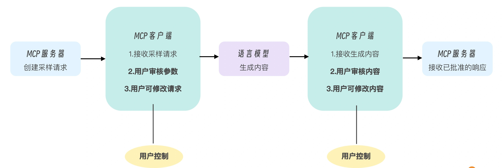

# MCP Sampling
在 Model Context Protocol（MCP）框架中，采样（Sampling）独特的功能，
它允许服务器向客户端请求语言模型（LLM）的生成结果，从而实现复杂的代理行为，同时保持安全性和隐私性。
这一功能使得 MCP 服务器可以充当智能中介，协调用户、客户端和语言模型之间的交互。

---

## MCP 采样机制的工作流程
MCP 采样的工作流程精心设计了一个“人在环路中”（human-in-the-loop）的模式，确保用户对 LLM 的交互保持控制权。

这个模式包括以下流程。
- 服务器发出请求：服务器发送 sampling/createMessage 请求到客户端。
- 客户端审核：客户端接收请求，并允许用户审核和修改参数。
- LLM 生成：客户端调用语言模型生成结果，语言模型处理已批准的请求并生成内容。
- 内容审核：客户端向用户展示生成的内容，供用户审核和可能的修改。
- 结果返回：已批准的内容被发送回 MCP 服务器。



图中黄色的“用户控制”节点突出显示了两个关键干预点，即人类监督被明确地内置到流程中的地方。这种设计确保了整个 AI 交互过程中的透明度，并保持了用户的主导权，这是 MCP 采样机制的基本原则。

---

## 采样请求的标准结构
```json
{
  "method": "sampling/createMessage",
  "params": {
    "messages": [
      {
        "role": "user",
        "content": {
          "type": "text",
          "text": "用户的问题"
        }
      }
    ],
    "modelPreferences": {
      "hints": [{"name": "claude-3"}],
      "costPriority": 0.5,
      "speedPriority": 0.7,
      "intelligencePriority": 0.8
    },
    "systemPrompt": "你是一个助手...",
    "includeContext": "thisServer",
    "temperature": 0.7,
    "maxTokens": 1000,
    "stopSequences": ["\n\n"],
    "metadata": {
      "requestType": "query"
    }
  }
}
```

---

## 示例
mcp-sampling-demo

### 其它采样参数示例
1. 停止序列 (stopSequences): 参数允许指定一系列字符串，当模型生成这些字符串时就会停止生成：
```python
sampling_request["params"]["stopSequences"] = ["\n\n", "结束", "###"]
```
这在我们希望模型生成特定格式的内容时非常有用，例如当我们希望模型在生成特定分隔符时停止。

2. 模型偏好 (modelPreferences)
```python
sampling_request["params"]["modelPreferences"] = {
    "hints": [
        {"name": "deepseek-chat"}, 
        {"name": "llama-3"}, 
        {"name": "claude-3"}
    ],
    "costPriority": 0.3,      # 降低成本优先级
    "speedPriority": 0.8,     # 提高速度优先级
    "intelligencePriority": 0.9  # 提高能力优先级
}
```
通过提供多个模型提示和调整优先级，客户端可以做出更复杂的模型选择决策。

3. 包含上下文 (includeContext)
```python
# 不包含任何上下文
sampling_request["params"]["includeContext"] = "none"

# 仅包含当前服务器的上下文
sampling_request["params"]["includeContext"] = "thisServer"

# 包含所有连接服务器的上下文
sampling_request["params"]["includeContext"] = "allServers"
```
通过 includeContext 参数，可以控制 LLM 能够访问的上下文范围，这在涉及敏感数据的场景中，对于控制模型能够访问的信息范围非常重要。

4. 元数据 (metadata)
```python
sampling_request["params"]["metadata"] = {
    "requestType": "code_analysis",
    "priority": "high",
    "domain": "financial",
    "customParameter": "value"
}
```
元数据字段可以包含用于进一步定制采样行为的任何附加信息。虽然这些参数不会直接影响模型行为，但客户端可以用它们来作为请求上下文，做出决策。

5. 系统提示工程 (System Prompt Engineering)
```python
sampling_request["params"]["systemPrompt"] = """
你是一个专业的文件系统助手。
- 永远不要执行危险操作如删除文件
- 总是先解释操作的后果
- 使用清晰的步骤格式回答问题
- 如果不确定，明确表示你不知道
"""
```
提示工程是控制模型行为的强大工具，通过精心设计的系统提示，可以指导模型的回答风格、内容限制和行为准则。


6. 消息上下文设计 (Message Context Design)
```python
sampling_request["params"]["messages"] = [
    {
        "role": "user",
        "content": {
            "type": "text",
            "text": "如何查找大文件？"
        }
    },
    {
        "role": "assistant",
        "content": {
            "type": "text",
            "text": "您可以使用'find'命令来查找大文件。具体来说，您可以..."
        }
    },
    {
        "role": "user",
        "content": {
            "type": "text",
            "text": "如何删除这些文件？"
        }
    }
]
```
可以通过构建消息（也就是对话）历史来引导模型的行为，为模型提供更丰富的上下文，影响其理解问题的方式。

7. 客户端实现的用户审核机制
也可以在客户端可以实现更复杂的用户审核机制（这并不是 Sampling 的一部分），为用户提供更多指导。
```python
# 高级用户审核，提供解释和建议
print("\n采样请求分析：")
print(f"系统提示: {params.get('systemPrompt', '')}")
print(f"温度设置: {params.get('temperature', 0.7)} (较高值会产生更多样化但可能不太准确的回答)")
print(f"最大令牌数: {params.get('maxTokens', 1000)} (当前设置约为{params.get('maxTokens', 1000)//2}个中文字)")

# 提供智能建议
if "delete" in question.lower():
    print("\n⚠️ 警告: 检测到删除相关操作，建议降低温度参数以获得更谨慎的回答")
    print("建议: temperature=0.2, maxTokens=500")

# 允许用户使用预设模板
print("\n选择参数配置:")
print("1. 默认")
print("2. 创意模式 (temperature=0.9)")
print("3. 精确模式 (temperature=0.1)")
print("4. 自定义")
```

---

## 采样机制的应用场景
采样功能会在多种场景中有广泛应用。比如数据分析与解释：服务器可以读取数据，然后请求 AI 分析和解释这些数据；可以分析代码库，使用 AI 生成代码解释或优化建议；在多步骤工作流中，服务器可以实现复杂的多步骤任务，使用 AI 在各步骤间做决策；交互式文档生成过程中，基于现有资源生成文档，允许用户审核和修改；对于上下文敏感响应，可以根据特定环境生成更相关的回答。

---

## 安全和隐私
实现采样功能时，安全和隐私是一个需要考虑的考虑因素，实现安全采样的示例代码如下：
```python
# 安全措施示例
# 1. 验证用户输入
question = arguments.get("question", "")
if len(question) > 1000:  # 防止过长输入
    question = question[:1000]
# 2. 限制敏感操作
if "delete" in question.lower() or "remove" in question.lower():
    return types.GetPromptResult(
        messages=[
            types.PromptMessage(
                role="assistant",
                content=types.TextContent(
                    type="text",
                    text="删除操作需要额外确认，请明确指定要删除的内容。"
                )
            )
        ]
    )
```