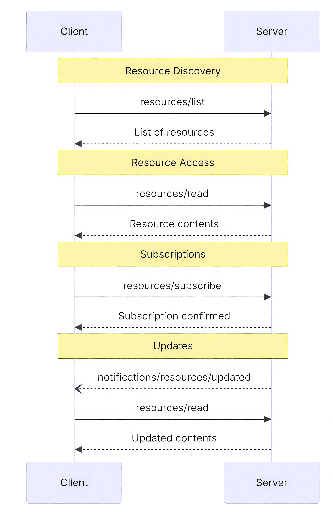

# MCP资源发现



## 什么是 MCP 中的资源
这里的资源可以是任意类型的文本或二进制数据，包括文件内容、数据库记录、API 响应、日志、截图、音频、视频等。

每个资源都由唯一的 URI 确定，遵循通用的 `[协议]://[主机]/[路径]` 形式，例如：
```
file:///home/user/docs/report.pdf
postgres://db.example.com/customers/schema
screen://localhost/display
```
资源是应用控制的，意味着客户端应用程序可以决定如何以及何时使用这些资源。例如，应用可以树状或列表视图通过 UI 元素展示可选资源，或允许用户搜索和过滤可用资源。

不同的 MCP Hosts处理资源的方式可能不同，例如：
- 像 Claude Desktop 要求用户明确选择资源。
- 有的 Hosts 可能根据启发式规则自动选择资源。
- 某些实现甚至允许 AI 模型自行决定使用哪些资源。

服务器开发者在实现资源支持时，需要意识到资源的交互模式是 MCP Host 确定的。
如果需要服务端自动向模型暴露数据（而不是 Host 来决定），服务器应使用模型控制的原语（如 Tools）而非资源。

---

## 资源的定义和发现
在 MCP 协议中，“服务端资源的定义和发现”是指服务器如何声明（定义）它能提供的各种数据内容，以及客户端如何探测（发现）并访问这些资源。

服务器需要用一个统一的数据结构来描述每个资源对象，包括后面这几项内容。
- URI：唯一标识符，形如 scheme://host/path（比如 file:///logs/app.log）。
- name：人类可读的名称，如 “Application Logs”。
- description（可选）：对资源内容的简要说明。
- mimeType（可选）：资源的媒体类型（text/plain、application/json、image/png 等）。
- size（可选）：资源的字节数

支持资源功能的服务器必须声明 resources 能力：
```json
{
  "capabilities": {
    "resources": {
      "subscribe": true,
      "listChanged": true
    }
  }
}
```
- subscribe：客户端是否可以订阅单个资源的变更通知
- listChanged：当资源列表变化时，服务器是否会发送通知

---

### 静态资源 vs 动态资源
静态资源是值在服务提供时路径已经明确的资源，此时一次性列出 URI 即可，服务器返回一组具体的资源对象,例如：
```json
{
  "uri": "file:///logs/app.log",
  "name": "Application Logs",
  "description": "实时日志文件",
  "mimeType": "text/plain"
}
```
动态资源的内容或可用集合会随参数变化而变化，此时服务器通过 URI 模板（遵循 RFC 6570）来定义资源，例如：
```json
{
  "uriTemplate": "logs://recent?timeframe={duration}",
  "name": "最近日志",
  "description": "按时长获取日志",
  "mimeType": "text/plain"
}
```
在通信过程中，客户端只要填入模板参数就能构造出具体的资源 URI。

---

### MCP 接口绑定
在代码层面，服务器通过装饰器或注册函数来实现资源定义接口。
```py
# 使用装饰器注册资源列表处理函数
@app.list_resources()
async def list_resources() -> list[types.Resource]:
    """
    实现资源列表API，返回服务器提供的资源列表
    
    返回:
        list[types.Resource]: 资源对象列表
    """
    return [
        # 创建一个资源对象
        types.Resource(
            uri="file:///logs/app.log",  # 资源的唯一标识符
            name="Application Logs"    # 资源的显示名称
            mimeType="text/plain"
        )
    ]
```
当收到 resources/list 请求时，MCP 框架就会调用这个方法返回资源列表。

---

### 客户端读取资源
客户端要使用服务器暴露的数据，必须先“发现”有哪些资源可用。

主要有两种方式：
- 直接列出（Direct Listing）： 客户端向服务器发送 resources/list 请求，服务器返回一组具体的资源对象。这个方式的优点是客户端一次就能拿到所有可用资源的完整信息，典型的场景为资源数量较少且变化不频繁时。
- URI 模板（URI Templates）： 对于需要根据参数动态生成的资源，客户端向服务器发送 resources/list 请求后，服务器先返回 URI 模板；客户端根据自己的需求填入模板参数（如时间范围、分页参数等），构造出真正的资源 URI，然后再发起 resources/read 请求读取内容。这样，就能避免在列表中暴露大量组合情况，只定义好了参数化方式。典型的场景为读取日志、监控指标、分页数据等动态内容。


客户端发起 resources/list 请求以发现可用资源。

request:
```json
{
  "jsonrpc": "2.0",
  "id": 1,
  "method": "resources/list",
  "params": {
    "cursor": "optional-cursor-value"
  }
}
```
response:
```json
{
  "jsonrpc": "2.0",
  "id": 1,
  "result": {
    "resources": [
      {
        "uri": "file:///project/src/main.rs",
        "name": "main.rs",
        "description": "Primary application entry point",
        "mimeType": "text/x-rust"
      }
    ],
    "nextCursor": "next-page-cursor"
  }
}
```

客户端通过 resources/read 请求指定 URI，服务器会返回包含一个或多个内容项的列表。
request:
```json
{
  "jsonrpc": "2.0",
  "id": 2,
  "method": "resources/read",
  "params": {
    "uri": "file:///logs/app.log",
  }
}
```
response:
```json
{
  "jsonrpc": "2.0",
  "id": 2,
  "result": {
    "contents": [
      {
        "uri": "file:///logs/app.log",
        "mimeType": "text/plain",
        "text": "2025-05-11 10:00: INFO Server started\n..."
      }
    ]
  }
}
```

资源模板（Resource Templates）允许服务器通过 URI 模板公开可参数化的资源，其参数可通过补全 API（completion API，这个内容我们后续文章中会介绍）自动填充。

request:
```json
{
  "jsonrpc": "2.0",
  "id": 3,
  "method": "resources/templates/list"
}
```
response:
```json
{
  "jsonrpc": "2.0",
  "id": 3,
  "result": {
    "resourceTemplates": [
      {
        "uriTemplate": "file:///{path}",
        "name": "Project Files",
        "description": "Access files in the project directory",
        "mimeType": "application/octet-stream"
      }
    ]
  }
}
```

---

## 资源的动态更新
MCP 支持实时通知机制，让客户端保持对资源状态的感知。
- 列表变更通知：当服务器端资源列表增删改时，发出 notifications/resources/list_changed 通知。
- 内容更新订阅：客户端可通过 resources/subscribe 订阅某个 URI；服务器在资源变化时用 notifications/resources/updated 通知，客户端再调用 resources/read 拉取最新内容；必要时可调用 resources/unsubscribe 取消订阅 。

---

## 错误处理
服务器应对常见失败情况返回标准 JSON-RPC 错误：
- 资源未找到（Resource not found）：错误码 -32002
- 内部错误（Internal error）：错误码 -32603
```json
{
  "jsonrpc": "2.0",
  "id": 5,
  "error": {
    "code": -32002,
    "message": "Resource not found",
    "data": {
      "uri": "file:///nonexistent.txt"
    }
  }
}
```

--

## MCP 资源最佳实践
MCP 协议的官方文档中，给出了一系列关于资源使用的最佳实践。
- URI 设计：使用清晰可读的协议和路径，便于调试与文档化。
- 名称与描述：资源列表中提供人性化 name 与详细 description，帮助客户端或用户界面展示上下文。
- MIME 类型：尽量填写 mimeType，让客户端能够正确解析和展示内容。
- 订阅机制：对于频繁变化的重要资源，结合订阅通知减少轮询开销。
- 分页与缓存：当资源列表较大时，采用分页设计（允许服务器以较小的块形式生成结果，而不是一次性全部生成）；对于大型二进制资源，可考虑本地缓存。

在安全与合规方面，则需要遵循下列原则。
- 输入验证：校验所有 URI，防止目录遍历和注入攻击。
- 访问控制：对敏感路径或数据实施访问控制，在执行操作前应检查资源权限。
- 数据清理：二进制数据需要正确的编码。
- 传输加密：在跨网络通信时使用 TLS 等安全协议。
- 速率限制：防止恶意或错误的高频读取请求。