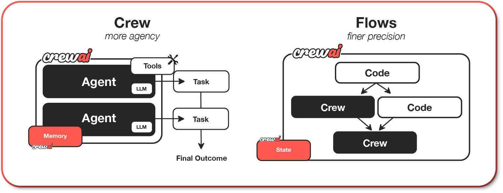

# crawai demo
A Simple CrawAI Demo

---

## 运行
```bash
uv run main.py
```

---

## CrewAI介绍
CrewAI 于 2023 年由 João Moura 创立，最初作为一个开源项目发布在 GitHub 上，目标是为开发者提供一个直观的多智能体框架，特别适合快速原型开发与中小型项目。CrewAI 的核心理念是“以人为本的自动化”，通过模仿人类团队的分工与协作（如项目经理、研究员、开发者等角色），让 AI 智能体以结构化的方式完成任务



这张图展示了 CrewAI 框架中两种工作模式—— “Crew”（团队模式）和 “Flows”（流程模式）的架构特点。左侧是 Crew 模式，强调“更多代理”（more agency）；右侧是 Flows 模式，强调“更高精度”（finer precision）。两者都以 CrewAI 为核心框架，目标是产生 Final Outcome（最终输出），但通过不同的方式组织智能体和任务。

CrewAI 更适合中小型项目与快速开发，特别受到初学者与中小企业的青睐。其与 LangChain 等工具的兼容性和社区驱动的生态使其具有长期发展潜力，但与 AutoGen 和 AG2 相比，CrewAI 在复杂推理与大规模生产环境支持方面仍需进一步完善。