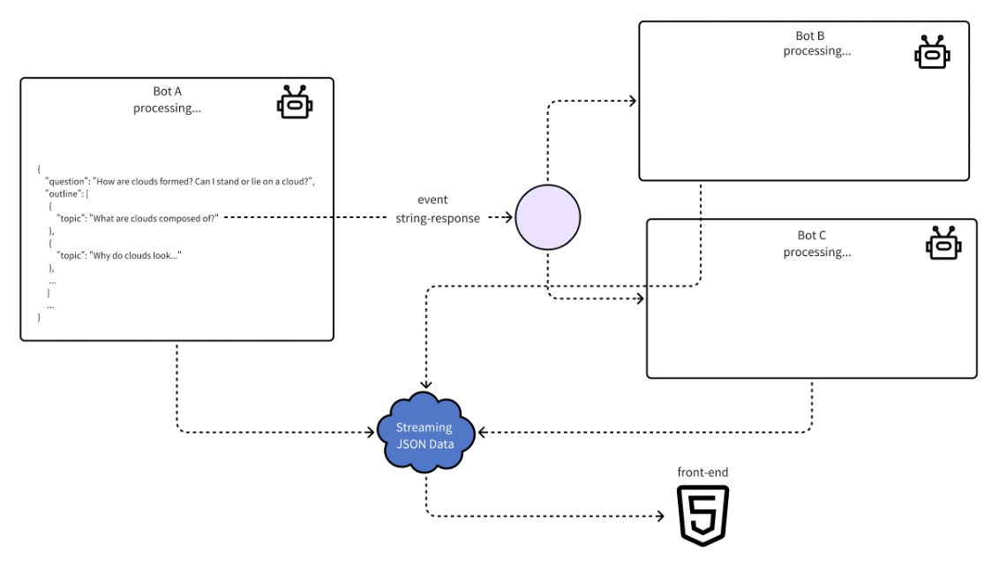
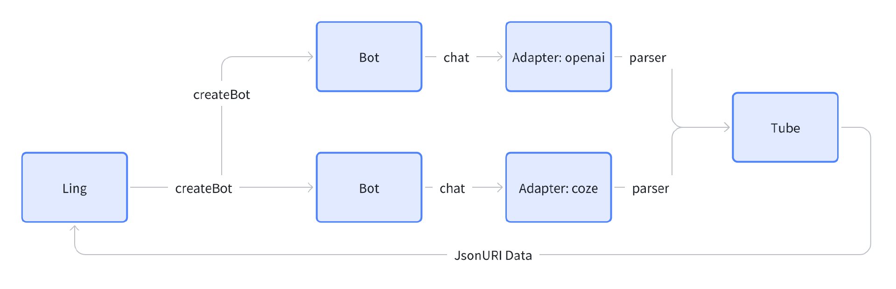

# Ling
Ling 是一个基于流式 JSON 数据的异步工作流框架。

---

## 示例
[demo](ling-demo)

---

## 四个子系统
Ling 框架包含四个子系统。
- adapter：大模型 API 底层模块适配器，目前支持标准 OpenAI 和 Coze 两类文本大模型 API。
- bot：对大模型节点的抽象，负责管理和控制单一节点。
- parser：JSONParser 实现，这是一个可独立使用的子系统。
- tube：对流式（Streaming）对象的封装、前后端通讯的数据格式定义以及事件管理。

我们通过创建 Ling 对象实例来管理 bot。bot 在内部处理节点输入输出时调用 adapter，根据配置的模型参数，由 adapter 选择具体的 API 调用。在 adapter 具体调用 API 过程中会通过 parser 来动态解析大模型输入输出，并将处理好的数据通过 tube 发送，最后再由 tube 转发给前端。