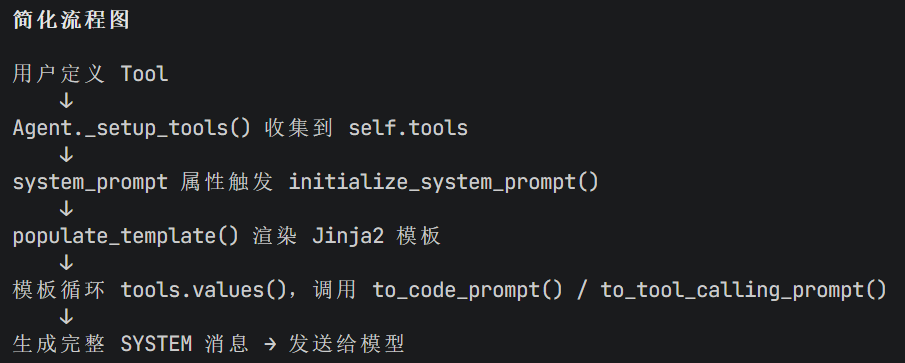

# CodeAct
由 Hugging Face 团队于 2024 年 12 月开源的 Smolagents 框架，这是一款极其轻量（核心逻辑仅约 1000 行代码）且高效的开发框架。在 2024 年底那个年代，大家都在拼命为 Agent 添加各种各样的工具的，Smolagents 就采用了 CodeAct 这种高效灵活的模式，并且该模式一直沿用至今。

## CodeAct 模式究竟为何强大
假设我们已经有了一个包含某只股票近一年收盘价的 CSV 文件，现在需要分析其走势、计算移动平均线并绘制图表。在传统的工具调用型 Agent 中，我们通常需要预先准备一系列工具：比如用于读取 CSV 数据的工具（基于 Pandas 库）、用于数值计算的工具（基于 NumPy 库），以及用于绘制移动平均线图表的工具（基于 Matplotlib 库）。

除了数据读取相对通用外，其他工具往往是针对特定计算或绘图需求定制的。这就导致了一个问题：我们要分析的指标越多，需要注册和定制的工具就越多。最终，Agent 会携带大量工具，导致上下文窗口被冗长的工具描述文档大量占用，引发经典的上下文管理难题。

再看看该场景下传统工具调用型 Agent 的运行逻辑。以经典的 ReAct 框架为例，当用户输入提示词“请读取 xxx.csv 中的 xx 股票近一年的收盘价数据，帮我分析其走势、计算移动平均线并画出移动平均线图表”时，ReAct Agent 会先进行思考，然后调用工具读取数据；接着观察工具执行结果，再次思考，再调用工具计算移动平均线……

这种方式就像一个拿着算盘的学徒，拨一下算一下，交互次数非常频繁。那么面对海量数据时，就很容易因大量数据挤占上下文导致“上下文污染”，或因交互次数过多引发“上下文腐烂”。

CodeAct 的 Agent 设计模式应运而生。其本质就是**让模型通过编写代码来解决问题**。接下来，我们就看一下在数据分析场景下，CodeAct 是如何运行的。

在 CodeAct 模式下，Agent 会自带一个**代码解释器**工具。该工具的入参是由模型根据用户提示词生成的、能够解决当前问题的代码（通常是 Python 或 TypeScript）。

这样，整个 Agent 依然可以沿用 ReAct 的设计模式，进行“思考 - 工具调用 - 观察结果”的循环。甚至直接依赖模型本身的 Function Calling 能力构建一个最简单的 Agent Loop 也可以。不同点在于，**在工具调用前，模型会生成解决当前问题的代码；工具调用环节，会调用代码解释器；观察工具结果变成了观察代码执行结果是否能解决当前问题**。

在数据分析这种典型的需要编写 Pandas 等代码，且代码不固定，需要根据实际场景和数据边改代码边分析的场景下，CodeAct 模式的作用和效率尤为突出。开发者无需提前定义读取 CSV、计算移动平均线等繁杂的工具。在 CodeAct 模式中，如果使用的模型写代码能力比较强（比如智谱的 GLM-5.2、Kimi-K3 等），甚至可以直接一次性生成完整代码并完成任务。

---

## 实战：使用 OpenAI SDK 搭建一个 CodeAct Agent
### 1. 系统提示词的设计
一切从系统提示词（System Prompt）开始。为了让这个 CodeAct Agent 具备良好的通用性，我们需要通过清晰的指令来规范它的行为。我设计的系统提示词如下：
```
你是一个在 {os.getcwd()} 目录下的能够编写和执行代码的智能助手。
当用户提出问题时，你需要：
1. 分析问题并确定需要编写什么代码
2. 编写能解决问题的Python代码
3. 使用execute_python工具执行代码
4. 分析执行结果，如果有错误则修改代码再次执行
5. 最终给用户提供答案

请确保你的代码能够正确执行并将最终结果存储在名为'result'的变量中。
```
这段提示词首先使用 os.getcwd() 获取当前目录的路径，以便为模型规定工作目录。之后通过五个明确的步骤，引导模型遵循“问题理解 → 代码生成 → 执行 → 调试 → 答案输出”的闭环流程，并对每个环节的要求做了严格规范。

---

### 2. 代码解释器的设计
模型生成的代码必须在一个真实的运行环境中落地，才能获取到实际结果，因此我们需要设计一个代码解释器。在工业生产环境中，为了保障系统安全，通常会采用容器化沙箱（如 Docker）、受限解释器或专用的远程执行服务。但在示例中，为了降低理解门槛，我们将使用 Python 内置的  exec。
```py
def execute_python(code: str) -> str:
    """执行Python代码并返回结果。"""
    try:
        print("##执行代码:\n",code)
        # 创建本地环境执行代码
        local_vars = {}
        exec(code, {}, local_vars)  # python可以动态 执行 代码
        result= local_vars.get('result', '执行成功')
        print("##执行结果:\n",result)
        return str(result)
    except Exception as e:
        return f"Error executing code: {str(e)}
```

### 3. Agent Loop 的实现
这个示例的 Agent，我们是基于模型自身的 Function Calling 能力构建的。因此 Agent Loop 主要是通过一个 While True 循环，来控制人类与模型间的多轮对话与多轮工具调用。示例代码如下：
```py
def agent_loop(messages):
    max_rounds = 10
    current_round = 0

    while True:
        current_round += 1

        if current_round > max_rounds:
            print(f"Maximum rounds {max_rounds} reached, exiting")
            sys.exit(0)

        response = send_messages(messages)

        if response.choices[0].message.tool_calls != None:
            messages.append(response.choices[0].message)
            
            for tool_call in response.choices[0].message.tool_calls:
                if tool_call.function.name == "execute_python":
                    arguments_dict = json.loads(tool_call.function.arguments)
                    result = execute_python(arguments_dict['code'])
                    
                    messages.append({
                        "role": "tool",
                        "content": result,
                        "tool_call_id": tool_call.id
                    })
        else:
            break
```
以上便是 CodeAct 设计模式的实现原理，非常简单易懂。具体代码参考 harness-cli-learning/02 codeact

---

## Smolagents 基于 CodeAct 设计模式的加强
Smolagents 框架中设计了两类 Agent：一类是传统的工具调用型 Agent，即  ToolCallingAgent；另一类则是基于 CodeAct 深度扩展而来的  CodeAgent。两类 Agent 的底层都采用 ReAct 的思想。

CodeAgent  并不满足于仅仅让模型产出一段解决原生任务的代码，它的核心优势在于能够让模型“阅读”并理解本地定义好的工具代码文件。在此基础上，模型能够像一位经验丰富的资深程序员一样，直接产出一段能够“一把梭”调用多个工具的完整代码。而且代码运行在沙箱（本地虚拟环境、Docker 等多种沙箱环境可选）中，可以确保隔离性与安全性。

以之前的数据分析场景为例，假设本地已经存在读取 CSV 文件、计算移动平均线、绘制图表这三个工具函数。当我们将这三个本地工具交给  CodeAgent  后，模型会在底层将这些工具的函数签名和逻辑内化，生成类似如下代码：
```py
# CodeAgent 自主生成的完整分析脚本
df = read_csv("stock_data.csv")  # 调用本地读取工具
if df is not None:
    ma_data = calculate_moving_average(df, window=5)  # 调用本地计算工具
    plot_chart(ma_data, title="5日移动平均线")  # 调用本地画图工具
    final_answer("分析图表已生成完毕！")
else:
    final_answer("文件读取失败，请检查路径。")
```

CodeAgent 之所以能如此智能地串联这些工具，背后依赖了两个严密的底层机制

### 机制一 工具信息注入系统提示词：让模型认识工具
当你将本地定义好的工具传入 CodeAgent 时，框架底层会利用 Python 的反射机制，自动提取这些函数的名称、文档字符串以及参数。

这些纯文本信息会被自动填充进一段预设的 Jinja2 模板中，组装成一段详尽的系统提示词。这段提示词会明确告诉模型有哪些工具可以被利用。这样一来，模型在思考阶段就能清晰地“看”到本地工具的接口定义，知道该如何在代码中正确调用它们。

Smolagents 的系统提示词位于 src/smolagents/prompts 下，上述获取工具描述注入提示词的代码调用栈如下图所示：



### 机制二 工具源码打包映射：让沙箱执行工具
当模型根据提示词生成了 Python 代码块后，Smolagents 需要将本地定义的工具代码注入到沙箱中，以便模型生成的代码可以真实调用到工具。此时分为两种情况。
- 第一种是使用本地代码解释器的情况，Smolagents 会将工具代码映射到 static_tools 字典中，然后通过 AST 解释器进行工具代码的执行。
- 第二种是使用远程沙箱，比如 E2B/docker 的情况，Smolagents 会将工具源码序列化后发送到远程沙箱中，然后在远程沙箱中重建代码。

通过这种“提示词注入接口，沙箱注入源码”的双重机制，CodeAgent  将原本割裂的工具调用串联成了一个具备条件判断、变量传递和异常处理的严密逻辑闭环，真正实现了一把梭式的自动化执行。