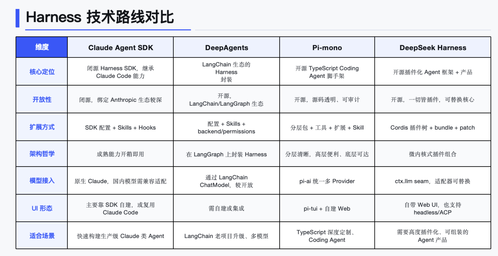

# agent framework history
## 第一阶段:纯工具调用
Agent 开发的热潮兴起于 2023 年，但从技术原理上追溯，最早可以归结为 Function Calling（函数调用）与 ReAct 这两大工具调用机制。

Function Calling 机制由 OpenAI 首创，其核心是将工具文档注册给模型，让模型能够在合适的场景下主动选择合适的工具来解决问题。ReAct 框架的功能与之类似，但它通过提示词的形式，显式地教会了模型“推理（Reasoning）- 行动（Acting）- 观察（Observing）”的完整过程，使得整个链路更加透明且具备可观测性。

但业务场景不断深入，纯工具调用 Agent 的弊端也逐渐显现，最典型的便是“幻觉”问题以及任务完成质量不稳定、难以达到预期效果。

---

## 第二阶段：多种设计模式和脚手架的出现
业界开始探索通过模仿人类解决问题的方式来提升 Agent 的表现，多种 Agent 设计模式应运而生。比如
- 计划模式：先规划出任务执行步骤，让模型严格按照步骤推进。
- 反思模式：设置一个“反思智能体”去审查“执行智能体”的输出，并提出改进意见。
- 人机协作模式：在关键节点中断 Agent 的执行，邀请人类介入提供决策。
- 多 Agent 模式：按照任务或角色划分出子 Agent，由一个管理员 Agent 统一调度。

伴随着这些设计模式的出现，AutoGPT、CrewAI 等新的 Agent 开发脚手架也大量涌现。这个阶段，开发者的工作量又加大了，因为需要分出大量精力去研究和适配这些复杂的设计模式。

---

## 第三阶段：工作流与 LangGraph
在引入了多种设计模式后，大家发现整个 Agent 系统最薄弱的一环依然是模型本身的能力。有时很难仅凭一套提示词就 100% 约束模型的行为，任务的输出步骤和结果依然充满不确定性。为了尽量减少这种情况，让 Agent 系统能够尽量按照人类预设的步骤运行，于是“工作流模式”开始流行。

这种模式的核心思想是将任务步骤用“节点”来表示，然后用一条“流水线”将这些节点串联起来。在这种架构下，模型只存在于节点之上，专注于完成该节点内具体的小任务；而“下一步该怎么做”的决策权，不再完全交给模型，而是由人类通过工作流流水线强行接管。

对于普通开发者，使用 Coze 与 Dify 等平台都可以通过拖拉拽的方式完成工作流编排。但对于需要写代码的 Agent 工程师，LangGraph 才是编排工作流的神器。

---

## 第四阶段（当前）：从上下文工程到 Harness 工程
从 2025 年开始，“上下文工程”这一概念得到了业界的广泛关注。开发者们意识到，在之前的 Agent 构建过程中，无论使用何种设计模式，本质都是在尽可能地为模型提供丰富的上下文以辅助解决问题——这便是上下文工程早期的理解，聚焦于上下文的构建。

然而随着实践深入，大家发现不可能无限制地为模型堆砌上下文：一方面模型的上下文窗口容量有限；另一方面，当对话轮次过多后，模型会越来越偏离最初的目标。因此，上下文工程的另一个方向——“上下文管理”被更加重视，诸如渐进式加载、上下文压缩、记忆工程等成为了新的研究热点。

到了 2025 年下半年，Claude Code、OpenCode 等编程工具开始火爆。许多人在体验了其强大且丝滑的 AI 编程能力后，开始深入研究其 Agent 系统的设计：为什么它能够连续稳定运行几十分钟、甚至几个小时？为什么能够浏览大型代码库而不会撑爆模型的上下文窗口？为什么仅使用几个简单的基础工具，就能成为操作系统级的 AI 编程助手？此外随着 Skills 概念的火爆，很多人逐渐意识到，原来 Claude Code 不仅能用来编程，配合业务相关的 Skills，它完全可以胜任写 PPT 等其他工作。

进入 2026 年，一个全新的概念横空出世，这便是 Harness Engineering。它通过  Agent = Model + Harness  的公式向我们揭示了一个本质：自 2023 年以来，大家做的各种各样的 Agent 设计，本质上都是为了让 Model 的输出更加稳定，因此这些都属于 Harness 的范畴。

Claude Code、OpenClaw（其底层 Agent 是 Pi-Mono）被公认为是在 Harness 部分实现得极其出色的 Agent。它们都拥有自己的 SDK，可以非常方便地直接构建自带 Harness 的 Agent。近期 LangChain 推出的 DeepAgents，也是在 LangChain、LangGraph 脚手架的基础上，融合了 Harness 的思想，构成了新一代的 Agent 脚手架。

---

## Agent开发本质
对于“Agent 开发本质上是在开发什么？”这个问题已经有了清晰的答案。核心就在于，我们应当将主要精力聚焦于业务开发本身，例如提示词（Prompt）、工具（Tools）以及 Skills 的打磨与优化。而当我们的 Agent 系统表现出不稳定性时，再去针对性地运用工程化手段对其进行调优。

---

##  Claude Agent SDK、DeepAgents、Pi-mono、dsh 的对比

---

## 配套代码
https://github.com/worldluoji/harness-cli-learning