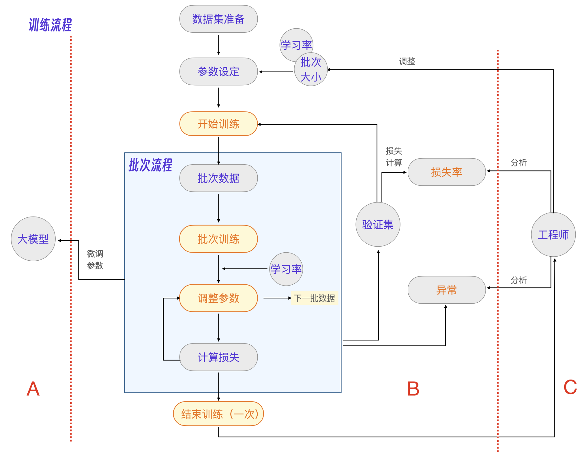
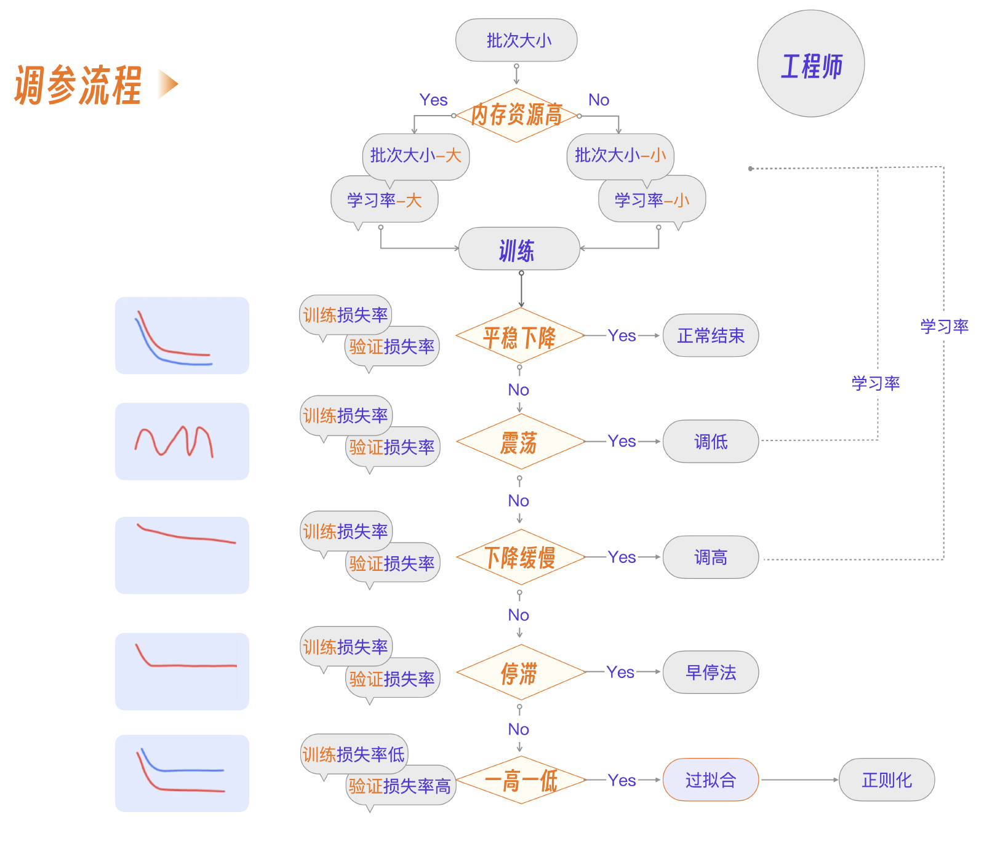

# 模型训练
大模型训练的核心代码都类似下面这一小段示例程序：
```python
#程序1
import torch
from transformers import Trainer, TrainingArguments


#定义训练参数
training_args = TrainingArguments(
    output_dir='./results',          #输出目录
    evaluation_strategy="epoch",     #评估策略，每个epoch评估一次
    per_device_train_batch_size=8,   #训练时每个设备的批量大小
    per_device_eval_batch_size=8,    #评估时每个设备的批量大小
    num_train_epochs=50,             #最大训练轮次
    save_steps=10_000,               #保存间隔步数
    eval_steps=500,                  #评估间隔步数
    logging_steps=500,               #日志记录间隔步数
    learning_rate=2e-5,              #学习率
    load_best_model_at_end=True,     #在结束时加载最佳模型
)


#创建Trainer实例
trainer = Trainer(
    model=model,                         #你的模型
    args=training_args,                  #训练参数
    train_dataset=train_dataset,         #训练数据集
    eval_dataset=eval_dataset            #验证数据集
)


#开始训练
trainer.train()
```
包含了大模型训练最核心的 4 个要素：dataset - 数据集，training_args - 训练参数 ，trainer - 训练器，trainer.train() - 执行训练。


## 模型训练基本流程
所谓大模型微调，是指在基座大模型的基础上，通过数据微调参数，生成业务专有的大模型。

### 细节 1，怎么选择合适的基座大模型？
有很多开源的大模型可以作为基座大模型，针对电商客服的场景，我们比较几个常见的开源大模型：LLMA3，通义千问、DeepSeek 和 ChatGLM。

### 细节 2，怎么选择合适的微调方法？
一共有 3 个常见的微调技术，分别是全参微调，LoRA 微调和 P-tuning v2 微调。

简单来说，全参微调和 LoRA 微调更倾向于给大模型微调让其具备某些能力，而 P-tuning v2 微调更倾向于微调大模型让其扮演某个角色。

以下是DeepSeek给出的对比：

| **特性**               | **全参微调 (Full Fine-tuning)**       | **LoRA 微调 (Low-Rank Adaptation)** | **P-tuning v2 微调**               |
|------------------------|--------------------------------------|-------------------------------------|------------------------------------|
| **优点**               |                                      |                                     |                                    |
| - **性能**             | 性能最佳，适应性强                  | 性能接近全参微调，但略低            | 性能较好，适合少样本学习           |
| - **计算效率**         | 计算成本高                          | 计算效率高，参数更新少              | 参数效率高，仅优化少量提示参数     |
| - **内存占用**         | 内存占用高                          | 内存占用低                          | 内存占用低                        |
| - **灵活性**           | 适用于各种任务                      | 模块化设计，任务间共享基础模型      | 灵活性高，适应多种任务             |
| **缺点**               |                                      |                                     |                                    |
| - **计算成本**         | 计算和存储开销大                    | 计算成本较低，但仍需调整低秩矩阵    | 计算成本低，但提示设计复杂         |
| - **过拟合风险**       | 小数据集上容易过拟合                | 过拟合风险较低                      | 过拟合风险较低                    |
| - **任务依赖性**       | 无特别任务依赖性                    | 部分复杂任务可能需要更多调整        | 提示设计对任务效果影响较大         |
| - **资源需求**         | 需要大量GPU内存和计算资源            | 适合资源有限的环境                  | 适合资源有限的环境                |
| **适用场景**           | 大数据集、高性能需求的任务           | 资源有限、中等规模数据集的任务      | 少样本学习、提示设计灵活的任务    |

- **全参微调**：适合高性能需求和大数据集，但资源消耗大。
- **LoRA 微调**：适合资源有限的中等规模任务，性能接近全参微调。
- **P-tuning v2**：适合少样本学习和灵活提示设计的任务，资源消耗低。

根据任务需求、数据集规模和计算资源选择合适的微调技术。

### 细节 3：dataset 数据集的细分和适配
它的目的是把我们的数据格式转化为LLM需要的数据格式。

### 细节 4：选用更适合大模型场景的训练器 
Seq2SeqTrainer 它擅长大模型场景下的序列化数据训练。

```python
#程序2
#配置文件
ft_config = FinetuningConfig.from_file(config_file)


#数据集处理
...


#训练器
trainer = Seq2SeqTrainer(
        model=model,                   #模型
        args=ft_config.training_args,  #参数
        data_collator=DataCollatorForSeq2Seq(
            tokenizer=tokenizer,
            padding='longest',
            return_tensors='pt',
        ),
        train_dataset=train_dataset, #训练集
        eval_dataset=val_dataset,    #验证集
        tokenizer=tokenizer
        compute_metrics=functools.partial(compute_metrics, tokenizer=tokenizer),
    )
 
 #开始训练
 trainer.train()
```

trainer.train() 开启训练后，并不是一次性地训练整个数据集，而是分批分步训练。
所以，搞清楚一个批次的训练流程，也就理解了整个模型训练过程，而最重要的几个 training_args 训练参数也都体现在批次流程里。

- 批次大小：表示每一批训练的数据大小。
- 学习率：表示每一次训练对数据的学习强度。
- 损失率：表示调整完参数后模型对数据预测失败的程度，分为训练损失率和验证损失率。


大模型微调时，大模型会分批接收数据，学习这些数据，尝试调整参数，然后马上用新参数测试这些数据，看学习到多少，损失了多少，如此往复，让损失率逐步降低。

训练流程总结如下：



### 细节 5：将原始数据格式转为 LLM需要 的数据格式（JSON) 再拆分数据集。
比如电商客服数据，原本是Excel, 需要转化为JSON:
```json
[
  {
    "conversations": [
      {
        "role": "user",
        "content": "是自己用的嘛"
      },
      ...
      {
        "role": "user",
        "content": "用了多长时间呢"
      },
      {
        "role": "assistant",
        "content": "18款回答19年，19款回答20年。没怎么用所以出了"
      },
      ...
    ]
  }
]
```

### 细节 6：将数据格式（JSON）的数据集转为训练器的数据格式，考虑序列化，考虑 loss 损失率
因为大模型训练器内部的数据格式是一个序列化的张量，所以首先要做 token 化，把 JSON 格式的数据转为 token 列表。
```python
...
new_input_ids = tokenizer.build_single_message(
    message['role'], '', message['content'] #将数据转化为token
)
...
```
如果想要方便做损失率计算，就要标明输入的 token 列表哪些 token 是输入，哪些是输出。你可以用一个 loss_mask 列表来标明。
```python
input_ids, loss_masks = [
    tokenizer.get_command('[gMASK]'),
    tokenizer.get_command('sop'),
], [False, False] #初始化loss_mask列表


#如果是用户的数据则不做损失计算
if message['role'] in ('system', 'user'):
    loss_mask_val = False #输入：不做损失计算
else:
    loss_mask_val = True  #输出：做损失计算
```

##  工程经验
### 如何高效处理大规模训练数据？
- 具体场景：在模型训练过程中，如果训练语料特别大（如 1TB 的数据），一次性加载到内存会导致内存不足。
- 解决方案：使用 JSONL 格式（每行一个 JSON），采用流式加载。这样可以根据需要加载数据，避免内存占用过大。

### 如何保证数据加载的随机性？
- 具体场景：JSONL 格式默认按行加载数据，每次加载顺序几乎是固定的，需要在每轮训练中，确保加载的数据样本具有随机性和多样性，避免模型过拟合。
- 解决方案：设置数据加载的随机种子，并一次性加载足够大的数据集（例如 10 万条），然后打乱数据顺序。

### JSONL 格式常见陷阱有哪些？
- 陷阱问题：如果 JSONL 文件的最后一行为空，或者数据量少于 32 条，可能导致 Hugging Face 的 PyTorch 版本报错或解析失败。

### 灵活使用 Py 文件加载数据？
- 具体场景：当模型语料不便于转换为 JSONL 格式（如原始数据是 Excel、CSV 或来自数据库），或者语录里有 JSON 数据，不方便转义。
- 解决方案：编写 Py 脚本将数据转换为适合模型训练的格式，利用 PyTorch 的 DataLoader 加载 Py 文件中的数据集。Py 文件中的类应继承自 Dataset 类。
- 陷阱问题：PyTorch 会将 Py 数据文件写入 /tmp/cache/，如果 import 的包不规范或路径不正确，可能导致加载失败。所以要避免使用相对路径的跨目录引入，一定要用绝对路径确保数据文件正确加载。


## 工程中的调参方法
程序的核心输入就是我们参数配置文件里的核心参数（批次大小和学习率)。
```
#参数
...
per_device_train_batch_size: 4 #批次大小
learning_rate: 5e-5 #学习率
...
```
就拿学习率而言，如果把学习率调得很高，大模型会出现类似我们学习书本过程中死记硬背的问题，最后在单元测验和期末考试中反而会考零分。所以，显然不是学习率越高越好。

具体参考： https://pan.baidu.com/s/13rxKe6bhlXDpdVCaJQcLkg?pwd=937n

简单来说，就是三条结论。
- 批次大小结合当前资源情况设定。
- 学习率结合批次大小设定。
- 在多次训练过程中按不同情况调参。




## 模型训练的过程监控
[wandb](https://wandb.ai/home) 可以方便地上传和监控模型训练的基础日志，也可以自定义相应的参数，并且提供网页实时查看数据。

要集成 wandb 和自定义参数，需要在 程序 2 基础上加入 wandb 的代码。
```python
#程序3
import wandb  # Import wandb
...
wandb.init(project="project_name")  # 将 "your_project_name" 替换为实际的项目名称
...
wandb.log({"eval_loss": loss.item()}) # 自定义参数上传
```