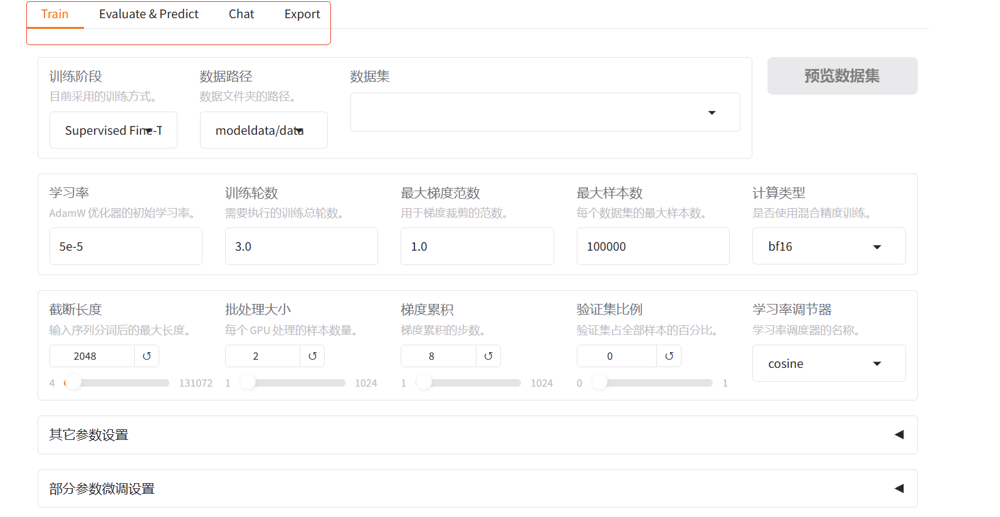
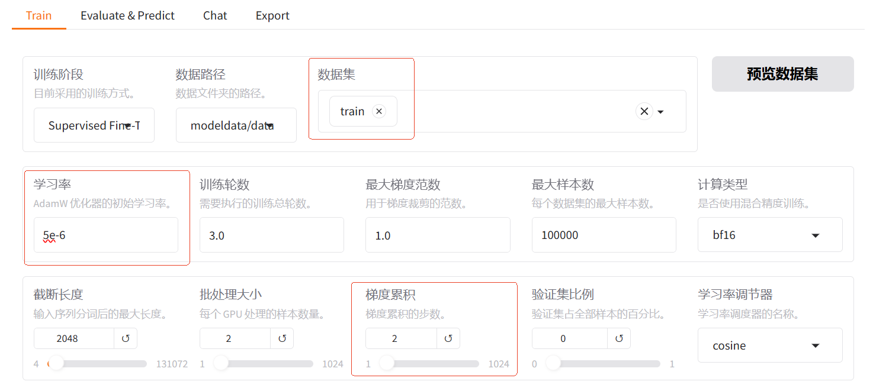
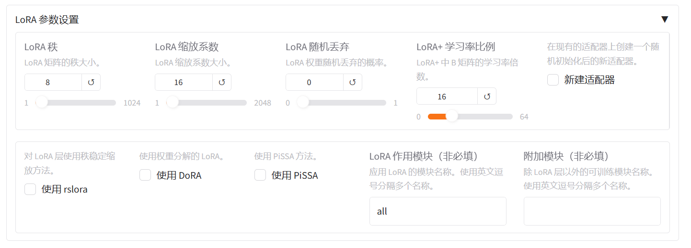

# 使用LLama-factory进行微调
LLama-factory 是一款整合了主流的各种高效训练微调技术，适配市场主流开源模型，而形成的一个功能丰富、适配性好的训练框架。LLama-factory 提供了多个高层次抽象的调用接口，包含多阶段训练、推理测试、benchmark 评测、API Server 等，使开发者开箱即用。同时提供了基于 gradio 的网页版工作台，方便初学者迅速上手操作，开发出自己的第一个模型。

---

## 准备工作
从(Llama-factory官网文档)[https://github.com/hiyouga/LLaMA-Factory]中可以看到，7B 的大模型，如果使用 LoRA 方式进行微调，最少需要 16GB 的显存。


LLama-factory 支持选择待微调的模型后，自动下载模型，但是我们在 ModelScope 下载模型时，经常会出现文件下载不全或者下载中断的情况，因此 LLama-factory 官方建议自己手动进行下载。下载命令为：
```shell
pip install modelscope


modelscope download --model deepseek-ai/DeepSeek-R1-Distill-Qwen-7B --cache_dir /root/ms_cache
```
模型会下载到 /root/ms_cache/deepseek-ai/DeepSeek-R1-Distill-Qwen-7B/ 目录。

数据集你可以使用如下命令进行下载：
```shell
wget https://atp-modelzoo-sh.oss-cn-shanghai.aliyuncs.com/release/llama_factory/data_news_300.zip
```
下载完成后解压，会得到三个文件，分别是 dataset_info.json、train.json 以及 eval.json:
- dataset_info.json 是目录文件，LLama-factory 需要通过读取该文件，才能知道有哪些可用的数据集。- train.json 是训练数据集，内置了包含 300 组对话样本，是根据新闻分类器的要求准备的；输入为新闻标题，输出为新闻所属的种类，不需要额外解释，但保留思维链的内容；并且在输入的新闻标题前加上“新闻分类：”等类似标签来标明询问目的。例如：
```json
[
    {
        "conversations": [
            {
                "from": "human",
                "value": "新闻分类：给力！中国两次出手，美到手的订单黄了，该国从此只认中国制造！"
            },
            {
                "from": "gpt",
                "value": "<think>\n首先，我需要分析给出的新闻标题：“给力！中国两次出手，美到手的订单黄了，该国从此只认中国制造！”\n\n接下来，根据标题内容进行分类。标题中提到了中国两次行动导致美国订单出现问题，并且其他国家开始依赖中国制造，说明这涉及国家之间的经济合作和社会影响。\n\n结合新闻种类，考虑到涉及国际贸易和经济合作，最合适的分类是“经济”。所以，这条新闻应该归类到“经济”类别中。\n</think>\n\n经济"
            }
        ]
    }
]
```
- eval.json 是评估数据集，相当于测试用例，LLama-factory 会通过自动执行测试用例来评估训练的效果。

我们将这三个文件，放到 /root/data 目录下。

---

## 编译运行 LLama-factory

下载 LLama-factory (源码)[https://github.com/hiyouga/LLaMA-Factory/releases/tag/v0.9.1]

在代码中有两个特别重要的目录:
- 第一个是 data，里面存放的是官方为我们准备的测试数据集，新手使用这些数据集，特别容易上手。
- 第二个是 docker 文件夹，里面为我们准备了不同架构平台的 Dockerfile，有了 Dockerfile，我们就可以直接将源码编译成镜像。

NVIDIA 的卡，可以在代码的根目录执行如下命令进行编译：
```shell
docker build -f ./docker/docker-cuda/Dockerfile \
    --build-arg INSTALL_BNB=false \
    --build-arg INSTALL_VLLM=false \
    --build-arg INSTALL_DEEPSPEED=false \
    --build-arg INSTALL_FLASHATTN=false \
    --build-arg PIP_INDEX=https://pypi.org/simple \
    -t llamafactory:v0.9.1 .
```
镜像编译完成后，可以执行如下命令，运行镜像：
```shell
docker run -dit --gpus=all \
    -v /root/ms_cache/deepseek-ai/DeepSeek-R1-Distill-Qwen-7B/:/root/.cache/modelscope/hub/models/DeepSeek-R1-Distill-Qwen-7B \
    -v /root/data:/app/modeldata/data \
    -v /root/config:/app/config \
    -v /root/saves:/app/saves \
    -v /root/output:/app/output \
    -p 7860:7860 \
    -p 8000:8000 \
    --name llamafactory \
    llamafactory:v0.9.1
```
7860 端口是 webui 的访问端口，8000 是 API 访问端口。


我们进入到 docker 容器内部，执行下面的命令，启动 llama-factory 的 webui。
```shell
llamafactory-cli webui
```
之后在浏览器输入 < 公网 ip>:7860，就可以进入到 WebUI。

WebUI控制台提供了三种微调方法，分别是 full、freeze 和 lora。
- Full 是全参数微调，意思是把模型所有的权重都放开，用新数据从头到尾训练一遍。这种方法训练效果好，但是所需资源量非常大。
- Freeze 是冻结微调，意思是冻结模型的大部分底层参数，比如前 80% 的层，只训练顶部的几层。这种方法使用的数据量比较少，适合微调简单的任务，比如简单的文本分类等等。
- Lora 中文叫低秩自适应，其原理是不修改原模型参数，而是插入低秩矩阵（理解为轻量级的适配层），只训练这些新增的小参数。优点是超级省资源，且效果很好，解决 Full 微调太耗费资源的问题。但对于用户的要求较高，需要充分理解每个参数的含义和效果。


还支持设置 QLoRA 的量化等级等参数。QLoRA 是 LoRA 的改进版本，Q 的意思是量化。QLoRA 的原理是先把模型进行量化，然后再进行 LoRA 微调。这样的好处在于能进一步节省显存消耗。比如我在一张 16G 的 T4 卡上使用 LoRA 微调 7B 模型，会报显存不足的错误，但如果使用 QLoRA，便可以进行微调。

再往下就是主功能:



这一部分是控制台的四大核心功能。分别是训练（微调）、评估 & 优化、对话和导出。
- 训练包含了我们进行模型微调时的一些步骤，包括数据集的选择、参数的设置等等。参数的设置，需要用户根据微调任务的实际情况自行配置。这里可以操考 [3.模型训练](./3.%20模型训练.md)
- 评估页面会使用评估工具对模型性能进行评估。
- 对话页面可以直接加载原始模型或者微调过后的模型，之后通过与模型进行对话，来人为地检验模型的效果。
- 导出页面可以将对话页面加载的模型输出成模型文件。

---

## 实战
首先加载模型:


然后进行微调，选择数据集，并设置学习率为 5e-6，梯度累积为 2:



之后进行 LoRA 参数设置，设置 LoRA+ 学习率比例为 16，LoRA+ 被证明是比 LoRA 学习效果更好的算法。在 LoRA 作用模块填 all，意思是将 LoRA 层挂载到模型的所有线性层上，提高拟合效果。



设置完成后，点击开始，就会开始训练。下方会输出训练日志以及进度。

训练完成后，我们先来进行评估。点击上方的检查点路径，选择我们刚刚训练好的输出目录，就可以在模型启动时加载微调结果。选择 Evaluate&Predict 页面，数据集选择 eval，点击开始。评估完成后，会给出评估得分。

我们主要关注其中的 predict_rouge-1 的得分，这个分越高，说明生成质量越好。此次评估得分是 55.53 分，说明生成的文本与参考文本在单词级别上有约 55.53% 的重合。

---

## 参考
https://qqe09mcsmy6.feishu.cn/docx/VoO0dJlmwocxpIxVW0Oc1LW0nYb