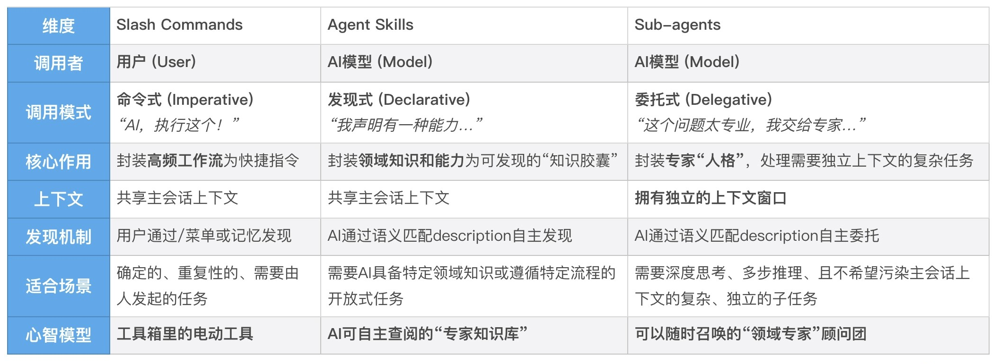
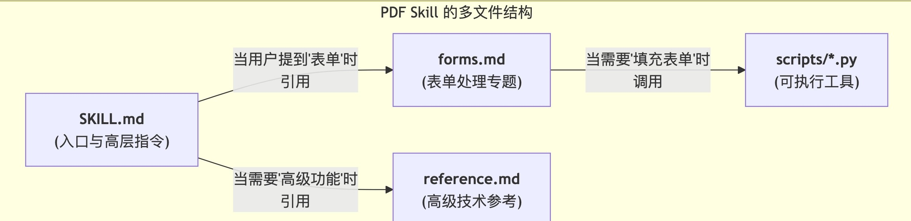

# Agent Skill
我们不可能为每一个垂直领域（比如"处理公司财务报表""遵循团队 Figma 设计规范""分析 Kubernetes 日志"）都去从零开始训练一个专门的大模型，那样的成本是天文数字。我们也不想把所有领域的专业知识都一股脑地塞进一个巨大的、难以维护的 CLAUDE.md 文件里，那样会迅速撑爆 AI 的上下文窗口，导致其性能下降和"认知混乱"。

我们需要一种更先进的知识封装和调用机制。这种机制，应该能让我们的专业知识像一个个独立的"知识插件"一样存在，只有在 AI 处理相关任务时，才被精准地、动态地、高效地加载进来。

正是 Anthropic 给出的革命性答案——Agent Skills（智能体技能）。Agent Skills 正式统一了 AI 扩展自身能力的"软性知识与逻辑"标准。 只要你的 Skill 遵循这个规范，它就能像 Docker 镜像一样，在不同的 AI 智能体之间无缝流转和运行。官方仓库：[github.com/anthropics/skills](https://github.com/anthropics/skills)。

---

## 为什么说 Agent Skills 是能力涌现的关键？
- 指令（如 Slash Command）：是一个"祈使句"。它由用户发起，明确地告诉 AI"去做这件事"。例如，/review-go-code。
- 技能（Skill）：是一段"陈述句"。它由开发者预先定义，安静地躺在那里，向 AI"自我介绍"："我是一种能做某件事的能力"。例如，"我是一个能够根据 Go 项目规范审查代码的技能"。

这，就是"智能涌现"的关键。 我们不再需要为每一个任务都设计一个精确的指令。我们只需要像建设一个图书馆一样，不断地用标准化的格式，为 AI 丰富它的"技能库"。AI 则会像一个聪明的学者，根据自己要研究的课题，自主地去图书馆里查找并使用最相关的书籍和工具。

---

## 一个 Skill 的具体形态

**基础结构：一个文件夹 + 一个 SKILL.md**
```
my-first-skill/
└── SKILL.md
```
SKILL.md 文件由两部分构成：
- YAML Frontmatter（元数据）：文件最顶部由 `---` 包围的区域，定义了技能的"身份证"。
- Markdown Body（指令主体）：文件主体，包含 AI 激活此技能时需要遵循的具体步骤、指南和示例。

### SKILL.md Frontmatter 完整字段一览（截至 2026 年）

这是和去年版本差异最大的一节。Frontmatter 是 AI 发现和调用 Skill 的"窗口"，字段选错或写错，整个 Skill 都可能形同虚设。

#### 必填字段

| 字段 | 约束 | 作用 |
|---|---|---|
| `name` | 1-64 字符；只能包含**小写字母、数字、连字符**；不能以连字符开头或结尾；不能有连续连字符（如 `my--skill`） | 技能的全局唯一 ID，对标 npm 包或容器镜像命名 |
| `description` | 字符串，建议 1-3 句话 | 技能的能力广告语——AI 用它做语义匹配，决定是否激活 |

#### 可选但强烈推荐

| 字段 | 取值 | 作用 |
|---|---|---|
| `allowed-tools` | 空格分隔的工具名列表，如 `Read Grep Glob Bash` | 限定 Skill 激活时允许使用的工具，是最有效的"防越权"手段 |
| `compatibility` | 多行字符串 | 声明运行环境依赖（Python 版本、外部 CLI、网络要求等），Agent 在加载前可评估是否满足 |

#### 新增的精细化控制字段

| 字段 | 取值 | 何时用 |
|---|---|---|
| `disable-model-invocation: true` | 布尔 | 阻止 Claude 自动发现和调用，只能通过 `/skill-name` 手动触发。适合"我希望保留主动权"的 Skill |
| `user-invocable: false` | 布尔 | 从 `/` 菜单中隐藏，但仍允许模型调用。适合"只供 sub-agent 内部使用"的 Skill |
| `context: fork` | 布尔 | 把 Skill 的执行上下文 fork 到一个隔离的 sub-agent，主对话的上下文保持干净。适合"重操作型" Skill |
| `agent: <name>` | 字符串 | 指定由哪个已注册的 sub-agent 来执行此 Skill |

#### 元信息字段

| 字段 | 作用 |
|---|---|
| `license` | 开源协议声明，如 `Apache-2.0` |
| `metadata.version` | 语义化版本号，方便团队演进管理 |
| `metadata.author` | 维护者信息 |

#### 一个完整的示例
```yaml
---
name: financial-data-collection
description: |
  采集中国 A 股和港股上市公司的财务数据，包括资产负债表、利润表、现金流量表和财务指标。
  当用户提到财务数据、财报、三大报表、akshare、上市公司财务等需求时使用此 Skill。
  不要用于：实时行情数据、非财务报表（如 ESG 报告）、美股数据。
allowed-tools: Read Bash
compatibility: |
  - Python 3.9+
  - 依赖：akshare, pandas, openpyxl
  - 需要公网访问 akshare 接口
license: Apache-2.0
metadata:
  version: 2.1.0
  author: data-team
---

# 财务数据采集技能
[具体指令...]
```

#### ⚠️ 两个易混淆的"开关"陷阱

`disable-model-invocation` 和 `user-invocable` 是两个**正交维度**，很多人会把它们搞混。记住这张表：

| 组合 | 效果 |
|---|---|
| 两个都默认（不写） | 用户能 `/` 调，模型也能自动调（最常用） |
| `disable-model-invocation: true` | 模型不会自动激活，但用户仍可 `/` 调 |
| `user-invocable: false` | `/` 菜单看不到，但模型仍可自动激活（适合 sub-agent 专用 Skill） |
| **两个都打开** | Skill 完全从 session 中消失（GitHub Issue #43875 仍存在相关 bug，慎用） |

### 进阶结构：references / scripts / assets
```
pdf-skill/
├── SKILL.md           # Level 2: 核心入口和指令
├── references/        # Level 3+: 按需查阅的参考资料
│   ├── forms.md
│   └── reference.md
├── scripts/           # Level 3+: 可被调用的脚本
│   ├── fill_form.py
│   └── ...
└── assets/            # Level 3+: 模板、图标、数据等静态资源
    └── template.pdf
```
和去年版本的两个关键区别：
- 散落的 `forms.md` / `reference.md` 现在规范是放进 `references/` 目录，而不是平铺在 Skill 根目录。
- 新增 `assets/` 目录用于存放模板、图片等不需执行但要分发的静态资源。

主 SKILL.md 文件大小建议控制在 **800 行以内**。如果内容超过这个量级，说明你把太多底层细节塞进了 AI 的初始工作记忆中，应该拆分到 `references/` 让 AI 按需"翻书"。

---

## 部署位置：Project 级 vs. User 级 vs. Plugin 级

Skill 文件夹可以放在三种标准位置，作用域依次扩大：

### Project Skills（团队共享）
- 位置：项目根目录下的 `./.claude/skills/<skill-name>/`
- 特点：随项目一起提交到 Git 仓库，团队成员 clone 项目后立即拥有这些技能。
- 用途：封装团队共享的最佳实践、项目特定的工作流，如 `go-code-reviewer`、`deploy-to-staging`。

### Personal Skills（个人专属）
- 位置：用户主目录下的 `~/.claude/skills/<skill-name>/`
- 特点：只存在于你自己的机器上，可以在所有项目中随时被 AI 发现和调用。
- 用途：封装个人高频习惯、私人脚本工具集，如 `summarize-git-diff`、`translate-to-english`。

### Plugin Skills（生态分发）—— 新增
- 位置：通过 `/plugin marketplace add <owner/repo>` 添加市场源，再 `/plugin install <plugin-name>@<marketplace>` 安装。
- 特点：一个 Plugin 可以打包多个 Skill + 命令 + Hook + MCP 配置，统一版本化管理，跨项目分发。
- 用途：把团队（或公司）的能力封装成可一键安装、可版本迭代的产品包。
- 官方示例：`/plugin marketplace add anthropics/skills` 然后 `/plugin install document-skills@anthropic-agent-skills`。

Claude Code 启动时会自动扫描前两种目录；Plugin 则是按需安装、按需激活。

---

## "渐进式披露"：解决 AI 上下文瓶颈的优雅之道

Agent Skills 的设计哲学可以概括为四个词：可组合（Composable）、可移植（Portable）、高效（Efficient）、强大（Powerful）。支撑这一切的核心机制是**渐进式披露（Progressive Disclosure）**——通过一个三层信息加载模型实现：


- **Level 1：元数据（发现层 / 能力索引）**：启动时，Claude Code 只加载每个 SKILL.md 头部的 YAML Frontmatter（特别是 `name` 和 `description`）。这些简短描述会被永久注入到系统提示中，相当于为 AI 构建了一个可无限扩展的"能力索引"。AI 的知识库可以无限大，但工作记忆只存放索引，成本极低——这就是 Skills 解决可扩展性（Scalability）的答案。
- **Level 2：核心指令（触发层 / 即时加载）**：当用户任务与某个 Skill 的 description 语义匹配时，AI 才真正去读取该 SKILL.md 的主体内容。这是"即时加载（Just-in-Time Loading）"的体现——AI 需要成为"PDF 专家"时，才去"阅读"那本专业书籍，而不是把所有书都背在身上。
- **Level 3+：辅助资源（执行层 / 深度按需加载）**：SKILL.md 中引用的其他文件（Python 脚本、参考资料、模板），只有 AI 执行到那一步时才加载。脚本执行结果默认全部回灌上下文，因此**长输出脚本应该落盘或配合 tail/grep 策略**，避免一次性污染上下文。

可移植性（Portable）源于标准化的文件夹结构——一个 Skill 本质上是一个自包含的文件夹，可以跨项目、跨团队、跨产品共享，Build once, use everywhere。

可组合性（Composable）源于 AI 模型的自主协调能力——复杂任务如果同时触及多个 Skill，AI 能像项目经理一样，先后或交错地调用它们。

---

## Skills vs. Slash Commands vs. Sub-agents



- **Slash Command**：当你希望自己能方便快捷地触发一个固定流程时使用——流程的确定性最高。
- **Agent Skill**：当你希望 AI 在处理某个特定领域的问题时，能自动地、更聪明地工作时使用——探索的自主性最高。
- **Sub-agent**：当你希望 AI 能将复杂问题分包给一个不会干扰当前对话的"专家分身"去独立解决时使用。

### 边界正在融合：Slash Command × Skill 的组合模式

过去这两者泾渭分明，但 2026 年的实践已经出现了新组合：

```markdown
# .claude/commands/collect-finance.md
!`/financial-data-collection --code 600519 --market A股 --years 2024`
```

Slash Command 用 `!` 显式触发 Skill，把"用户的确定性入口"和"Skill 内部的自主决策"结合起来。这种"两层确定性 + 中间一层智能"的混合模式，在严肃工程交付场景中特别有用。

---

## 实战：把 /review-go-code 改造为更智能的 go-code-reviewer Skill

**第一步：创建 Skill 目录结构**
```bash
mkdir -p ./.claude/skills/go-code-reviewer
```

**第二步：编写 SKILL.md**（注意新的字段和语法）
```yaml
---
name: Go Code Reviewer
description: |
  根据本项目的开发"宪法"(constitution.md)对 Go 代码进行深度审查。
  使用场景：用户要求审查 Go 代码、检查代码质量、验证是否符合项目规范。
  不要用于：纯文档修改、非 Go 语言的代码审查、纯语法问题（请用 linter）。
allowed-tools: Read Grep Glob
context: fork
---

# Go Code Reviewer Skill

## 执行步骤
[... 与去年版本相同，省略 ...]
```

相比去年版本的关键升维：
- `description` 用 YAML 多行字符串，并补充了**负面场景**（"不要用于..."），降低误触发概率。
- `allowed-tools` 改为空格分隔（去年错误地用了逗号）。
- 新增 `context: fork`：审查会产生大量中间输出，fork 到隔离 sub-agent 避免污染主对话。
- 新增"组合模式"建议：可以再写一个 `/review-go-code` Slash Command，内部用 `!` 触发此 Skill。

---

## 从官方 Skills 仓库看高级模式

Skills 的真正威力在于封装包含多个辅助文档和可执行脚本的复杂能力。官方仓库 [github.com/anthropics/skills](https://github.com/anthropics/skills) 现在的结构是：

```
anthropics/skills/
└── plugins/
    ├── document-skills/
    │   ├── pdf/
    │   │   ├── SKILL.md
    │   │   ├── references/
    │   │   └── scripts/
    │   ├── xlsx/
    │   └── ...
    ├── example-skills/
    │   ├── frontend-design/
    │   ├── skill-creator/        # 元技能：用于创建其他 Skill
    │   └── ...
```



SKILL.md 的主体内容就像一个"路由"——最关键的一点是：`references/`、`scripts/` 中的文件，只有在被明确"提及"时，才会被加载到上下文中。AI 在处理一个简单的文本提取任务时，完全不会知道 `forms.md` 的存在，从而极大地节省 Token。

这个官方示例揭示了**设计复杂 Skill 的最佳实践**：将专业知识像写一本结构清晰的书一样组织起来。SKILL.md 是"目录"，辅助文档是"章节"，可执行脚本是"工具箱"。

---

## Skill 与 MCP 的协同（新增）

2026 年的最佳实践是**Skill 描述流程，MCP 提供工具能力**。SKILL.md 中可以引用 MCP 工具，格式是 `mcp__<server>__<tool>`：

```yaml
allowed-tools: Read Grep Bash mcp__playwright__browser_navigate
```

一个真实场景：
- MCP Server：playwright（提供浏览器自动化工具）
- Skill：定义"抓取 GitHub Trending 页面并整理成 Markdown"的具体流程
- 协作方式：Skill 描述"先 navigate、再 extract 列表、最后 format"，具体的浏览器操作由 MCP 提供

这种解耦让 Skill 保持精简，同时复用 MCP 生态的丰富工具。

---

## 用 skill-creator 元技能自动打磨 Skill（新增）

编写 Skill 最难的部分，不是写出第一个版本，而是**写出一个能稳定触发的 description**。Anthropic 官方提供了 `skill-creator` 元技能，通过 Plugin 安装：

```bash
/plugin marketplace add anthropics/skills
/plugin install example-skills
```

它启动后会做三件事：
1. **采访你**，帮你生成 SKILL.md 的初稿。
2. **Grader Agent** 拿这个 Skill 跑几十个你没想到的测试用例打分。
3. **Comparator / Analyzer Agent** 进行双盲对比，告诉你哪个版本好在哪里，是哪句 description 导致了触发失败，并自动为你优化。

建议把 `skill-creator` 作为所有团队内部 Skill 的"出厂质检"流程。

---

## Skills 的设计哲学与最佳实践

**保持技能的"单一职责"**：例如，创建三个独立的 Skill：`pdf-form-filling`、`word-doc-analysis`、`markdown-table-generator`，而不是一个万能 `office-files`。

**精心撰写"技能广告语"**：description 是 AI 发现你技能的唯一入口。一个好的 description 必须清晰地回答三个问题：
1. **这个技能能做什么？**（能力）
2. **什么时候该用它？**（正面触发场景，最好包含关键词）
3. **什么时候不要用它？**（负面场景，防止误触发）

**把"确定性"剥离给脚本**：千万别用 LLM 做确定性的计算！这不仅浪费 Token，而且错误率极高。**LLM 负责控制流与意图理解，脚本负责数据流与确定性执行**——这是高质量 Skill 架构的不二法则。

**善用结构化约束，但也要解释 Why**：很多人写 Prompt 时喜欢大写的 `MUST`、`NEVER` 试图"恐吓"大模型，这种强约束在 Skill 里其实是**官方推荐**的做法（Anthropic 内部 Skill 大量使用 MUST/SHOULD/NEVER），关键是要在 MUST 旁边补一句"为什么"——把 AI 当作一个绝顶聪明但暂时缺乏业务上下文的新入职高级同事，**既要告诉它"怎么做"，更要向它解释"为什么（The Why）"**。

**版本化与团队共演进**：
```yaml
metadata:
  version: 2.1.0
  changelog: |
    - 2.1.0 (2026-07-15): Added support for processing password-protected PDFs.
    - 2.0.0 (2026-05-01): Breaking change - `allowed-tools` now uses space-separated syntax.
    - 1.0.0 (2026-02-10): Initial release.
```

Skills 并非一蹴而就。鼓励团队成员：
- 主动反馈："我希望 AI 帮我做 X，但它没有调用 Y 技能，是不是 Y 技能的 description 不够好？"
- 共同建设：在 SKILL.md 中，像维护代码一样记录使用的"坑"和成功的"模式"。

---

## Skill 生态与分发（新增）

随着 Skills 标准化，生态也在快速形成：

- **官方仓库**：[github.com/anthropics/skills](https://github.com/anthropics/skills) —— 包含 document-skills、example-skills 等官方维护的 Skill 集合。
- **社区市场**：[skills.sh](https://skills.sh) —— Vercel 维护的 Skill 热度榜，按安装量排名，可用 `npx skills add <project>` 一键安装。
- **跨 Agent 兼容**：Skills 规范正在演化为开放标准 [agentskills.io](https://agentskills.io/)，目标是在 Claude Code、Claude API、Gemini CLI 等不同产品间通用。

如果你要把 Skill 分享给团队之外的人，建议**优先用 Plugin 形式打包**（包含完整的版本声明、依赖管理、Hook 配置），而不是只扔一个文件夹。

---

## 最后

Agent Skills 的革命性，不在于它引入了什么全新的概念，而在于它**用最简单的文件夹结构 + Markdown 文件，把"AI 的专业知识"变成了可版本化、可分发、可测试、可组合的工程制品**。

而工程化的本质，就是把"重复造轮子"变成"站在巨人肩膀上"。当你的团队积累了几十个高质量的 Skill 后，新成员入职第一天就能"继承"整个团队的隐性知识——这就是能力涌现的真正含义。

---

## 大厂的skill
- https://github.com/VoltAgent/awesome-agent-skills
- https://clawhub.ai/soul-code/skills/financial-report-analyzer