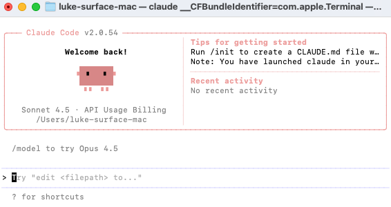
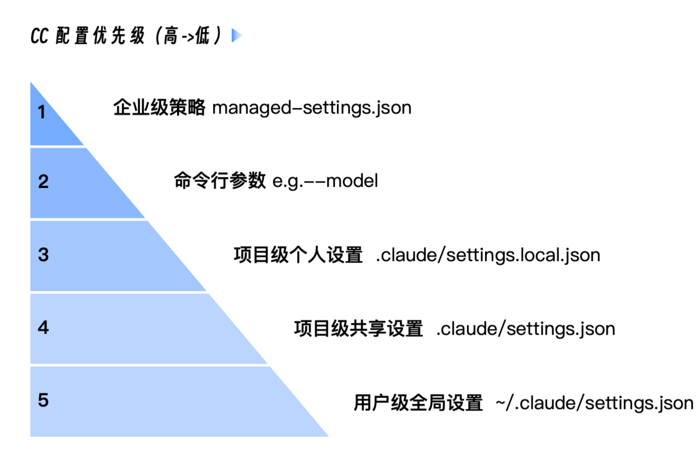

# Claude Code installation
首先要保证Node.js版本在18以上
```
node -v

v18.20.4
```

全局安装claudecode
```bash
npm install -g @anthropic-ai/claude-code
```

查看安装位置：
```
% which claude
/usr/local/bin/claude
```

查看版本
```
claude --version
```
如果安装后claude命令不生效：
```
npm config get prefix
```
查找到npm的全局目录，然后将其加入到环境变量之中。、
```
echo 'export PATH="$HOME/.npm-global/bin:$PATH"' >> ~/.zshrc
```

直接运行claudecode
```
claude
```
这时候是连接Anthropic的Claude API


---

## 核心理念：“车身”与“引擎”的分离
- “车身”：指的是我们安装的 Claude Code 命令行程序。它是一个高度复杂的客户端应用，负责所有与你、与你的本地文件系统交互的逻辑。它定义了工作流，提供了 @、!、/ 等强大的交互指令，实现了 Checkpointing、Hooks、SubAgent 等高级功能。
- “引擎”：指的是背后真正进行语言理解、逻辑推理和代码生成的大语言模型（LLM）。这个“引擎”通常通过云端 API 的形式提供服务。

Claude Code 客户端默认会去连接 Anthropic 官方的“引擎” – Claude 系列大模型。而我们的“引擎移植”策略，就是要通过修改配置，让“车身”不去连接官方引擎，而是去连接我们指定的、兼容 Claude 大模型 API 的国产大模型引擎，比如智谱 AI 大模型。

接下来的所有配置操作，本质上都是在修改那个名为 settings.json 的“ECU（发动机控制器）”，告诉“车身”去哪里寻找新的动力源。

环境变量配置：
```bash
export ANTHROPIC_BASE_URL=https://api.deepseek.com/anthropic
export ANTHROPIC_AUTH_TOKEN=<your_deepseek_api_key>
```
- ANTHROPIC_BASE_URL：这是最关键的一行。它告诉 Claude Code 客户端，不要去访问默认的 Anthropic API 地址，而是将所有的网络请求都发送到DeepSeek AI 的 API 兼容端点。我们在这里实现了“请求重定向”。
- ANTHROPIC_API_KEY：尽管变量名看起来是“Anthropic”的，但由于我们已经重定向了 BASE_URL，这个 Key 实际上会被发送给DeepSeek AI 的服务器进行验证。我们在这里实现了“身份凭证替换”

这次 Claude Code 没有让我们选择 login method，而是直接 login 成功了！按照步骤进入到
Claude Code 的工作页面：



在输入提示符后面输入 /status 后回车，就可以看到当前 Claude Code 使用的模型的各种最新信息.

这里显示我们使用的是 claude-sonnet-4-5-20250929

---

## 设置默认使用的模型
我们需要找到并修改 Claude Code 的（分级）配置文件 settings.json。这个文件是 Claude Code 的“大脑中枢”，控制着它的核心行为，包括环境变量、权限、工具行为等。

先建立一个清晰的认知：Claude Code 的配置并非只有一个文件，而是一个设计精巧的分层配置体系，其核心思想是，高层级的配置会覆盖低层级配置中的同名设置。其优先级从高到低，如下图所示：



我们以项目级配置为例，打开 ~/.claude/settings.json 文件（如果没有自行创建）
```json
{
  "env": {
    "ANTHROPIC_DEFAULT_HAIKU_MODEL": "deepseek-chat",
    "ANTHROPIC_DEFAULT_SONNET_MODEL": "deepseek-chat",
    "ANTHROPIC_DEFAULT_OPUS_MODEL": "deepseek-chat"
  }
}
```
我们重新运行 Claude Code 并通过 /status 命令查看当前模型信息:
```
...
Model: Default (deepseek-chat)
...
```

打开一个新的终端窗口（以确保环境变量生效），输入以下命令：
```bash
claude -p "你好，请用中文介绍一下Claude Code, 不超过200字"
```
正常则返回：
```
让我通过其他方式为您介绍Claude Code：

Claude Code是Anthropic开发的AI编程助手，基于Claude Agent SDK构建。它是一个交互式CLI工具，专门帮助用户完成软件工程任务。

主要功能包括：
- 代码编写、调试和重构
- 文件操作和代码搜索
- 运行构建和测试
- Git操作和版本控制
- 多工具并行执行
- 安全测试和防御性安全

特点：
- 支持多种编程语言
- 能够理解复杂代码库结构
- 提供专业客观的技术建议
- 专注于授权安全测试和教育用途
- 避免过度工程化，保持解决方案简洁
```

---

## 三个技巧
你可以在任何时候通过在 Claude Code 会话中输入 /config 来调整它们。
- 统一视觉风格（Theme）：你的终端是什么配色，就在 /config -> Theme 里选择一个最接近的主题。一个和谐的视觉环境，能让你的眼睛更舒适，注意力更集中。
- 告别换行难题（Line Breaks）：你是不是厌倦了在终端里输入多行文本的了？如果你本地主机使用的是iTerm2 或 VS Code 的集成终端，直接在 Claude Code 里运行 /terminal-setup 命令。它会自动为你配置好 Shift+Enter 作为换行快捷键，从此你可以像在 IDE 里一样轻松输入大段代码和指令。
- 任务完成提醒（Notifications）：如果你是一个 tmux 或 screen 的用户（我强烈推荐你成为！），在执行一个长耗时任务时，可以开启窗口活动监控（monitor-activity on）。当任务完成时， tmux 会在状态栏高亮提示，你就能第一时间知道结果，无需频繁切换回来查看。

---

## 其它选择
阿里的 qwen3-coder-flash：
https://help.aliyun.com/zh/model-studio/claude-code?spm=a2c4g.11186623.0.0.72a93ca6tLnWnQ

目前测试结果，deepseek-chat 模型效果不错，但是 qwen3-coder-plus 对claude-code支持不太好，反馈400错误，格式不匹配。

---

minimax性价比之选，套餐很划算：
https://platform.minimaxi.com/docs/guides/text-ai-coding-tools#%E6%89%8B%E5%8A%A8%E7%BC%96%E8%BE%91%E9%85%8D%E7%BD%AE%E6%96%87%E4%BB%B6

---

你的配置里出现了多个模型环境变量，它们分别控制 Claude Code 内部不同用途的默认模型。简单说：

- ANTHROPIC_MODEL：主对话模型（默认模型）。
- ANTHROPIC_SMALL_FAST_MODEL：用于快速、轻量任务的模型（如生成标题、总结等）。
- ANTHROPIC_DEFAULT_SONNET_MODEL / ANTHROPIC_DEFAULT_OPUS_MODEL / ANTHROPIC_DEFAULT_HAIKU_MODEL：分别对应 Anthropic 官方分级中的 Sonnet、Opus、Haiku 级别的默认模型。

当你使用第三方模型（如 MiniMax、千问、DeepSeek）时，通常需要把这些变量全部指向同一个模型，否则 Claude Code 内部某些功能（比如自动选择小模型处理简单任务）可能会回退到 Anthropic 官方模型，导致请求失败或混淆。