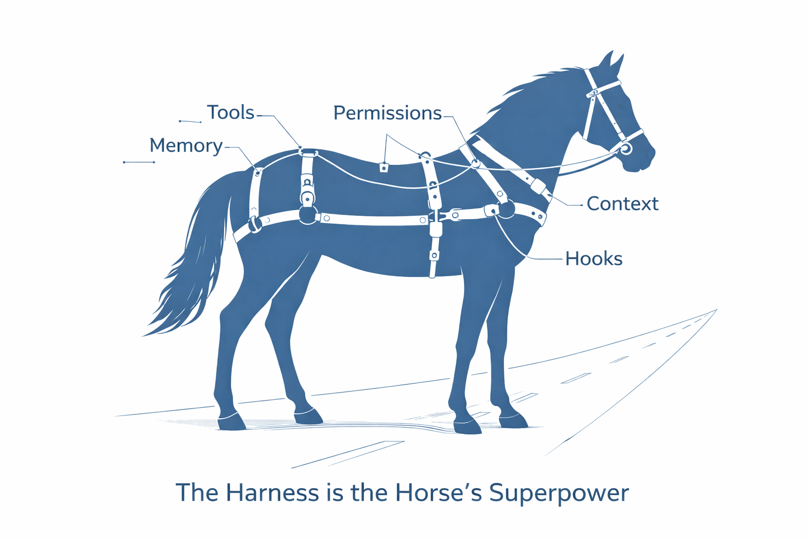
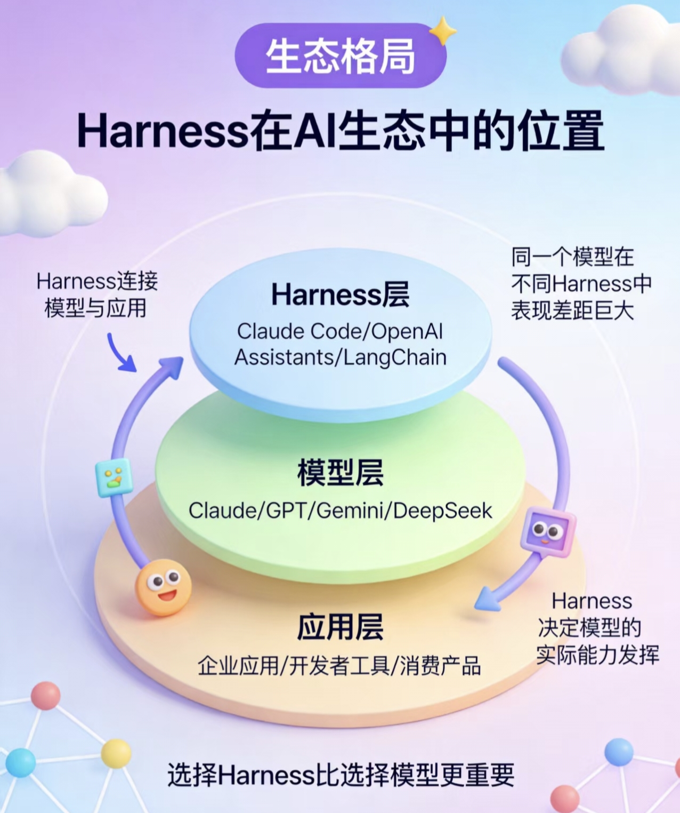
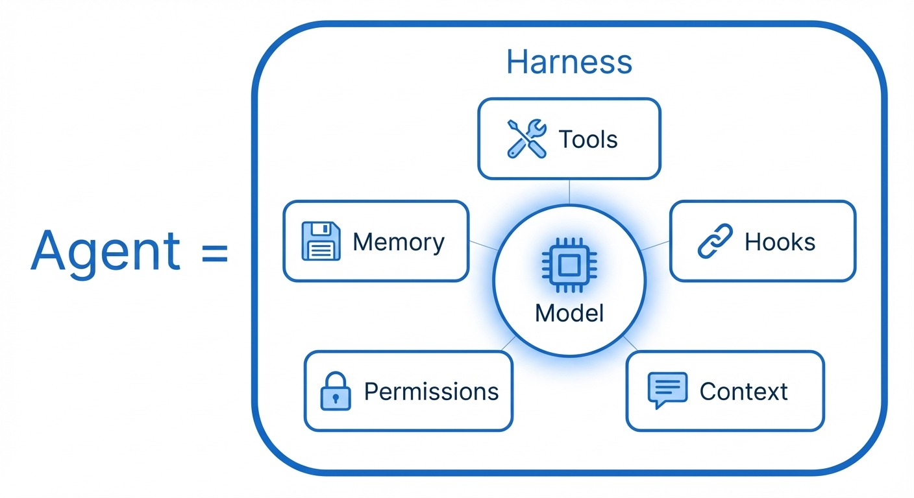
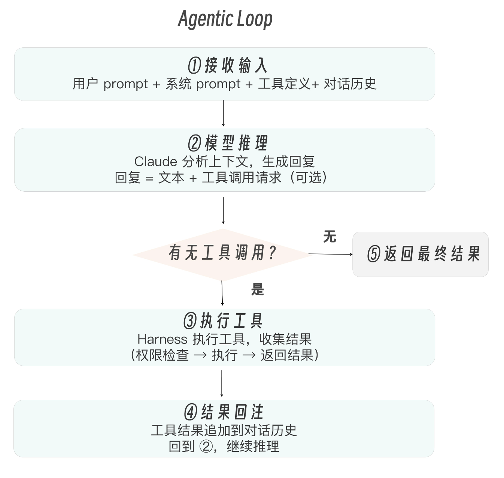
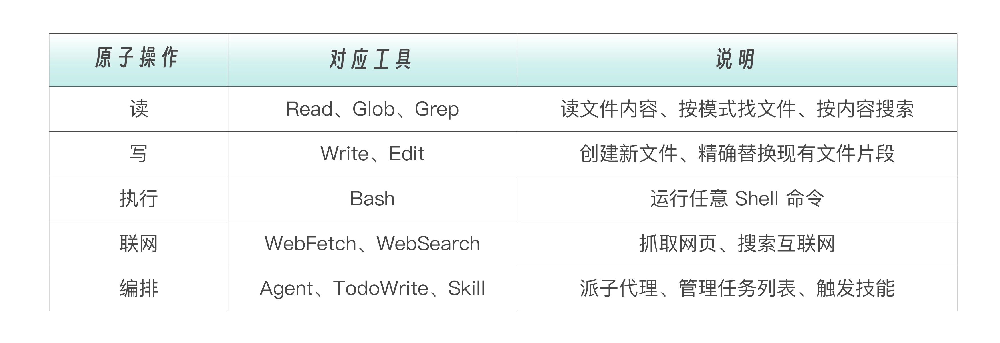

# 🐴 Harness 是什么？一文看懂
在早期，由于大模型逻辑推理能力弱，我们需要用厚重的 Framework 去帮它做意图识别、路由分发, 开发者们发明了各种基于 “链（Chain）” 和 “有向无环图（DAG）” 的框架。框架（比如LangGraph,在这些框架中，逻辑是硬编码的）扮演的是一个“事无巨细的微管家”。这种架构的致命缺陷在于“静态”与“过度干预”。真实世界的排障过程是千变万化的。如果在 NodeA 执行工具时，网络超时了，或者返回了一个预期之外的 JSON 格式，传统的 DAG 图往往缺乏弹性的回退机制，直接抛出异常导致进程崩溃。更严重的是，框架为了实现这种节点间的跳转，在底层维护了极其复杂的、人类难以阅读的隐式状态机（State Machine）。一旦发生死循环，在图的中间开发者根本无法插手干预。

但今天，面对 GPT-5.2 或 Claude 4.6 Sonnet 这样极其聪明的模型，它们原生就具备了顶级的规划（Planning）和工具调用（Function Calling）能力。它不需要你用代码去规定“先执行 A，再执行 B”。它只需要你给它一个包含当前状态的上下文（Context），并告诉它“这里有几个工具”，它就能自主推导出下一步该干什么。

基于这个前提，Harness（驾驭工程）应运而生。它不再是一个定义业务逻辑的图结构，而是一个极简的、动态的运行时环境（Runtime Environment）。我们需要的不再是教模型“怎么想”的抽象层，而是一个为模型提供健壮物理躯体和生存环境的底层引擎——这就是 Harness（驾驭工程）。

---

## 先说一个比喻

> 想象一匹千里马（AI 模型），它跑得很快，但如果没有**缰绳、马鞍、马蹄铁**，它就只是一匹野马——跑不了预定的路，也完不成任务。
>
> **Harness 就是那套"缰绳 + 马鞍"**，让 AI 模型能沿着你设定的方向，稳定、可靠地完成复杂任务。



---

## 🤔 为什么需要 Harness？

以前大家做 AI 开发，主要关注两件事：

| 阶段 | 关注点 | 解释 |
|:----:|:------:|:-----|
| 第一阶段 | **Prompt Engineering** | 怎么跟 AI "说话"，写好提示词 |
| 第二阶段 | **Context Engineering** | 怎么给 AI "喂信息"，管理上下文 |
| **现在** | **Harness Engineering** | 怎么给 AI 搭"运行环境"，让它真正干活 |



**一句话：** 光有聪明的大脑不够，还得有眼睛、耳朵、手脚，才能真正做事。

模型的能力由 Anthropic/OpenAI 决定，你无法改变。但 Harness 的配置——CLAUDE.md 怎么写、工具权限怎么设、Hooks 怎么接、MCP 怎么连——这些全在你手中。

### 💡 一个震撼的数据

> **普林斯顿大学 SWE-Agent 论文**证明：
>
> **同一个 GPT-4 模型**，只改了 Harness 的接口设计（没有换模型！），性能从 **3.97%** 提升到 **12.47%**，**相对提升 64%**！

这说明：**模型只是基础，Harness 才是决定 AI 能不能真正干活的关键。**

---

## 🧩 Harness 的 5 个核心组成部分
Model 在中心，五个组件围绕它排列，整体被一个名为 Harness 的边框包裹。这不是随意的布局，它精确表达了一个架构事实：模型不直接接触外部世界，所有交互都通过 Harness 的组件中转。Harness 是模型和现实之间的唯一接口。

这五个组件也不是孤立的。Tools 的执行结果变成 Context 的一部分；Hooks 在 Tools 执行前后触发；Permissions 决定哪些 Tools 可以被调用；Memory 用于跨会话保留 Context 中的关键信息。它们构成了一个协同运转的系统，少了任何一个，Agent 的能力都会大打折扣。



- Tools（工具），模型的手脚。Read、Write、Edit、Bash、Grep……这些工具赋予模型与文件系统、终端、网络交互的能力。没有工具，模型只能说，不能做。
- Context（上下文），模型的记忆加载器。CLAUDE.md、系统提示词、对话历史、工具定义——这些上下文在每一轮循环中被注入模型，决定了模型看到什么、知道什么。上下文管理的精妙之处是，它不仅是被动的信息传递，还包括主动的压缩和重注入策略。
- Memory（记忆），模型的长期存储。跨会话的记忆持久化，让模型能“记住”你的偏好、项目规则和历史决策。CLAUDE.md 是显式记忆，自动记忆（~/.claude/memory/）是隐式记忆。没有 Memory，每次对话都从零开始。
- Hooks（钩子），模型的神经反射。事件驱动的自动化机制，在工具执行前后触发自定义逻辑。比如每次保存文件前自动格式化，每次提交前自动运行 lint。Hooks 让 Harness 有了“条件反射”的能力——不需要模型主动决策，某些行为会自动发生。
- Permissions（权限）——模型的安全围栏。哪些工具可以自由使用，哪些需要人工审批，哪些完全禁止——权限系统是 Harness 的安全底线。它解决了一个核心矛盾：你希望 Agent 足够自主以提高效率，但又不希望它自主到失控。

---

## 🏗️ Claude Code 的 Harness 架构长什么样？

Claude Code（Anthropic 的 AI 编程助手）是目前 Harness 工程的最佳实践案例，它的架构分 4 层：

### Agentic Loop——Harness 的心脏

```
while (任务未完成) {
    思考 → 调用工具 → 观察结果 → 继续思考
}
```
就像人做事一样：想一步、做一步、看结果、再想下一步。简单但有效。

**特点：**
- 单线程主循环，避免复杂的对话分支
- 支持异步双缓冲队列，用户可随时插入新指令

如果 Harness 是一台机器，Agentic Loop 就是它的发动机.



关键点在于步骤 ② 和步骤 ④  之间的循环。模型不是一次性给出最终答案的。它可能先读一个文件，看完结果后决定再搜索一下，搜索完又决定编辑某行代码，编辑完再运行测试——每一步都是一次循环。一个复杂任务可能跑几十轮循环。

### 工具引擎（手脚）
Agentic Loop 是引擎，工具是车轮。Claude Code 内置了 20+ 个左右的工具，覆盖了软件工程的五个原子操作。



工具设计背后有一个深刻的哲学，少而精。Claude Code 没有内置重构工具、测试工具、部署工具……它只给了最基础的原语。重构是 Read + Edit + Bash 的组合涌现；测试是 Bash + Read 的组合涌现；部署还是 Bash。

Bash 工具是一个图灵完备的逃逸舱。通过它，Claude 可以执行任何 Shell 命令：安装依赖、运行测试、调用 API、操作数据库。这意味着 Claude Code 的能力上限，理论上等于操作系统的能力上限。这也是为什么 Harness 需要权限控制的原因。

### 记忆与规划（记性）
 Harness 最精巧的部分，其实是上下文管理。

| 类型 | 说明 |
|:----:|:-----|
| 短期记忆 | 当前对话的上下文 |
| 长期记忆 | 项目文档、历史决策 |
| 任务规划 | 把大任务拆成小步骤 |

Claude 的上下文窗口是有限的（200K tokens）。一个真实的编码任务——读 20 个文件、搜索 50 次、执行 30 条命令——产生的对话历史会迅速膨胀到几十万 tokens。如果不管理，要么爆掉上下文窗口，要么模型开始“遗忘”早期信息。

Claude Code 的解决方案是自动压缩。当对话历史接近上下文窗口的 92% 时，Harness 会触发一次压缩操作。

CLAUDE.md、系统提示词、工具定义在每次压缩后都会重新注入。这意味着即使对话历史被截断了，模型仍然知道项目的规则、自己有哪些工具、应该遵循什么约定。

### 安全护栏（刹车）

- 危险操作需要人工确认
- 防止 AI 做出不可逆的破坏性操作
- 控制递归深度，防止 AI "失控"

---

## Claude Agent SDK——可编程的 Harness 接口
```
# TypeScript 版本
npm install @anthropic-ai/claude-agent-sdk

# Python 版本
pip install claude-agent-sdk
```
Agent SDK 提供了与 Claude Code 完全相同的 Agentic Loop、内置工具、上下文管理、权限系统、Hooks、Sub-Agent 支持和 MCP 集成。区别在于，Claude Code 是面向终端用户的交互式产品，Agent SDK 是面向开发者的编程库。

用 Agent SDK，你可以构建自己的 Harness——一个定制化的 Agent 应用，嵌入到你自己的产品、工作流或 CI/CD 系统中
```python
from claude_agent_sdk import AgentClient

client = AgentClient(api_key="...")

# 创建一个有工具能力的 Agent
result = client.run(
    prompt="审查这个 PR 的安全问题",
    tools=["Read", "Grep", "Glob", "Bash"],
    max_turns=20,
    allowed_tools={"Bash": ["npm test", "npm run lint"]}
)

print(result.text)
```

---

## 📊 Harness vs 传统开发方式


Harness 的三大革命性转变：
- 控制反转（IoC）：业务流程的控制权从“Go/Python 代码”完全转移到了“大模型的实时推理和规划”中。代码只提供物理定律（如文件读写和编辑、沙箱执行等），不干涉任务走向。
- 防线前移：既然大模型是自由的，它就可能犯错或搞破坏。因此 Harness 的核心代码全部集中在了 Middleware（防止搞破坏）和 Compactor（防止内存被撑爆）上。
- 状态透明：循环只依赖一个单一的数据结构——也就是不断累加的 Context 消息列表。没有任何隐式的树节点或图节点变量。

---

## 🎯 核心公式

```
模型（大脑）+ Harness（身体）= 真正的 Agent
```

| 组件 | 作用 |
|:----:|:-----|
| 模型 = 大脑 | 做决策 |
| Harness = 眼睛、耳朵、手脚 | 感知和执行 |

**Agent 永远都是那个模型本身。而我们程序员要做的，是给这个大脑配上"身体"——这就是 Harness 工程。**

---

## 📚 总结

> **Prompt Engineering** 教你怎么"跟 AI 说话"
>
> **Context Engineering** 教你怎么"给 AI 喂信息"
>
> **Harness Engineering** 教你怎么"让 AI 真正干活"

**Harness 是 2026 年 AI Agent 工程化的核心趋势，OpenAI 和 Anthropic 都已经在正式使用这个概念。对于开发者来说，*会搭 Harness，才算真正会用 AI*。**

让 Agent 变聪明的，往往不是大模型 API 本身有多贵，而是你如何“驾驭”它、限制它、以及如何为它提供优质的上下文（Context）和健壮的环境边界。

---

## 🔗 相关资源

- 原文链接：https://time.geekbang.com/column/article/958033
- Claude Code 源码分析：多 Agent 系统 vs 单线程主循环
- MCP (Model Context Protocol)：连接外部服务的标准协议


