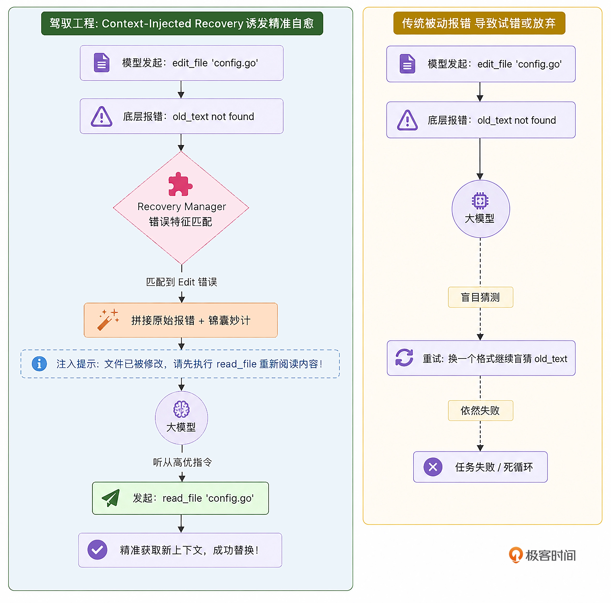

#  Error Recovery
在传统的框架中，工具底层的 Error 会被原样变成一段纯文本，作为 ToolResult 直接丢给大模型。而大模型在面对这些生硬的报错时，表现往往令人抓狂：它要么只会机械地道歉：“对不起，文件没找到”，然后直接放弃任务；要么陷入盲目的试错：连续三次生成一模一样的、错误的 old_text 去尝试 edit_file。

在驾驭工程中，这被称为“报错信息的不可操作性”。

我们要让底层引擎在捕捉到错误时，不再只是冷冰冰地陈述报错，而是化身为一位“资深导师”，直接把“锦囊妙计（Recovery Hints）”塞进上下文中，引导大模型走向正确的“自救道路”。

---

## 认知重塑：报错不应只是陈述，而应是“行动指南”
顶级 Harness 引擎（如 Claude Code / OpenClaw）深刻地认识到：当工具调用失败时，仅仅返回原始的 Error Log 是远远不够的。必须基于当前的工具和错误类型，向 Context 中注入带有强烈倾向性的恢复建议。



---

## 代码实战：构建 Error Recovery 模板仓库
第 1 步：定义错误分类器与“锦囊”模板

新建 internal/context/recovery.ts。我们需要在这里拦截工具层抛出的 Error 字符串，并为其匹配补丁。
```
【架构师的抉择：脆弱的字符串匹配 vs 领域级错误码】
在本讲的实现中，为了保持代码的极简和直观，我们采用了基于 string.includes() 的关键字匹配。
必须明确：在真实的生产环境中，依赖模糊的中文报错字符串去进行逻辑分支控制，是极其脆弱（Flaky）的反模式。如果底层工具的报错信息稍微改了一个字，整个自愈机制就会失效。
工业级的优秀实践是：
底层工具（如 read_file）在遇到 os.Open 失败时，抛出的是基于 C API / Unix 原生的标准系统错误，如 no such file or directory 或 permission denied（这些 POSIX 标准极其稳定）。
或者在 Tool Registry 层，定义一套严谨的领域错误码（Domain Error Codes），如 ERR_FILE_NOT_FOUND、ERR_EDIT_FUZZY_MATCH_FAILED。大模型不仅收到报错文本，还能在上下文中看到错误码。
今天的代码仅为演示 Harness 在架构层如何做劫持与注入，如果在企业级落地，请务必将其改造为基于标准化 Error Code 的 switch-case。
```

第 2 步：将 Recovery 机制缝合进 Main Loop

我们需要在 engine/loop.ts 中挂载这个管理器。当工具执行完毕并准备把 ToolResult 写入 Session 历史时，如果是错误结果，我们就给它“加点料”。

---

## 总结：
上下文感知的错误自愈（Error Recovery）。
- 化被动为主动：传统的框架在工具报错时是被动的，它们把修复的希望寄托在 LLM 本身的先验知识上。而 Harness 则化被动为主动，直接通过底层的分类器给出具体的行动建议。
- 善用工具组合拳：大模型往往不知道失败后应该调用什么工具来解决问题。我们在锦囊中明确提示“先使用 read_file”“先使用 bash ls”，这实际上是在向模型传授我们沉淀的高级排障 SOP。
- 极简的实现：实现这一套自愈系统，我们仅仅在 loop.ts 中插入了一行字符串拦截拼接代码。核心的控制流依然保持已有的清晰。