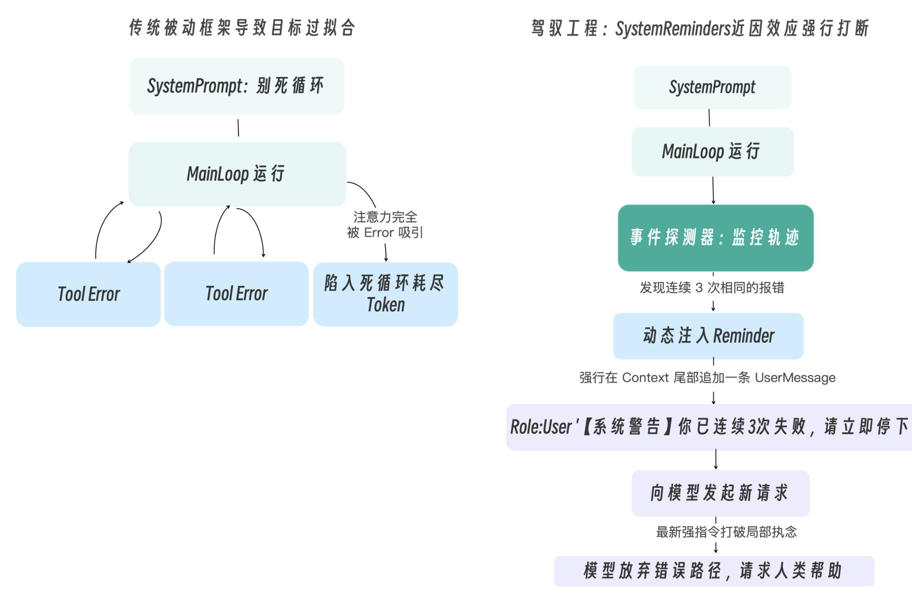

# Doom Loop
将实现一套 System Reminders（运行时动态提醒机制），作为在后台随时准备打断和引导 Agent 的那双“无形之手”，防止死循环。

---

## 为什么 System Prompt 拦不住死循环？
导致死循环的真正原因，是驾驭工程中极具挑战性的两个大模型行为陷阱：
- 上下文内容分布偏移：当模型连续几次遇到同一个棘手的 Error 时，上下文末尾会堆积大量结构相似的错误信息（ToolResult）。这些高度重复的 token 在内容分布上占据了绝对主导，使得模型的下一步生成被这些近期输入强力牵引，表现出“只想解决眼前报错”的行为倾向。这并非注意力机制本身发生了结构性故障，而是输入内容的分布决定了输出的走向。
- 近因偏差（Recency Bias）：这一现象在学术上有实证支撑——研究表明，当关键信息位于长上下文的头部或中部时，模型对其的响应权重会显著低于位于上下文末尾的信息（即 Lost in the Middle 效应）。相比于写在上下文最顶端、长达数千字的、泛泛而谈的系统规则，模型更倾向于对距离它最近的输入（即刚刚返回的那个 ToolResult 报错信息）做出强烈反应。

这两个因素叠加，就导致了一种典型的行为失控：模型陷入“只要我再微调一下这个 bash 命令的参数，下一秒肯定能成功”的局部最优幻觉，从而完全无视了位于前部的系统规则中连续失败请停止的宏观警告。

---

## System Reminders 的破局之道
你必须在它做决定的前一刻（Point of decision），也就是即将发起下一次 LLM 推理调用的地方，将高优先级的引导指令伪装成最新的一条 User Message，直接怼到它的脸上！

