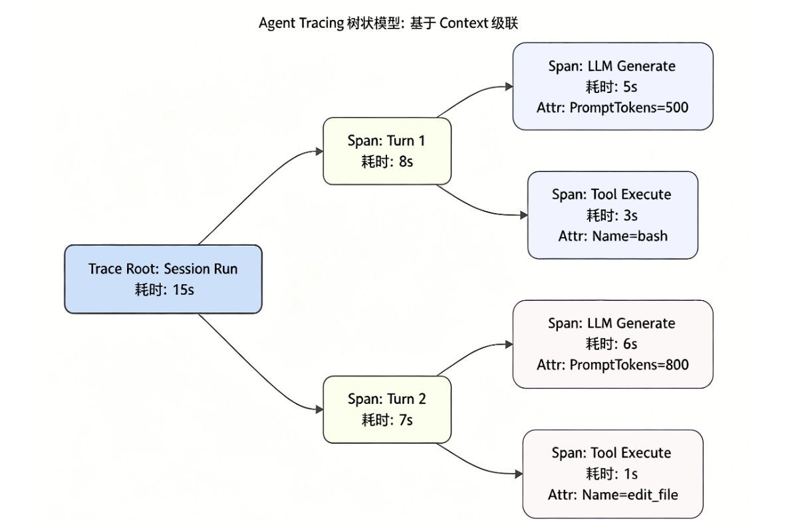

# tracing
设想这样一个真实的生产事故：你的 Agent 在排查线上问题时，跑了整整 5 分钟，经历了 15 个 Turn（轮次）的 ReAct 循环，最终宣告：“对不起，我无法修复这个问题。”

作为它的主程序员，你面对满屏滚动的终端日志，完全是一头雾水：
- 它在哪一步开始跑偏的？
- 在第 8 个 Turn 时，它发给大模型的 System Prompt 和 Working Memory 到底长什么样？大模型返回的原始 JSON 是不是因为截断而导致了幻觉？
- 它并发调用的 3 个工具，究竟是哪一个导致了耗时飙升？

大模型本身是一个不可控的“黑盒（Black Box）”。如果在驾驭工程（Harness Engineering）中，我们不能提供透视这个黑盒的“X 光机”，一旦 Agent 发生智障行为，我们将陷入无法调试的境地。

链路追踪（Tracing）, 将 Agent 的每一次“思考 - 行动”完整固化为可供回放的 JSON 决策树。

---

## Agent 链路追踪的本质是树（Tree）
一个完整的 Agent 运行周期，天然具备一棵极度工整的树状结构：
- Root Span（根跨度）：代表一次完整的 Run 任务。
- Child Spans（子跨度）：代表 ReAct 循环中的每一个 Turn。
- Leaf Spans（叶子节点）：代表每一个 Turn 内部的细分操作，例如 Generate（LLM 调用）、Execute（工具执行）、Compaction（内存压缩）。

---

## 代码实战：构建极简版 Trace 引擎
工业级框架通常会引入庞大的 Telemetry Trace SDK。但为了保持 node-tiny-claw 的极简，我们将手写一个无第三方依赖、输出原生 JSON 的 Trace 引擎。

将所有的追踪代码收敛在 trace.ts 中，并在 engine 和 tools 层进行埋点。