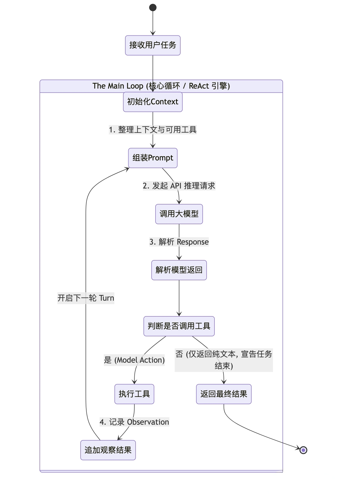

# Main Loop
在传统的软件开发中，程序的执行流是确定且线性的。比如，你写下 if-else，程序就严格按照路径执行。

但大模型（LLM）面对的是一个开放的、动态的、需要不断探索的环境。当它拿到一个宏大的任务（比如：“找出项目中计算错误的原因并修复”）时，它不可能像传统的纯问答（QA）机器人助手那样，在一次 API 调用中就吐出最终的完美代码。因为它缺少实时信息——它不知道当前目录下有什么文件，也不知道运行 pnpm start 会报什么错。

为了解决大模型“睁眼瞎”的问题，研究人员经历了几次重要的范式演进。

**1.纯推理（Reasoning Only）与纯行动（Acting Only）**
- 纯推理模式（如 Chain of Thought, CoT）：通过在 Prompt 中加入“Let’s think step by step”，强迫模型把思考过程写出来。这极大地提升了模型的逻辑推导能力，但致命缺陷是它无法与外部世界交互。如果代码库更新了，或者报错信息变了，模型依然在用过时的、基于训练数据的“幻觉”在推理。
- 纯行动模式（Acting Only）：直接给模型一堆工具（Tools），让它直接预测下一个要执行的动作。这种模式下，模型缺乏深度的状态跟踪和自我反思，往往就像一个横冲直撞的莽夫，很容易因为上一步的报错而陷入迷茫。

**2.ReAct：智能体的觉醒时刻**

ReAct 范式认为，一个真正的智能体，必须像人类解决问题一样，在每次行动前先思考，在每次行动后观察结果。
- 思考（Reason / Thought）：分析当前拿到的线索，规划下一步的意图。例如：“我看到了 calc.ts 这个文件，里面可能有 Bug，下一步我要读取它。”
- 行动（Act / Action）：向外部环境发出指令。例如：调用 read_file 工具。
- 观察（Observe / Observation）：外部环境（比如我们的 Harness 引擎）将工具执行的结果返回给模型。例如返回了 calc.ts 的具体代码。
- 然后再回到第 1 步，结合新获得的 Observation 再次思考，循环往复，形成闭环。

**3. Harness 视角的 Main Loop 特征**

在驾驭工程（Harness Engineering）中，我们将这套理论抽象为一个底层的 for 循环。我们可以用下面这张状态机图来精确描述它在 node-tiny-claw 中的流转过程：

只要大模型返回的结果中包含“工具调用请求（Tool Call Request）”，这个 Loop 就会一直循环下去。每一次从“组装 Prompt”到“追加观察结果”，我们称之为一个 Turn（轮次）。

在顶级引擎（如 Claude Code、OpenClaw）中，这个 Main Loop 的设计有几个极其鲜明的特征：
- 极度纯粹，没有预设分支：循环中没有业务逻辑，全凭模型决定走向。
- 不设硬性的最大步骤限制：传统的玩具框架喜欢设置 max_turns=10，但真实的工业任务可能需要 50 步。顶级引擎不在此处做生硬的截断，而是依赖后续我们将会讲到的 Context Compaction（内存压缩） 和 System Reminders（系统级防死循环干预）来维持稳定。
- 上下文（Context）是唯一的记忆载体：在这个循环中，数据会像滚雪球一样不断累加，记录下每一次的思考、动作和观察结果。

---

## 实战
第 1 步：定义系统的统一血液 (Schema)在 Harness 驾驭引擎中，各个组件（大模型、工具、主循环）之间传递的数据就是上下文（Context）。由于市面上不同大模型（Claude、OpenAI 模型等）的 API 格式千差万别，我们必须定义一套属于 node-tiny-claw 自己的标准数据结构，来承载 ReAct 范式中的“思考”与“行动”。

-> schema/message.ts

第 2 步：抽象 Provider 和 Tool 接口。在写 for 循环之前，Engine 需要知道去哪里调用大模型，去哪里执行工具。我们通过接口（llm-provider）来隔离底层实现。

-> llm/llm-provider.ts

接着，在 internal/tools/registry.ts 中定义工具注册表的接口：

-> tools/registry.ts