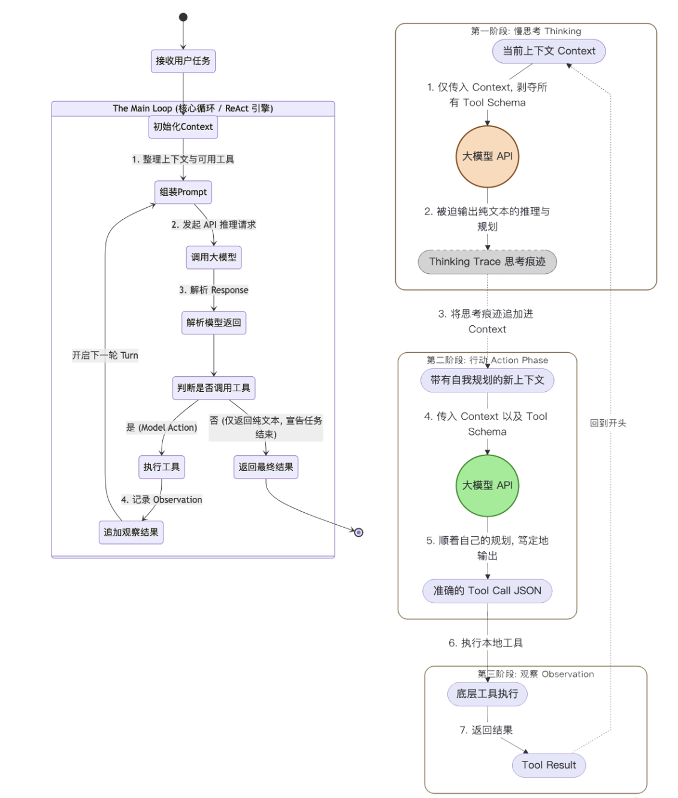

# Thinking
大语言模型的本质是预测下一个 Token。

当你向大模型发起一次普通的 API 请求时，它只能顺着当前的上下文，凭借概率直觉“一口气”把答案生成出来。如果问题极其复杂，它无法在生成第一个字之前，在脑海里预演几十步的完整计划。

为了激发大模型的“系统 2（慢思考）”，学术界发明了 Chain of Thought（思维链，CoT） 技术。我们会在提示词里加上一句咒语：“Let’s think step by step（让我们一步步思考）”。这就相当于给了大模型一张“草稿纸”，让它在输出最终答案前，先把中间推理过程写出来。

Agent 的工具调用（Function Calling）场景下，这种单纯的提示词工程彻底破产了。因为 AI 工程师在构建长程 Coding Agent 时，发现了一个致命的规律：当工具可用时，模型倾向于迅速采取行动，而不是深入思考。

如果你在系统提示词里写：“请你先仔细规划，然后再调用工具”。大模型往往会无视这句话。只要它在上下文的 Schema 里看到了诱人的 bash 或 edit 工具，它的预测概率就会瞬间坍塌，转而生成一段 JSON 参数去调用工具。

如何解决呢？既然提示词管不住它的“手”，那我们就用架构锁住它的“手”！驾驭工程（Harness Engineering）给出的解法是：机制决定行为。

在每一次大模型采取行动前，Harness 引擎会向它发起一次没有附带任何工具 Schema 的纯文本 API 请求。在这个绝对没有工具诱惑的“小黑屋”里，模型别无选择，只能乖乖地输出一段纯文本的深度推理与规划。等它想清楚了，Harness 会把这段推理记录追加到上下文中，然后再发起第二次附带工具的请求，让它去执行。

这就是工业级 Agent 循环中的 **Two-Stage ReAct**（两阶段 ReAct 循环）。

---

## 代码实战：在 Main Loop 中剥离 Thinking 阶段