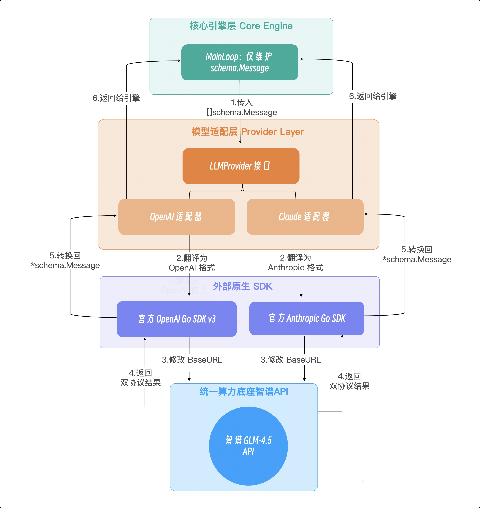

# LLM Provider兼容性
不同大模型厂商的 API 数据结构存在巨大差异。特别是涉及 Function Calling（工具调用）和上下文组装时，OpenAI 生态和 Anthropic（Claude）生态是两套截然不同的标准。

如果在我们的核心 Main Loop 中直接写入这些特定厂商的 SDK 代码，整个驾驭工程（Harness Engineering）的解耦原则就会被彻底破坏。

Main Loop 的唯一职责是维护上下文时间线（Context History）。它不应该知道外部世界是用什么协议通信的。

在驾驭工程中，Main Loop 应当只认识一种语言——也就是我们的 schema.Message、schema.ToolCall 和 schema.ToolResult。

当 Main Loop 发起推理请求时，Provider 需要将内部干净的 schema.Message 历史记录，翻译成各大厂商 SDK 所要求的那种晦涩、嵌套极深的请求体；而当大模型 API 返回结果后，Provider 又必须将厂商特有的 ToolUseBlock 或 FunctionCall 结构，精确地反向翻译回内部的 schema.Message。



通过这层抽象，具备了“即插即用”换大脑(LLM)的能力。

---

## 适配 MiniMaxProvider
使用方式：
```
import { MiniMaxProvider } from './llm/minimax-provider.ts';
const provider = new MiniMaxProvider('your-model-name');
// 设置环境变量 MINIMAX_API_KEY
```