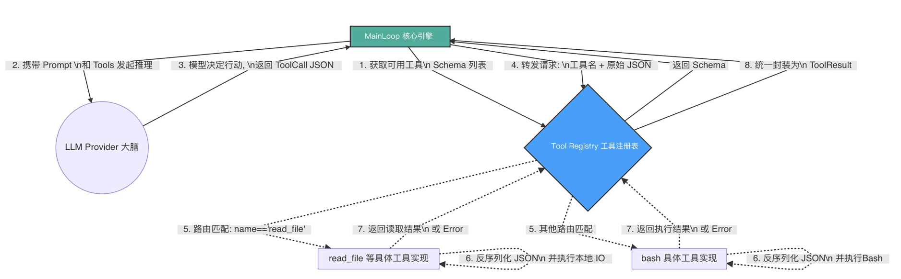

# Tool Registry
## 为什么需要 Tool Registry？
在 Harness（驾驭工程）的理念中，Main Loop 永远是“瞎子”和“聋子”。它不应该知道 bash 命令怎么调用，也不应该知道 read_file 需要什么参数格式。它只负责维护上下文，并将模型吐出来的 JSON 字符串丢给执行层。

Tool Registry 扮演了一个极其关键的“集线器（Hub）”和“路由器（Router）”的角色。它的核心职责有三：
- 动态挂载（Register）：允许开发者在引擎启动时，随时随地向系统插拔新的工具实现（在 Node.js 中，其本质上是实现了特定接口的类）。
- 描述暴露（Expose Schema）：在每次向大模型发起推理前，Registry 负责把当前所有已挂载工具的名称、描述以及 JSON Schema 打包成列表，交给 Provider 翻译给大模型听。
- 路由分发与执行（Dispatch & Execute）：当大模型决定调用某个工具，并吐出一串 JSON 参数（ToolCall）时，Registry 负责找到对应的函数，把 JSON 丢给它执行，最后将结果封装成统一的 ToolResult 返回给 Main Loop。



有了这个 Registry，我们未来给 Agent 添加任何新能力，都只需要写一个独立的源码文件实现特定接口，然后 Register 进去即可，核心引擎（Main Loop）一行代码都不用改！

---

## 代码实战：构建动态 Registry 与 Tool 接口
实现一个 read-file.ts 工具。对于 node-tiny-claw 来说，一个工具必须能说出自己的名字、描述，能给出严谨的参数要求（JSON Schema），并且能接收一段原始的 JSON 字节数组去执行具体逻辑。

第 1 步，定义 BaseTool 接口, 并实现 Registry 的路由与分发 -> tools/registry.ts

第 2 步：编写第一个物理工具 read-file.ts

在大模型的 API 调用中，Token 就是金钱，Context 就是生命线。如果你放任大模型读取超大文件，不仅会引发高昂的账单，还会导致上下文爆炸，甚至导致 API 拒绝服务。驾驭工程的真谛就是：绝不把系统的安全性寄希望于大模型的理智，而是在底层的工具实现中强制兜底。

第 3 步：连接真实大脑与真实手脚

为了测试效果，请在你的项目根目录下创建一个测试文件 hello.txt：
```bash
echo "Hello, node-tiny-claw 引擎！我是来自物理文件系统的一段神秘文本。大模型今天终于看到了我！" > hello.txt
```