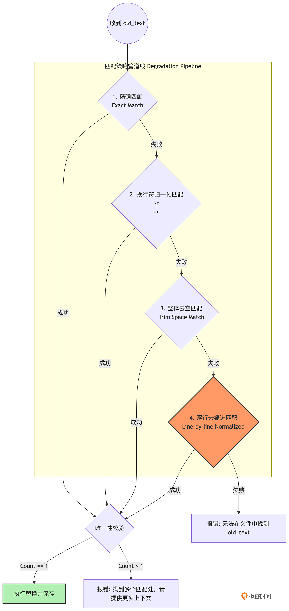

# Edit
设想这样一个真实的业务场景：你的代码库里有一个长达 2000 行的 server.go 文件。你让 Agent 去修复其中第 543 行的一个空指针逻辑 Bug。

Agent 读懂了代码，它知道怎么改。但接下来，它应该如何把改动落回磁盘？
- 如果用 write_file，它必须把这 2000 行代码完整地重新生成一遍。这不仅极其消耗 API Token（既慢又贵），而且大模型在长文本生成中极易发生截断或引入新的语法错误。
- 如果用 bash，大模型需要手写一段极其复杂的 sed 或 awk 正则表达式。但经验表明，大模型在处理包含特殊转义字符的多行正则表达式时，翻车率高达 80% 以上，极易把整个文件搞坏。

对于一个理想的 edit 工具，它的 JSON Schema 应该非常简单：提供 path（文件路径）、old_text（你要替换的旧代码）和 new_text（新代码）。

如果用 Go 语言的思路，底层实现无非就是一句 strings.Replace(fileContent, oldText, newText, 1)。但在 AI Agent 的世界里，绝对不能这么写。

但在 AI Agent 的世界里，绝对不能这么写。大模型在输出 old_text 时，经常会犯一种极其顽固的错误——**格式幻觉**。
```
        if user == nil {
            return err
        }
```

大模型在返回的 JSON 工具参数中，为了节省字数或者受限于其内部的注意力机制，它吐出的 old_text 很可能是去掉了缩进的：
```
if user == nil {
    return err
}
```
如果你使用精确匹配，strings.Replace 会直接失败，因为找不到要替换的字符串。在没有容错机制的 Harness 中，Agent 会收到 Error: old_text not found。接着，Agent 会在下一个 Turn 拼命重试，依然不带缩进，最终陷入死循环，任务宣告失败。

---

## 降级策略：多级模糊匹配链（Chain of Responsibility）
顶级引擎（如 Claude Code/OpenClaw）是如何解决这个问题的？答案是：把容错做在底层工具里，吸收大模型的误差。

我们不再要求精确匹配，而是实现一条多级模糊匹配链。



最关键的安全底线是“唯一性校验”：模糊匹配可能会导致匹配到代码里多个相似的片段。如果匹配结果 > 1，工具绝对不能盲目替换，而是必须抛出错误，要求大模型提供更多的上下行代码以精确定位。