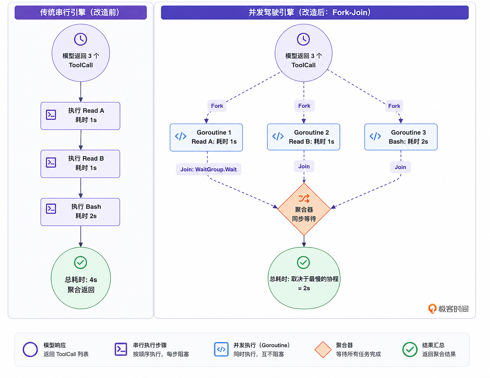

# Parallel Tool Calling

## 独立性假设
在将串行改为并行之前，我们需要先在驾驭工程的理论层面上厘清一个关键问题：同一轮（Turn）中的多个工具调用，它们之间存在依赖关系吗？

那我们到底该不该并行？业界顶级 Harness（如 OpenClaw / Claude Code 内部逻辑）的做法是基于一个强有力的独立性假设：
```
如果大模型在同一个 Turn（单次 Response）中并行下发了多个工具调用，Harness 引擎必须假设这些调用是互不依赖、互相独立的。引擎应当无脑并行执行它们。为什么？因为大模型在经过大量 RLHF（基于人类反馈的强化学习）微调后，它非常清楚：如果有强先后依赖的操作，必须分两个 Turn 来完成。
```
如果大模型犯傻，在同一个 Turn 里下发了存在依赖的工具导致报错，那是模型系统规划的问题。 YOLO（全权信任）与自纠错（Self-Correction）哲学：错误的原样回传，会让模型在下一轮自己吸取教训，改为分步执行。

所以，作为底层 OS，我们要做的就是：放开手脚，拥抱并发。

---

## 从串行到并发（Fork-Join 模式）
将 Main Loop 中的工具分发环节，重构为经典的 Fork-Join（分支 - 聚合）模式。



如果是基于Go语言，通过引入 Goroutine 和 sync.WaitGroup，我们将原本 O(N) 的耗时，硬生生降到了 O(Max(N))。这在面对 I/O 密集型操作时，甚至是数量级的性能提升。

---

## 思维实验：假设大模型在同一个 turn 中生成了有数据竞争的并发工具调用
作为一名严谨的驾驭工程架构师，如果我们要在 Harness 引擎层完全规避掉模型并发工具调用的“竞争风险”，我们应该怎样做呢？接下来，我们就来做一个思维实验，思考一下可以用来规避风险的可行方案。

假设大模型在同一个 Turn 中，非常鲁莽地生成了两个针对同一个文件的工具调用：
- edit_file：试图修改 main.go 中的某行代码。
- read_file：试图读取 main.go 的内容。

或者更糟糕的，两个并行的 edit_file 试图同时修改同一个文件。

这必然会导致物理文件层面的 Data Race（数据竞争）：
- 读取工具可能会读到只写了一半的“脏数据”。
- 并发写入可能会导致文件内容被互相覆盖，甚至彻底损坏。

一个更健壮的 Harness 并发策略可以是：由 Harness 引擎（而非模型本身）在分发 ToolCall 批次时，检查本批次是否全部为只读工具调用。若是，则启用并发 Goroutine；若批次中存在任何写操作，则退化为顺序执行。这种“只读并发、涉写串行”的策略，以极低的复杂度，在绝大多数场景下同时保证了性能与正确性。

---

## 实战
修改前是串行
```ts
// engine.ts
import { LLMProvider } from '../llm/llm-provider.js';
import { Registry } from '../tools/registry.js';
// eslint-disable-next-line @typescript-eslint/no-unused-vars, no-unused-vars
import { Message, Role, ToolCall } from '../schema/message.ts';
import { logger } from '../utils/logger.ts';

// Use the global AbortSignal type if available (Node.js >= 15 or browsers)
type AbortSignal = globalThis.AbortSignal;

/**
 * AgentEngine 是微型 OS 的核心驱动
 */
export class AgentEngine {
  private provider: LLMProvider;
  private registry: Registry;
  /** WorkDir (工作区): 借鉴 OpenClaw 的理念，Agent 必须有一个明确的物理边界 */
  public workDir: string;

  private enableThinking: boolean = true; // 【新增】慢思考模式开关

  constructor(provider: LLMProvider, registry: Registry, workDir: string, enableThinking?: boolean) {
    this.provider = provider;
    this.registry = registry;
    this.workDir = workDir;
    if (enableThinking !== undefined) {
      this.enableThinking = enableThinking;
    }
  }

  /**
   * 启动 Agent 的生命周期
   * @param userPrompt - 用户输入的初始提示词
   * @param signal - 可选的取消信号，用于中断整个运行循环
   */
  async run(userPrompt: string, signal?: AbortSignal): Promise<void> {
    logger.info(`引擎启动，锁定工作区: ${this.workDir}`);
    logger.info(`慢思考模式 (Thinking Phase): ${this.enableThinking}`);

    // 1. 初始化会话的 Context (上下文内存)
    // 在真实的场景中，这里会由动态 Prompt 组装器加载 AGENTS.md。目前我们先硬编码。
    const contextHistory: Message[] = [
      {
        role: Role.System,
        content:
          'You are node-tiny-claw, an expert coding assistant. You have full access to tools in the workspace.',
      },
      {
        role: Role.User,
        content: userPrompt,
      },
    ];

    let turnCount = 0;

    // 2. The Main Loop: 心跳开始 (Two-Stage ReAct 循环)
    while (true) {
      // 支持通过 AbortSignal 中断循环
      if (signal?.aborted) {
        logger.info('收到中断信号，提前退出循环。');
        break;
      }

      turnCount++;
      logger.info(`========== [Turn ${turnCount}] 开始 ==========`);

      // 获取当前挂载的所有工具定义
      const availableTools = this.registry.getAvailableTools();

      // ====================================================================
      // Phase 1: 慢思考阶段 (Thinking) - 剥夺工具，强制规划
      // ====================================================================
      if (this.enableThinking) {
        logger.info('[Phase 1] 剥夺工具访问权，强制进入慢思考与规划阶段...');

        // 核心机制：传入的 availableTools 为空数组！
        // 大模型看不到任何工具定义，被迫只能输出纯文本的思考过程。
        try {
          const thinkResp = await this.provider.generate(
            contextHistory,
            [], // 空数组 = 无工具可用
            signal
          );

          // 如果模型输出了思考过程，我们将其作为 Assistant 消息追加到上下文中
          if (thinkResp.content) {
            logger.info(`🧠 [内部思考 Trace]: ${thinkResp.content}`);
            contextHistory.push(thinkResp);
          }
        } catch (error) {
          throw new Error(
            `Thinking 阶段生成失败: ${error instanceof Error ? error.message : String(error)}`,
            { cause: error }
          );
        }
      }

      // ====================================================================
      // Phase 2: 行动阶段 (Action) - 恢复工具，顺着规划执行
      // ====================================================================
      logger.info('[Phase 2] 恢复工具挂载，等待模型采取行动...');

      // 此时的 contextHistory 中已经包含了上一阶段模型自己的 Thinking Trace。
      // 模型会顺着自己的逻辑，结合恢复的 availableTools 发起精准的工具调用。
      let actionResp: Message;
      try {
        actionResp = await this.provider.generate(
          contextHistory,
          availableTools,
          signal
        );
      } catch (error) {
        throw new Error(
          `Action 阶段生成失败: ${error instanceof Error ? error.message : String(error)}`,
          { cause: error }
        );
      }

      contextHistory.push(actionResp);

      if (actionResp.content) {
        logger.info(`🤖 [对外回复]: ${actionResp.content}`);
      }

      // ====================================================================
      // 退出与执行逻辑
      // ====================================================================
      // 如果模型没有请求任何工具调用，说明它认为任务已经完成，跳出循环。
      if (!actionResp.tool_calls || actionResp.tool_calls.length === 0) {
        logger.info('任务完成，退出循环。');
        break;
      }

      logger.info(`模型请求调用 ${actionResp.tool_calls.length} 个工具...`);

      for (const toolCall of actionResp.tool_calls) {
        logger.info(`  -> 🛠️ 执行工具: ${toolCall.name}, 参数: ${JSON.stringify(toolCall.arguments)}`);

        // 通过 Registry 路由并执行底层工具
        const result = await Promise.resolve(
          this.registry.execute(toolCall, signal)
        );

        if (result.is_error) {
          logger.error(`  -> ❌ 工具执行报错: ${result.output}`);
        } else {
          logger.info(`  -> ✅ 工具执行成功 (返回 ${result.output.length} 字节)`);
        }

        // 将工具执行的观察结果 (Observation) 追加到 Context，准备进入下一轮
        const observationMsg: Message = {
          role: Role.User,
          content: result.output,
          tool_call_id: toolCall.id,
        };
        contextHistory.push(observationMsg);
      }

      // 循环回到开头，模型将带着新加入的 Observation 继续它的下一轮思考...
    }
  }
}
```

修改后 -> engine/loop.ts

Node.js 不需要 Goroutine 与 sync.WaitGroup —— 单线程事件循环让 Fork-Join 在语义上更轻：用 `Array.prototype.map` 把所有 `tool_calls` 一次性下发到事件循环，再用 `Promise.allSettled` 作为聚合点（即 Join）。

为什么选 `allSettled` 而非 `all`：`Promise.all` 是 fail-fast，任一拒绝就抛出，其它兄弟结果被丢弃；`allSettled` 保证所有分支都跑完、所有结果（成功或失败）都进上下文。这与上文 YOLO + 自纠错的哲学一致 —— 错误原样回传，让模型在下一轮自己改对。

至于上一节"思维实验"提到的"只读并发、涉写串行"策略，node-tiny-claw 目前没有走那条路：实现复杂度较高（需要维护工具的 readOnly/mutating 元信息、还要做工具间的资源依赖分析），而 YOLO + allSettled 把失败原样回传给模型即可——下一轮模型自然会把"先写再读"改为分两 Turn 执行。Harness 不调度，只如实反馈。

改造后的关键片段（替换原 `for...of` 串行循环）：

```ts
logger.info(`模型请求调用 ${actionResp.tool_calls.length} 个工具（并行 Fork-Join）...`);

// Fork: 一次性把所有工具调用挂到事件循环上并发推进
const settled = await Promise.allSettled(
  actionResp.tool_calls.map((tc) => {
    logger.info(`  -> 🛠️ 派发: ${tc.name}, 参数: ${JSON.stringify(tc.arguments)}`);
    return this.registry.execute(tc, signal);
  })
);

// Join: 按原索引回填 observation。
// allSettled 的结果数组与输入数组索引严格对齐 —— 与"哪个先完成"无关。
// 必须按 tool_calls 原序 push，以保证 contextHistory 中 tool_call_id 顺序与模型期望一致。
for (let i = 0; i < actionResp.tool_calls.length; i++) {
  const toolCall = actionResp.tool_calls[i];
  const s = settled[i];

  let output: string;
  let isError: boolean;
  if (s.status === 'fulfilled') {
    output = s.value.output;
    isError = s.value.is_error;
  } else {
    // registry.execute 自身 reject（罕见：通常工具异常已被 RegistryImpl 包装为 is_error:true）
    output = `Tool execution rejected: ${s.reason instanceof Error ? s.reason.message : String(s.reason)}`;
    isError = true;
  }

  if (isError) {
    logger.error(`  -> ❌ [${toolCall.name}] 报错: ${output}`);
  } else {
    logger.info(`  -> ✅ [${toolCall.name}] 成功 (返回 ${output.length} 字节)`);
  }

  contextHistory.push({
    role: Role.User,
    content: output,
    tool_call_id: toolCall.id,
  });
}
```

### 顺序保证的细节

`Promise.allSettled(promises).then(results => ...)` 中，`results[i]` 严格对应 `promises[i]`，与完成时间无关。因此我们用循环索引 `i` 配对 `tool_calls[i]` 与 `settled[i]`，就能保证 observation 入栈顺序与 `tool_calls` 原序一致 —— 哪怕 200ms 的工具 A 比 50ms 的工具 B 后完成，B 的 observation 也排在 A 后面。这一点对 `tool_call_id` 配对和对话连贯性至关重要。

### 性能验证

在 node-tiny-claw 的表格驱动测试 `test/engine/test.parallel-dispatch.engine.ts` 里，三个各 100ms 的独立工具：
- **改造前（串行 `for...of` + `await`）**：总耗时 ~304ms（≈3 × 100ms）
- **改造后（并行 `Promise.allSettled`）**：总耗时 ~110ms（≈max(100ms)）

完美兑现 O(N) → O(max(N)) 的承诺。同时表格测试还覆盖了"一失败两成功"、"全部 reject"、"完成顺序乱序但 observation 仍按原序" 三种鲁棒性场景，确保 Fork-Join 在异常路径下也守得住。