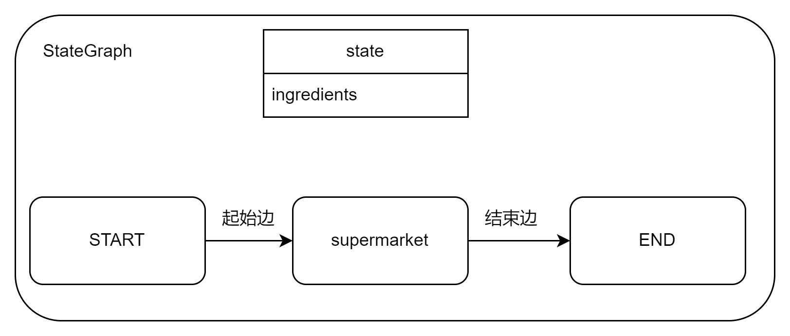

# LangGraph Demo
该示例用LangGraph模拟烹饪过程，假设现在需要烹饪羊排，完整的流程应该是：
- 食材采购：前往超市选购新鲜羊排
- 方法查询：通过抖音检索菜谱教程
- 烹饪实施：按照教程完成料理过程


## StateGraph
```py
class StateGraph(
    state_schema: Type[Any] | None = None,
    config_schema: Type[Any] | None = None,
    *,
    input: Type[Any] | None = None,
    output: Type[Any] | None = None
)
```
StateGraph 的第一个参数是 state_schema，其类型是 Type，也就是说要传入一个数据类型。state 是一个中央状态存储器，可以用来存储节点间流转时需要的各个变量的值。input/output对应图的输入输出。


## 运行
```
uv run demo1.py
```


理解了 demo1.py 的代码，理解 demo2.py 就很容易了。

demo3则掩饰了在各个节点间传递数据，实际就是上个节点return中的内容，会到下个节点的state中。