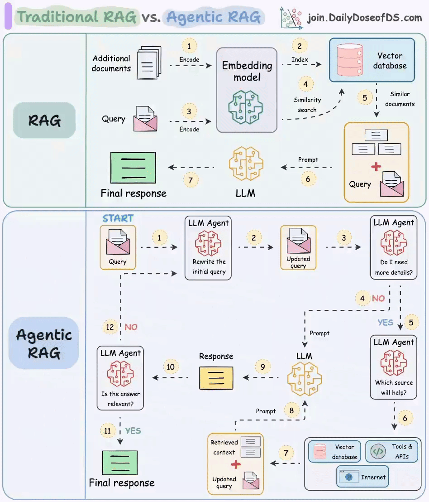

# RAG原理



## 传统 RAG
这张图分为两个部分，上半部分讲的是传统的 RAG。

RAG 分为前置的数据导入工作和后续的用户检索提问两个环节。
- 1 和 2 两个步骤就是前置数据导入步骤。过程很简单。第一步是将数据，比如文档、图片等内容通过向量大模型（Embedding Model）转成向量，第二步是将向量存入到向量数据库中。
- 3～7 标号点环节就是提问检索环节。首先将用户的提问，比如“颈椎病如何治疗”这样的文本转成向量，然后去向量数据库中做相似性搜索。如果搜索到结果比较相似的，就将内容取出来，组成新的 prompt。然后把这个新的 prompt 再发送给大模型，由大模型给出最终的答案。

这样做的目的，临时扩展了大模型的知识面，防止大模型不懂装懂，胡乱回答。

---

## Agentic RAG
统的 RAG 通常会存在这样几个问题：
- 用户的 query 在向量数据库里搜索不到，或者搜出来的结果不准。
- 用户的提问不一定需要去向量数据库中搜索，此时的搜索只会浪费 token 资源。比如用户要求生成一段计算加法的 python 代码，这其实直接交给大模型就可以完成。
- 既然是开卷考试了，那大模型非得翻书本吗（向量数据库搜索）？我去网上搜一下（联网搜索）行不行？我去问问别人（调用工具）行不行？
- 如何确定最后得到的答案是准确的呢？

针对上面这几个问题，就可以在关键环节上引入 Agent 来解决。

首先第一个 Agent 将用户的问题做了改写，这个环节通常会将用户的提问从多个角度拆分成多条，也就是说把一个问题换多个角度进行提问。比如用户输入了一个颈椎病如何治疗，经过改写后可能会产生如下几条 query：
```
颈椎病的治疗方案？
什么是颈椎病？
颈椎病如何防治？
什么样的人容易得颈椎病？
```
这样就会大大的增加向量匹配命中的概率。

第二个 Agent 会去判断用户提问的意图，如果认为不需要借助外力，大模型就能搞定，则直接将 query 发送给大模型；如果认为需要借助外力，则发送给下一个 Agent。这个过程，可以使用提示词工程完成。

比如我们的知识库、工具等都是医疗相关的，那么提示词可以像后面这样写：
```
你是一个用户提问内容理解和分类助手。当用户的提问涉及到医疗，看病等相关的内容时，你就输出 yes，如果是其他领域的内容，你就输出 no。除此之外，不要输出其他的任何内容与解释说明。
```
当上一个 Agent 认为用户的提问需要借助外力了，那么任务就交到了第三个 Agent 手里。它负责进一步分析用户的提问需要联网搜索解决，还是查知识库，或者是调用工具。这一步同样可以使用提示词工程搞定。

最后一个 Agent 就是当大模型给出回复后，需要做一下校验，判断答案是否能解决用户提问。比如用户提问是，颈椎病如何治疗，但大模型的回复是，今天天气不错，适合出去晒晒太阳。这样 Agent 就认为没有解决问题，就会重新循环整个过程，再问一遍。

通过这样一个复杂的机制，能大幅提高回答问题的准确率，当然缺点也很明显，那就是耗费 token，而且速度很慢，毕竟参与的大模型太多了。