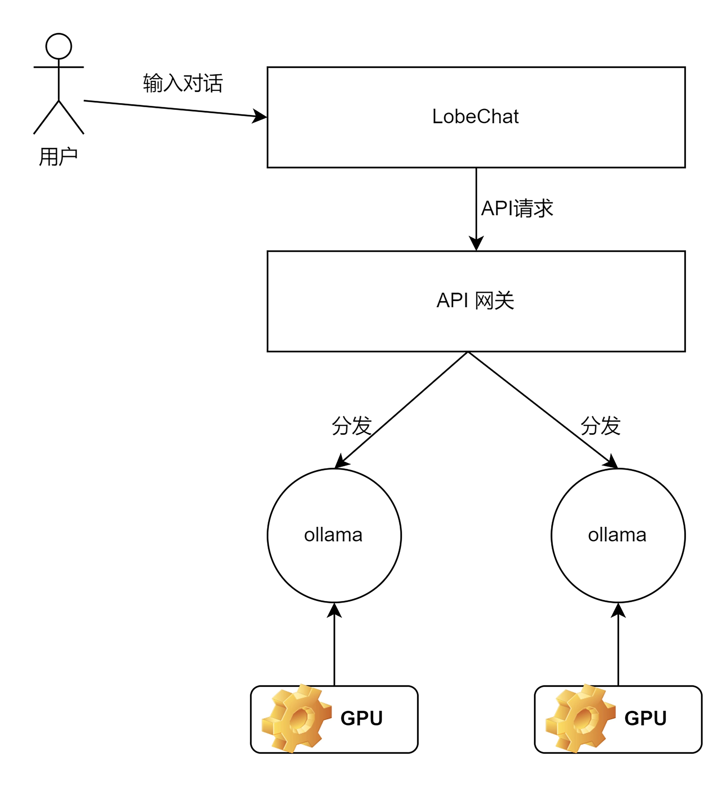
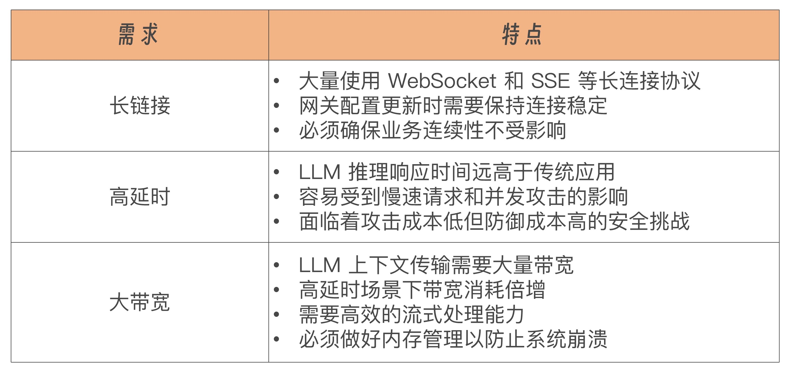

# 高可用大模型部署架构

## LobeChat (可选)
为了能让用户像使用 ChatGPT 一样，通过一个前端页面与大模型进行问答交互，部署了开源社区特别火的一款对话前端，名字叫 LobeChat。LobeChat 开箱即用，支持多模型的对接，非常适合我们做对话测试。

## 网关
如果只是简单测试一下负载均衡效果，那使用 Nginx 完全 OK。但如果是真正的实现生产级别的应用，那么我们就需要针对 AI 时代的新挑战而使用 AI 网关，比如 Kong、Higress 等。

## AI 网关 Higress
Higress 在 AI 时代之前是一个云原生 API 网关，在阿里内部，为解决 Tengine（加强版 Nginx）reload 对长连接业务有损，以及 gRPC/Dubbo 负载均衡能力不足的问题，Higress 应运而生。Higress 提供了基于 K8s 的部署模式，以及基于 Docker 的 all-in-one 的部署模式。